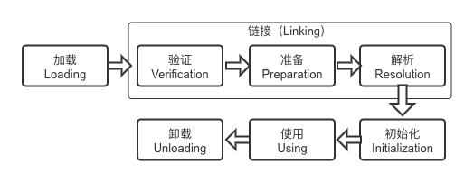
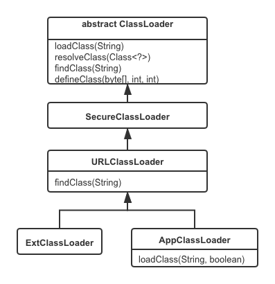
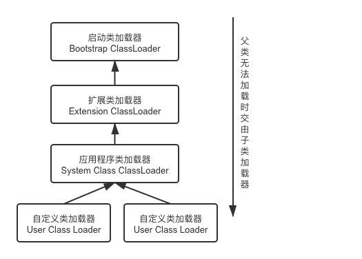
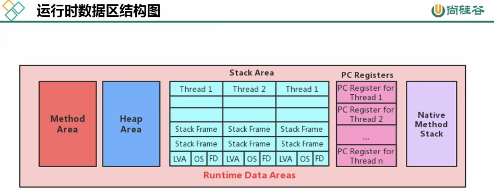

Java内存对象布局：https://time.geekbang.org/column/article/13081

伪共享：https://www.cnblogs.com/cyfonly/p/5800758.html

JOL：http://openjdk.java.net/projects/code-tools/jol/

查看对象内存布局：

```bash
java -jar jol-cli-0.10-full.jar internals java.util.HashMap
```

### 1. 类文件结构

### 2. 类加载器子系统

流程：字节码文件 -> 加载阶段 -> 类加载器子系统 -> 初始化

- 类加载器子系统负责从文件或网络中加载Class文件，class文件在文件头有特定的标识
- ClassLoader负责class文件的加载，至于它是否可以运行，则由Execution Engine决定
- 加载的类信息存放在方法区中

#### 2.1 类的加载过程



##### 2.1.1 加载（loading）

将类文件读取成二进制流，将流转换成运行时数据结构，在内存中生成代表这个类的

##### 2.1.2 验证（verification）

确保字节流中包含的信息符合当前虚拟机要求，保证类加载的正确性，不会危害虚拟机自身安全。

验证包括：文件格式验证，元数据验证，字节码验证，符号引用验证。

##### 2.1.3 准备（preparation）

为**类变量**分配内存并且设置该类static变量的默认初始值；由于常量（final修饰的static变量）的值在编译期间就已经确定，所以会显式初始化（而不是赋默认值）。

##### 2.1.4 解析（resolution）

将常量池内的符号引用转换成直接引用，这个过程包含：类或接口的解析，字段解析，方法解析，接口方法解析等步骤。

> 这个过程似乎比较复杂，我没有仔细看，如果以后需要研究，看《深入理解Java虚拟机》。

##### 2.1.3 初始化

执行类构造函数`<clinit>()`，这个构造器在多线程下会被同步加锁，这个功能可以被用于定义单例对象。

#### 2.2 类加载器

JVM支持2种类型的类加载器：一种是**启动类加载器**（Bootstrap ClassLoader），它使用C++语言实现，是虚拟机自身的一部分；另一种是**自定义类加载器**（User-Defined ClassLoader），这些类加载器由Java语言实现，全部继承于抽象类**java.lang.ClassLoader**，子类及继承层次如下：




- 启动类加载器：负责加载`<JAVA_HOME>/lib`目录下Java虚拟机能够识别的类库，启动类加载器无法在Java程序中引用，例如`String.class.getClassLoader()`返回值为`null`。出于安全方面的考虑，它只会加载包名以`java`、`javax`、`sun`等开头的类。
- 扩展类加载器：负责加载`<JAVA_HOME>/lib/ext`目录下的类库，用户可以将自定义类库放在该目录下，也会被加载。
- 应用程序类加载器：负责加载用户类路径下所有的类库，由于`java.lang.ClassLoader.getSystemClassLoader()`的返回值是应用程序类加载器，所以也被称为系统类加载器。

##### 2.2.1 双亲委派模型

双亲委派模型（Parents Delegation Model）：当一个类加载器收到一个类加载请求时，它首先把请求委派给父类加载器（父类加载器如果有父类加载器，则进一步向上委托），只有父类加载器无法加载时，子加载器才尝试加载这个类。双亲委派要求除了顶层的加载器外，其他的类加载器都必须有自己的父类加载器，需要注意的是这里所说的父子关系并不是面向对象中类的父子关系。

最主要的几个类加载器如下：



双亲委派模型对于保证Java程序的稳定运作极为重要，优先使用父类加载器可以确保JDK的类优先被加载。反之，如果不优先使用父类加载器，由各个类加载器自行去加载的话，如果用户编写了一个与JDK同名的`java.lang.String`类，那么将会导致出现不一样的String对象，Java类型体系中最基础的行为也就无从保证，应 用程序将会变得一片混乱。

为了加深印象，在这里列举一些例子：

**例子一**
创建一个java.lang包，在这个包下创建String类，即与JDK的String同名，类定义如下

```java
public class String {

    static{
        System.out.println("User String loaded.");
    }
}

// 在其他地方定义一个main函数
public class Test {
    public static void main(String[] args) {
        String str = new String("test");
        System.out.println(str);
    }
}
```

在输出的结果中没有看到静态构造函数的输出，说明我们虽然定义了同名的String对象，但是得益于双亲委派机制，JDK中的String对象并没有被破坏。

**例子二**
基于例子一定义的`java.lang.String`对象，在里面添加main函数，如下：

```java
public class String {

    public static void main(String[] args) {
        System.out.println("hello, parents delegation.");
    }
}
```

运行代码，发现直接报错：

```java
错误: 在类 java.lang.String 中找不到 main 方法, 请将 main 方法定义为:
   public static void main(String[] args)
否则 JavaFX 应用程序类必须扩展javafx.application.Application
```

这是因为main函数里传入的`String[]`与JDK的String不一致，所以在做函数签名验证的时候直接报错。

##### 2.2.2 自定义类加载器

在什么时候需要自定义类加载器：

- 隔离加载类，例如Tomcat就需要为不同的应用使用不同的加载器
- 修改类的加载方式
- 扩展加载源，例如使用spring-boot-maven-plugin打包的fat jar，在运行时spring boot会使用自定义的加载器来加载class文件，具体参见这篇文章：https://mp.weixin.qq.com/s/jUZkpRADySBuyeIDMabPuw
- 防止源码泄露，例如解析加密的class文件等

### 3. 运行时内存结构



在JVM规范中，内存划分成6个部分：

- 程序计数器（PC，Program Counter Register）
- Java虚拟机栈（Java Virtual Machine Stack），也称线程栈
- 堆（Heap）
- 方法区（Method Area）
- 运行时常量池（Runtime Constant Pool）
- 本地方法栈（Native Method Stack）

其中，线程私有的区域包括：程序计数器、Java虚拟机栈、本地方法栈（在Hotspot虚拟机中与Java虚拟机栈合二为一）；线程共享区域包括：堆、方法区、运行时常量池

#### 3.1 程序计数器

每一个线程在运行时都有自己的程序计数器，它记录了当前线程正在执行的JVM指令地址；如果当前执行的是本地方法，则是undefined。程序计数器占用的是线程私有的非常小的一块内存，它是不会导致OutOfMemory的唯一内存区域。

问：PC寄存器有什么作用？
答：多线程并行执行时，需要记录每个线程执行的位置，以便CPU进行上下文切换后可以准确的恢复并继续执行。

问：PC寄存器为什么被设定为线程私有的？
答：


#### 3.2 Java虚拟机栈

线程栈是一个后进先出的结构，里面的每一个元素称为一个栈帧，每一个栈帧对应一个方法，方法执行前会被push到栈顶，执行完成后从栈顶弹出。

#### 3.3 堆

#### 3.4 方法区

#### 3.5 运行时常量池

每个class文件在编译期间会生成常量池结构，这些常量池在类初始化时会加载到运行时常量池中。

#### 3.6 本地方法栈

JVM规范定义本地方法栈用于存放线程在执行本地方法时的栈帧。对于Hotspot来说，本地方法栈和线程栈二者合二为一。

### 4. 对象内存布局

#### 4.1 对象的内存分配方式

在Hotspot中对象的内存分配有2种方式：

- **指针碰撞**（Bump The Point）：使用指针将内存分成已使用和未使用，当需要为新对象分配内存时，将指针往未使用部分移动与将要分配对象内存大小的距离。Serial、ParNew等带压缩整理过程的收集器采用的是指针碰撞的方式，既简单又高效
- **空闲列表**（Free List）：当内存不规整时，虚拟机维护了一个用于记录空闲内存的列表，当需要分配内存时，虚拟机将从列表中寻找一块合适的空间划分给对象。CMS这种基于清除算法的收集器用的就是这种方式。

此外，内存分配会涉及到多线程并发问题，为了尽量避免并发导致性能下降，JVM为每个线程预留了一块特有的空间TLAB，即线程本地分配缓冲，详情参见《堆空间》章节。

#### 4.2 对象内存布局

对象在堆内存中的存储布局可以划分为三个部分：

- 对象头(Header)
- 实例数据(Instance Data)
- 对齐填充(Padding)

##### 4.2.1 对象头

HotSpot虚拟机对象的对象头部分包括两类信息。

第一类是用于存储对象自身的运行时数据，如哈希码(HashCode)、GC分代年龄、锁状态标志、线程持有的锁、偏向线程ID、偏向时间戳等，这部分数据的长度在32位和64位的虚拟机(未开启压缩指针)中分别为32个比特和64个比特，官方称它 为“**Mark Word**”。

另外一部分是类型指针，即对象指向它的类型元数据的指针，Java虚拟机通过这个指针来确定该对象是哪个类的实例。

#####  4.2.2 实例数据

实例数据部分是对象真正存储的有效信息，即我们在程序代码里面所定义的各种类型的字段内容。这部分的存储顺序会受到虚拟机分配策略参数(-XX:FieldsAllocationSty le参数)和字段在Java源码中定义顺序的影响。

##### 4.2.3 对齐填充

由于HotSpot虚拟机的自动内存管理系统要求对象起始地址必须是8字节的整数倍。所以如果实例数据不满足这个条件的话就需要对齐填充。也就是对齐填充没有特别的含义，它仅仅起着占位符的作用。

##### 4.2.4 装箱类型的说明

对于int类型，在被装箱后，在32位操作系统上占用的内存是16字节：mark word 4个字节、类型指针4个字节、int值4个字节、填充4个字节。使用以下命令验证：

```bash
java -jar jol-cli-0.10-full.jar internals java.lang.Integer
```

#### 4.3 对象的访问定位

Java程序会通过栈上的reference数据来操作堆上的具体对象，通过reference去定位对象有2种方式：

- 通过句柄定位：这种方式会在堆中划分一块内存作为句柄池，reference存储的是句柄地址，句柄包含了对象的具体访问地址。这种方式的优势是在对象被移动后（垃圾回收）只需修改句柄的地址，而无需修改reference。
- 直接定位：reference存储的是对象的访问地址。这种方式的优势是速度更快，由于对象访问在Java中非常频繁，减少性能开销是一项极为可观的执行成本，所以Hotspot选用的正是这种方式。

#### 4.4 对象的创建过程

一个对象new的过程包含哪些步骤？

1. 检查相应类对象在常量池中是否存在符号引用，如果不存在进行类对象的初始化流程
   - 类对象的初始化包括：加载、链接（验证、准备、解析）、初始化，见第2小节
2. 从堆空间中分配内存
   - Serial、ParNew等带内存整理的算法采用指针碰撞的方式分配内存
   - CMS等基于清理的算法使用空闲列表的方式分配内存
3. 如果启用了TLAB（默认启用），会先在TLAB中分配内存，避免多线程并发带来的性能问题
4. 将分配的内存重置为零
5. 设置对象头信息，如类对象、元数据、哈希码、偏向锁等
6. 执行构造函数