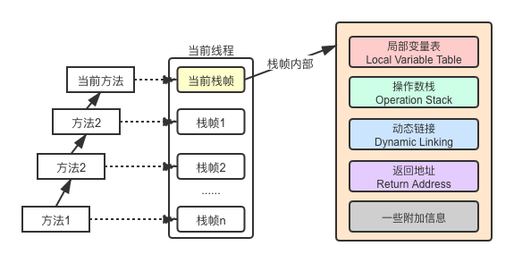
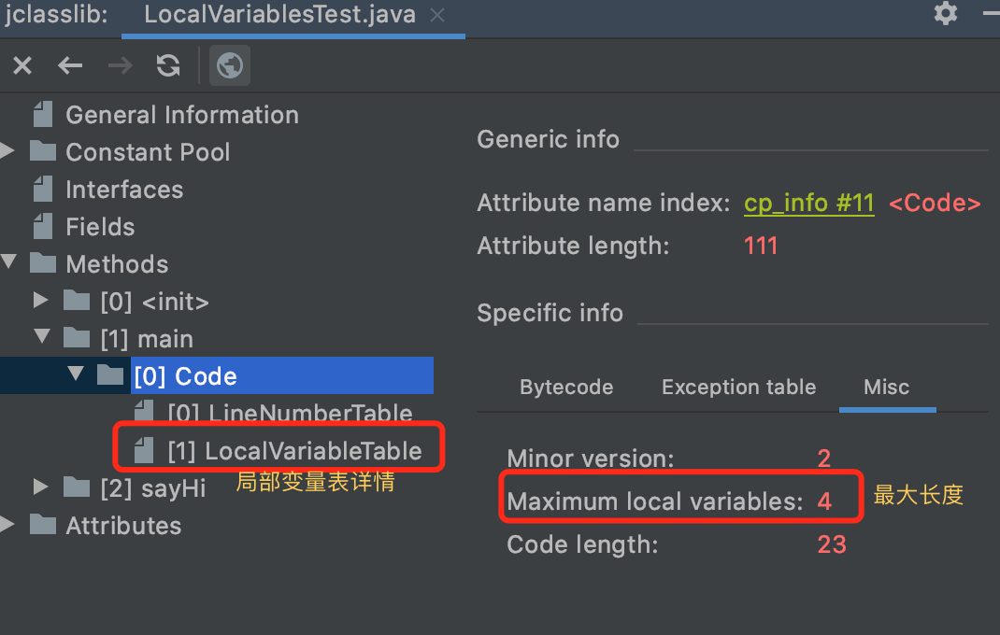

**Java虚拟机栈**(Java Virtual Machine Stack)也是线程私有的，它的生命周期与线程相同。虚拟机栈描述的是Java方法执行的线程内存模型：每个方法被执行的时候，Java虚拟机都 会同步创建一个**栈帧**（Stack Frame）用于存储局部变量表、操作数栈、动态连接、方法出口等信息。每一个方法被调用直至执行完毕的过程，就对应着一个栈帧在虚拟机栈中从入栈到出栈的过程。

每一个栈帧都包括了局部变量表、操作数栈、动态连接、方法返回地址和一些额外的附加信息。在编译Java程序源码的时候，栈帧中需要多大的局部变量表，需要多深的操作数栈就**已经被分析计算出来**，并且写入到方法表的**Code属性**之中。换言之，一个栈帧需要分配多少内存，并不会受到程序 运行期变量数据的影响，而仅仅取决于程序源码和具体的虚拟机实现的栈内存布局形式。

栈帧内部示意图：



栈帧内部结构包括：
- 局部变量表：
- 操作数栈：
- 动态链接：指向运行时常量池的方法引用
- 方法返回地址：
- 一些附加信息

当前线程遇到OOM后其他线程能不能正常运行？https://club.perfma.com/article/1554076

### 1. 局部变量表

局部变量表（Local Variables Table）也被称为局部变量数组或本地变量表。类型为一个数字数组，主要用于存储方法参数和定义在方法体内的局部变量，这些数据类型包括类基本数据类型、对象引用，以及returnAddress类型。

#### 1.1 局部变量与字节码

局部变量表所需大小在编译期间就已确定下来，保存在方法的Code属性的locals数据项中，方法运行期间是不会改变局部变量表的大小的。

以下面这段代码为例：

```java
public class LocalVariablesTest {
    public static void main(String[] args) {
        String str = "abc";
        Integer i = 123;
        LocalVariablesTest var = new LocalVariablesTest();
        var.sayHi();
    }

    public String sayHi() {
        return "hello";
    }
}
```

使用javap命令查看编译后的字节码：

```bash
javap -c -verbose LocalVariablesTest.class
```

输出结果：

```java
...
public class me.hanrui.jvm.LocalVariablesTest
  minor version: 0
  major version: 52
  flags: ACC_PUBLIC, ACC_SUPER
Constant pool:
   ...
{
  ...
  public static void main(java.lang.String[]);
    descriptor: ([Ljava/lang/String;)V
    flags: ACC_PUBLIC, ACC_STATIC
    Code:
      stack=2, locals=4, args_size=1 //局部变量表最大长度
         0: ldc           #2                  // String abc
         2: astore_1
         3: bipush        123
         5: invokestatic  #3                  // Method java/lang/Integer.valueOf:(I)Ljava/lang/Integer;
         8: astore_2
         9: new           #4                  // class me/hanrui/jvm/LocalVariablesTest
        12: dup
        13: invokespecial #5                  // Method "<init>":()V
        16: astore_3
        17: aload_3
        18: invokevirtual #6                  // Method sayHi:()Ljava/lang/String;
        21: pop
        22: return
      LineNumberTable:   // java代码行号与字节码指令行号的映射关系
        line 9: 0
        line 10: 3
        line 11: 9
        line 12: 17
        line 13: 22
      LocalVariableTable:	// 局部变量表信息，可以看到包括方法参数在内共计4个变量
        // Start: 字节码指令的行号，变量作用域起始位置
        // Length: 变量作用域范围，用Start加上(Length-1)可以得出作用与结束位置
        // Slot: 可以理解为变量的索引
        Start  Length  Slot  Name   Signature
            0      23     0  args   [Ljava/lang/String;
            3      20     1   str   Ljava/lang/String;
            9      14     2     i   Ljava/lang/Integer;
           17       6     3   var   Lme/hanrui/jvm/LocalVariablesTest;

  ...
}
SourceFile: "LocalVariablesTest.java"
```

也可以使用jclasslib工具查看字节码，更加直观和方便：



#### 1.2 变量槽细节

局部变量表的基本存储单位是槽（slot），我理解成局部变量表是一个数组，数组里存储的值就是变量的值，而这个值占用的空间就是槽。类型长度在32位以内的（7种基本数据类型、returnAddress类型）占用一个槽，长度为64位的（long和double）占用2个槽。

关于变量槽，有2个需要注意的点。

**知识点1**：当方法是实例方法时，局部变量表中第0个变量槽是关键字`this`指向的对象。

**知识点2**：为了节省空间，局部变量表中的槽可以被重用，当方法体中定义的变量的作用域不是整个方法时就可能会有这种情况。以下面这段代码来说：

```java
public static void slotReuseTest() {
    {
        Integer num1 = 1;
        System.out.println(num1);
    }
    Integer num2 = 520;
    System.out.println(num2);
}
```

上述代码中`num1`在被输出后作用域就结束了，所以JVM在使用`num2`时就重用了`num1`的槽位：

```java
...
{
  ...

  public static void slotReuseTest();
    descriptor: ()V
    flags: ACC_PUBLIC, ACC_STATIC
    Code:
      stack=2, locals=1, args_size=0
         ...
      LineNumberTable:
        ...
      LocalVariableTable:
        Start  Length  Slot  Name   Signature
            5       7     0  num1   Ljava/lang/Integer;  // 占用0号槽位
           19       8     0  num2   Ljava/lang/Integer;  // 占用0号槽位

  ...
}

```

可以从字节码中看出，`num1`、`num2`都是用了0号槽位。

**知识点3**：局部变量在GC时会作为GC Roots，所以为了尽快让那些不在是用的大对象被回收，可以手动将其赋值为`null`，例如：

```java
public static void slotReuseTest() {
    byte[] bigObj = new byte[64 * 1024 * 1024];
    // 手动赋值为null，让其尽快被回收
    bigObj = null;
    System.gc();
}
```

但是万事皆具有两面性，上面的代码我们期待的是bigObj应尽快被回收所以将其置为null，但是JIT在运行过程中可能会将这行对运行结果来说毫无意义的代码优化的无影无踪。

### 2. 操作数栈

#### 2.1 操作数栈详解

操作数栈是一个后入先出(Last In First Out，LIFO)的栈结构。和局部变量表一样，操作数栈的最大深度也被编译到了Code属性中，32位长度的类型占栈容量为1，64位数据占用栈容量为2。

当方法开始执行时栈是空的，当方法执行时，会有各种指令往操作数栈中写入和提取内容，也就是入栈和出栈操作。

以这段代码为例：

```java
public class OperandStackTest {
    public static void main(String[] args) {
        byte i = 15;
        int j = 8;
        int k = i + j;
    }
}
```

通过javap命令查看字节码：

```bash
javap -c -verbose OperandStackTest
```

可以看到输出：

```java
...
{
  ...

  public static void main(java.lang.String[]);
    descriptor: ([Ljava/lang/String;)V
    flags: ACC_PUBLIC, ACC_STATIC
    Code:
      stack=2, locals=4, args_size=1  // 操作数栈的最大深度
         0: bipush        15  // 将15入栈
         2: istore_1
         3: bipush        8  // 将8入栈
         5: istore_2
         6: iload_1
         7: iload_2
         8: iadd            // 执行相加操作
         9: istore_3
        10: return
      LineNumberTable:
        line 9: 0
        line 10: 3
        line 11: 6
        line 14: 10
      LocalVariableTable:
        Start  Length  Slot  Name   Signature
            0      11     0  args   [Ljava/lang/String;
            3       8     1     i   B
            6       5     2     j   I
           10       1     3     k   I
}
```

#### 2.2 面试题

- i++和++i有什么区别

  ```java
  public static void main(String[] args) {
      int i1 = 10;
      i1++;
  
      int i2 = 10;
      ++i2;
  
      int i3 = 10;
      int i4 = i3++;
  
      int i5 = 10;
      int i6 = ++i5;
  
      int i7 = 10;
      i7 = i7++;
  
      int i8 = 10;
      i8 = ++i8;
  
      int i9 = 10;
      int i10 = i9++ + ++i9;
  }
  ```

#### 2.3 栈顶缓存技术

基于栈式的虚拟机（区别于使用寄存器的架构）所使用的零地址指令更加紧凑，但完成一项操作的时候必然需要使用更多的入栈和出栈指令，这同时也就意味着将需要更多的指令分派（instruction dispatch）次数和内存读写次数。

由于操作数是存储在内存中的，因此频繁地执行内存读写必然会影响执行速度（相对于CPU）。为了解决这个问题，Hotspot JVM的设计者们提出了栈顶缓存（ToS，Top-of-Stack Cashing）技术，将栈顶元素全部缓存在物理CPU的寄存器汇中，以此降低对内存的读写次数，提升执行引擎的执行效率。

### 3. 静态链接与动态链接

在JVM中，将符号引用转换成调用方法的直接引用与方法的绑定机制有关。

如果被调用的目标方法在编译期间就已经确定，且运行期间不会改变，这类调用在**类加载**过程中就会把涉及到的符号引用转换成明确的直接引用，不必延迟到运行期间才去完成。这类调用就成为**静态链接**。

而动态链接的过程就与静态链接相反，对于那些在编译期间无法确定下来的方法调用，需要程序运行期间才能将符号引用转换成直接引用，由于这种引用转换的过程具备动态性，因此被称为**动态链接**。

静态链接、动态链接对应的方法的绑定机制为：早期绑定（Early Binding）、晚期绑定（Late Binding）。

#### 3.1 静态链接

静态链接说直接点就是“编译期可知，运行期不可变”。与之相关的JVM指令有：

- invokestatic 用于调用静态方法
- invokespecial 用于调用实例构造器`<init>()`方法、私有方法、父类的方法

能够使用这2个指令的方法有：静态方法、私有方法、实例构造器、父类方法，final修饰的方法。但是需要注意的是，final修饰的方法虽然也属于静态链接，但是由于历史原因它使用invokevirtual指令调用。这5类方法统称为非虚方法（Non-Virtual Method），与之相反的就是虚方法（Virtual Method）。

#### 3.2 动态链接

虚方法的调用需要延迟到运行期间才能完成，这种调用形式在《深入理解Java虚拟机》里也称为分派（Dispatch）调用，这种调用方式要复杂得多。

《虚拟机》那本书对这部分讲解的非常仔细，我在这里只是做一个概括。

与动态链接相关的指令是`invokedynamic`，这个指令实现了虚方法的动态分派过程，分成以下几个步骤：

- 找到操作数栈顶的第一个元素（所指向的对象）的实际类型，记作C
- 如果在类型C中找到相符的方法，则进行访问权限校验，校验不通过返回`java.lang.IllegalAccessError`异常
- 按照继承关系从下往上依次对C的各个父类进行上一步的搜索和验证过程
- 如果始终没有找到合适的方法，则抛出java.lang.AbstractMethodError异常

动态分派是执行非常频繁的动作，为了避免频繁的查找，Java虚拟机在方法区建立了一个虚方法表（Virtual Method Table，也称vtable），虚方法表中存放这方法的实际访问地址（按我的理解就是将虚方法实际上要调用的方法提前算好放在vtable中，后续实际调用就不需要像上面的步骤那样繁琐了）。虚方法表在类加载阶段就已经初始化完成（每个类都会有一个虚方法表吗？）。

#### 3.3 动态类型语言支持

##### 3.3.1 java.lang.invoke包

简单的说Java7之前做不到像C++函数指针那样的功能：

```c++
void sort(int list[], const int size, int (*compare)(int, int))
```

Java有办法单独把一个函数作为参数进行传递（直接传函数指针而不管到底是哪个对象），普遍的做法是设计 一个带有compare()方法的Comparator接口，以实现这个接口的对象作为参数。不过这一状况在Java7中有所改变，比如这段代码：

```java
public class MethodHandleTest {
    public static void main(String[] args) throws Throwable {
        Object obj = System.currentTimeMillis() % 2 == 0 ? System.out : new ClassA();
        getPrintlnMH(obj).invokeExact("icyfenix");
    }

    private static MethodHandle getPrintlnMH(Object reveiver) throws Throwable {
        MethodType mt = MethodType.methodType(void.class, String.class);
        return lookup().findVirtual(reveiver.getClass(), "println", mt).bindTo(reveiver);
    }

    static class ClassA {
        public void println(String s) {
            System.out.println(s);
        }
    }
}
```

`System.out`和`ClassA`都有名为`println`的方法，并且它们拥有同样的签名，此时使用`MethodHandle`就能实现将函数最为参数类似的功能。

此外，由于`MethodHandle`是对字节码指令调用的模拟，所以相对于反射来说，JVM指令的优化也能应用到这种调用方式上。

##### 3.3.2 invokedynamic指令

某种意义上可以说invokedynamic指令与MethodHandle机制的作用是一样的，为了实现类似于函数指针，或者类似于C#中委托的功能。Java8中的Lambda和接口默认方法都是这个指令的具体应用场景。

### 4. 方法返回地址

当一个方法开始执行后，只有两种方式能退出这个方法：

- 正常调用完成，当执行方法时遇到返回指令，返回值将返回给上层的调用者。
- 异常调用完成，当执行方法时遇到了异常（程序逻辑异常、虚拟机异常、手动抛出异常等），如果在异常表中没有搜索到匹配的异常处理器，就会导致方法退出，这种退出不会给方法调用者提供任何返回信息。

### 5. 一些附加信息

附加信息允许虚拟机增加规范中没有定义的信息到栈帧当中，比如调试信息、性能收集相关信息。

### 6. 基于栈的指令集和基于寄存器的指令集

Java用的就是基于栈的指令集，这种指令集不需要依赖于特定的平台，相对简单和紧凑，但是比较冗长，因为出栈、入栈操作本身就产生了相当大量的指令，而对栈的访问其实就是对内存的访问，相对于CPU来说内存始终是执行速度的瓶颈，所以性能相对较差。基于寄存器的指令集需要依赖于具体的物理硬件实现，所以可移植性较差，但是性能较好。

### 7. 相关面试题

1. 具体说明栈溢出的情况？

2. 调整栈的大小能保证不出现溢出吗？

   死循环，无论你调整多大都会溢出，只是时机早晚的问题。

3. 分配的栈内存越大越好吗？

   如果总内存是固定的，那么线程栈变大后，那么理论上能创建的总线程数会少，其他类型的空间（堆、元空间）会变小。

4. 垃圾回收是否会涉及到虚拟机栈？

5. 方法定义的局部变量是否是线程安全的？

   安全。

6. 线程栈在OOM后还能继续执行吗？

   分情况。