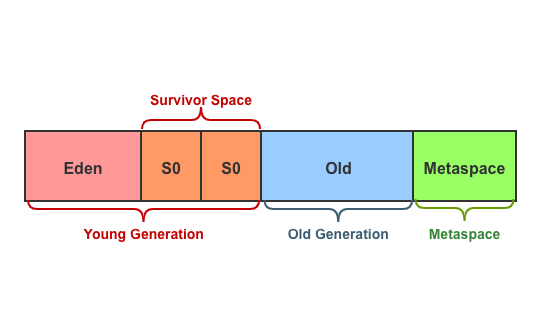

### 1 什么样的对象需要被回收？

在进行内存回收钱，需要先判定哪些对象还“活着”，哪些对象“已死”。从GC算法演进过程中，有2大算法来判定对象是否是垃圾。

#### 1.1 引用计数算法

引用计数算法（Reference Counting）核心就是计算对象被引用的次数，当计数为零，也就是没有被任何对象引用时，这个对象就会被判定为垃圾。

引用计数算法优点包括算法简单，判定效率高。一些注明的应用，如微软的COM计数，Python等使用的正式这种方式进行内存管理。但这种看似简单的算法需要配合很多额外的处理才能保证正确工作，引用计数最著名的问题就是无法简单的解决循环依赖（Reference-Cycle）的问题，这也是Java没有采用这种算法的根本原因！

> Python综合使用引用计数和标记-清除算法的解决引用计数问题。

#### 1.2 可达性分析

可达性分析（Reachability Analysis）是目前主流编程语言所采用的算法来判断对象是否存活。这个算法的思路就是从一系列称为“GC Roots”对象作为起始节点集，根据这些节点的引用关系，依次往下搜索，搜索过程所经过的路径成为引用链（Reference Chain），如果某个对象到GC Root没有引用链，那么该对象将不可达，也就会被判定为垃圾。

在Java中，作为GC Root的对象有：

- 线程栈中引用的对象，如方法堆栈中使用的参数、局部变量、临时变量等。
- 方法区中类静态属性引用的对象，常量引用的对象，如字符串池等。
- 本地方法栈中引用的对象。
- 所有被同步锁（synchronization）持有的对象。
- 反应Java虚拟机内部情况的JMXBean，本地代码缓存等。
- 新生代中被老年代引用的对象，或者G1算法中被其他Region引用的对象。

#### 1.3 引用分类

除了我们常见的强引用类型，Java中还存在几种引用类型：

- 强引用（Strongly Reference），指的是我们通常所说的引用。
- 软引用（Soft Reference），用于描述一个对象还有用，但非必须的对象，在内存不足时会被回收。
- 弱引用（Weak Reference），与软引用类似，表示非必须对象，但弱引用对象在下一次GC时就会被回收。
- 虚引用（Phantom Reference），它是最弱的一种引用，虚引用的对象唯一作用就是在GC时会收到一个系统通知。

这4中引用的强度依次减弱

> 按首字母记忆：**强软弱虚**。

#### 1.4 对象的起死回生

当对象通过可达性分析被标记成不可达时，并不代表这个对象一定会死，因为JVM为每个对象提供了一次在死亡之前复活自己的机会。具体来说，在对象判断不可达后，会进行一次筛选，刷选的依据就是是否需要执行对象的`finallize()`方法，如果对象重写了`finallize()`方法，那么该对象将会被发送到一个名为F-Queue的队列，并在稍后由虚拟机自动创建的、低调度优先级的Finalizer线程去执行他们的`finallize()`方法，执行完成后收集器会对这些对象进行**第二次**小规模的标记，如果被判定为垃圾，那么将会被垃圾回收。

`finallize()`方法是对象逃脱死亡的最后一次机会，如果对象要进行自救，只需重新与引用链上的任何一个对象关联上即可，比如：

```java
public class FinalizerTest {
    private static FinalizerTest that;

    public static void main(String[] args) {
        // 创建一个对象，然后置为null，将被gc
        that = new FinalizerTest();
        that = null;
      
        // 执行gc
        System.gc();
        // finalize方法执行可能有延迟
        // 强制让它执行
        System.runFinalization();

        // 对象还活着
        if (that != null) {
            System.out.println("object alive.");
        }

        // 再次置为null
        that = null;

        System.gc();
        System.runFinalization();

        // finalize方法只会被执行一次
        // 也就是对象只会被复活一次
        if (that != null) {
            System.out.println("object alive.");
        } else {
            // 对象已死
            System.out.println("object died.");
        }
    }

    @Override
    protected void finalize() {
        System.out.println("execute finalize");
        // 成功自救
        that = this;
    }
}
```

正如上述注释写的那样：**finalize方法无论如何只会被系统调用一次**，所以第二次不可能再起死回生了。

`finallize()`方法本意是在对象回收时自动释关联资源，如文件句柄、TCP连接等，但这个方法往往缺点大于优点，Java9中已经将该方法标记为弃用状态。

刚好最近看到一篇文章，也能说明`finallize()`的缺点，所以在此记录。（Java8环境）执行下面的代码，在一段时间后会报错：

```java
public static void main(String[] args) {
    for (int i = 0; i < 2000; i++) {
        try {
            // 注意这里
            // 创建了一个线程池，但没有任何引用
            Executors.newSingleThreadExecutor().submit(() -> {
            });
        } catch (RejectedExecutionException ex) {
            System.out.println("Exception happened at " + i + "th iteration");
            ex.printStackTrace();
        }
    }
}

// 异常信息
Exception happened at 954th iteration
java.util.concurrent.RejectedExecutionException: Task java.util.concurrent.FutureTask@25bbe1b6 rejected from java.util.concurrent.ThreadPoolExecutor@5702b3b1[Terminated, pool size = 0, active threads = 0, queued tasks = 0, completed tasks = 0]
	...
```

`newSingleThreadExecutor`使用了`FinalizableDelegatedExecutorService`对象，这个对象其实包装的是`ThreadPoolExecutor`对象，而且重载了`finalize`方法，以关闭线程池。

```java
public class Executors {
  
  public static ExecutorService newSingleThreadExecutor() {
      return new FinalizableDelegatedExecutorService
          (new ThreadPoolExecutor(1, 1,
                                  0L, TimeUnit.MILLISECONDS,
                                  new LinkedBlockingQueue<Runnable>()));
  }
  ...
    
  static class FinalizableDelegatedExecutorService
        extends DelegatedExecutorService {
        FinalizableDelegatedExecutorService(ExecutorService executor) {
            super(executor);
        }
        // 重载终结者方法，主要作用就是关闭线程池
        protected void finalize() {
            super.shutdown();
        }
    }
  
  // 中间人角色，包装了ExecutorService
  static class DelegatedExecutorService{
      private final ExecutorService e;
      ...
      DelegatedExecutorService(ExecutorService executor) { e = executor; }
    
      public Future<?> submit(Runnable task) {
            // 当执行到下面的submit方法后
            // 当前对象（即this）会被判定为垃圾（因为没被任何引用）
            return e.submit(task);
      }
  }
}
```

当执行submit方法时调用的其实是`ThreadPoolExecutor`中的方法，也就是`FinalizableDelegatedExecutorService`和它的父类`DelegatedExecutorService`只是作为一个中间人的角色，当它调用submit方法后（这时候task可能还没被提交到线程池），自己就没被任何对象引用了，也就会被判定为垃圾，进而会被垃圾回收，`finalize`进而会被执行，线程池被关闭，这时候如果task才被提交的话就会报上面的异常。

详情参见R大的分析： https://www.zhihu.com/question/51244545/answer/126055789。

> this的声明周期可能在方法还没执行完就结束，此时如果重写finalize就会产生意外效果。
>
> 在JDK9中新增了`Reference.reachabilityFence`方法来让对象保持引用。

#### 1.5 方法区的回收

方法区也会被回收，但是回收的频率比较低，因为性价比较低。

关于是否要对类型进行回收，JVM提供了`-Xnoclassgc`参数进行控制。对于大量使用反射、动态代理，或者Groovy等动态语言，可能会频繁的创建、销毁类型，此时就需要JVM具有卸载类型信息的能力，避免方法区占用内存过大。

JVM还提供了一系列用于跟踪类型加载的参数，具体参考网上说明。

### 2 垃圾收集算法

可以想象，在一个运行的Java应用中，很多对象都是“朝生夕死”，在Web应用场景尤为突出，而又有一些对象存活力顽强，比如静态对象等。根据这些特点，垃圾收集算法一般都采用的是分代垃圾回收算法，在Java中，内存会被分配成以下区域：



具体的介绍参见《堆空间》章节。

在划分出不同的区域之后，垃圾收集器才可以每次只回收其中一部分区域，针对HotSpot VM的实现，它里面的GC按照回收区域可以分成部分收集（Partical GC）和整堆收集（Full GC）：

- 新生代收集（Minor GC或Old GC）：只是新生代的垃圾收集
- 老年代收集（Major GC或Old GC）：只是老年代的垃圾收集
  - 目前只有CMS收集器会单独收集老年代
- 混合收集（Mixed GC）：收集整个新生代及部分老年代
  - 目前只有G1收集器会有这种行为
- 整堆收集（Full GC）：收集整个java堆和方法区

根据每一个区域对象的特性，有针对性的发展出了“标记-清除”、“标记-复制”、“标记-压缩”算法。

#### 2.1 标记-清除算法

标记-清除（Mark-Sweep）算法是最早也是最基础的算法。它分成“标记”和“清除”两个阶段：首先标记出所有需要清除的对象，标记完成后，统一回收被标记的对象。标记算法前面已经介绍过了。

这个算法有两个缺点：

- 执行效率不稳定，如果有大量对象需要被回收，那么就需要大量的标记-清除，随着对象的增多性能也随之下降
- 内存空间的碎片化问题，清理之后会产生大量不连续的内存碎片，而碎片太多会导致程序无法及时为较大对象分配连续的内存。

#### 2.2 标记-复制算法

1969年，为了解决碎片化问题，有人提出了“半区复制”（Semispace Copying）算法：将内存划分成大小相等的2个区域，每次只使用其中的一个区域，当标记阶段结束后，将存活对象复制到另一块区域中，从而回收当前整个区域的内存，也就不会产生内存碎片的问题了。

当然，如果大量的对象都是存活的，那么复制算法将会产生很大的开销，但如果多数对象是可回收的，那么就不用考虑空间碎片化的复杂情况了。

这种实现方式简单高效，缺点也很明显：浪费内存，而且只有对象大量“朝生夕死”的情况下才高效。

在Hotspot虚拟机中，采用了更优的半区复制分代策略，称为“Appel式回收”：将新生代分成3个部分，Eden、s0、s1，Eden区和s0区存活的对象将会拷贝到s1区，然后清空Eden和s0，这种情况下只有10%的空间被浪费（三个区域默认配比8:1:1）。

#### 2.3 标记-整理算法

标记-复制算法在对象存活率较高时效率会降低，而老年代对象恰好具有这样的特点，为此，1974年有人提出了有针对性的“标记-整理”（Mark-Compact）算法。其中标记的过程和上述算法一样，但在后续步骤中，不是直接清理可回收对象，而是将所有存活的对象移动到内存空间的一端，然后清理掉边界以外的内存。

这种算法缺点也非常突出，就是老年代对象往往存活率较高，也就是在进行内存整理的时候需要移动的对象占了绝大多数，而且这个过程需要STW，是一种极为负重的操作。

衡量垃圾收集算法的指标有：吞吐量、低延迟，针对不同的指标，Hotspot提供了不同的收集器。如果重点考虑吞吐量，可以使用Parallel Scavenge，它是基于标记整理算法的；而如果重点关注的是低延迟，可以使用CMS算法，它是基于标记清除算法，只是在无法容忍分区碎片时才退化成标记-整理算法。

### 3. 参考

- [Java Platform, Standard Edition HotSpot Virtual Machine Garbage Collection Tuning Guide](https://docs.oracle.com/javase/8/docs/technotes/guides/vm/gctuning/toc.html) GC调优指南