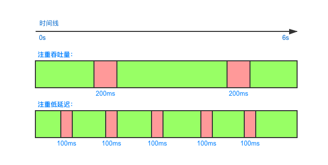
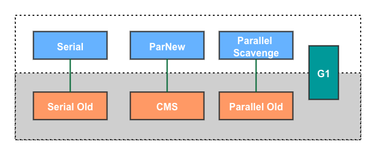
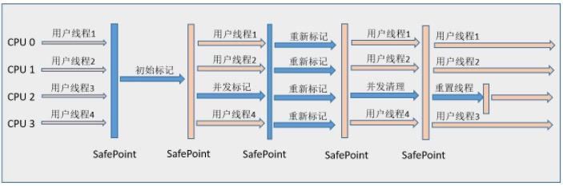
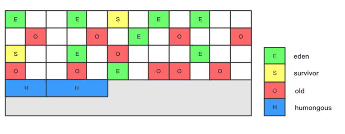

### 1. Hotspot算法实现细节

细节包括“根节点枚举”、“安全点”、“安全区域”等部分，按照我的认知，这里的知识点比较难，而且面试应该也不会问得这么什么，所以就没花精力在这里。了解详情参见《深入理解Java虚拟机》。

### 2. 垃圾收集器相关

#### 2.1 并发与并行

并发与并行在并发编程中指定是时间范围内是否是同时在执行。而在Hotspot中，指的是用户线程和GC线程是否是同时执行：

- 串行（Serial）指的是同一时间内只有一个GC线程在运行，此时会STW（即用户线程全部暂停）。
- **并行**（Parallel）描述的是多条垃圾收集器线程之间的关系，说明同一时间有多条这样的线 程在协同工作，通常默认此时用户线程是处于等待状态，也就是STW。
- **并发**（Concurrent）描述的是多条垃圾收集器线程之间的关系，说明同一时间有多条这样的线 程在协同工作，通常默认此时用户线程是处于等待状态。

#### 2.2 记忆集与卡表

在对新生代执行垃圾收集时，有可能存在老年代引用新生代的情况，这种情况下为了避免误判就需要把老年代对象加入GC Roots中，基本上就相当于进行了全堆扫描。

为了解决这种跨代引用带来的问题，Hotspot引用了记忆集（Remembered Set）**抽象**数据结构，它记录从非收集区域指向收集区域的指针集合的抽象数据结。

而卡表（Card Table）就是记忆集的具体实现。基于卡表的技术将内存区域划分成若干个内存块，称为卡页（Card Page），卡页通常是2的n次幂，默认是512字节。卡表中为每个卡页维护了一个标志位，记录了相关卡页是否有指向新生代的引用，如果有那么这个卡页就被认为是脏页（Dirty）。这样的话，在进行GC时，就不用扫描整个老年代了，而只需要在卡表中寻找脏卡并加入GC Roots就行了。

那卡表中的标志位是怎么维护的呢？Hotspot通过了写屏障（Write Barrier）技术来维护卡表的。写屏障类似于Spring中的AOP操作，虚拟机会为所有的写操作生成相应的指令，而收集器在写屏障中增加了更新卡表的操作。显然，写屏障会产生额外的性能开销，当然这种开销相对来扫描整个老年代来说代价还是相当低的。

在高并发的场景下，写屏障还存在另外一个问题“伪共享”（False Sharding）：当多个线程同时操作卡表时，可能会导致更新卡表时正好写入一个缓存行而影响性能。

> 伪共享这一部分涉及到了CPU缓存行的相关知识，目前还不清楚到底是咋回事，以后填坑。

#### 2.2 垃圾收集性能指标说明

评估垃圾收集器有3个核心指标：

- **吞吐量**（Throughput）：指的是用户代码执行时间占程序总运行时间的比例。例如，程序运行了10min，垃圾收集SWT占用1min，那吞吐量就是90%，即`(10-1)/10`。
- **暂停时间**：垃圾收集时用户线程被暂停的时间（STW），暂停时间越短表示延迟越低，即低延迟（Latency）
- **内存占用**（Footprint）：Java堆所占的内存大小

如上图所示，针对吞吐量优先的场景，可能延迟会比较高；而针对需要低延迟的场景，吞吐量可能会比较低。在Hotspot垃圾收集器演进的过程中，大都都是针对吞吐量和暂停时间进行的优化。例如：Parallel侧重于吞吐量，CMS侧重于低延迟（暂停时间短），而G1在保证最大吞吐量的情况下降低停顿时间。

#### 2.3 垃圾收集器搭配概览

按并发/并行分类：
- 串行回收器：Serial、Serial Old
- 并行回收器：ParNew、Parallel Scavenge、Parallel Old
- 并发回收器：CMS、G1

按代分类：

- 年轻代：Serial、ParNew、Parallel Scavenge
- 老年代：Serial Old、CMS、Parallel Old
- 混合：G1

按新生代和老年代组合分类：

上图描述的是常用组合，并非所有组合。

### 3. Hotspot垃圾收集器详解

#### 3.1 Serial：串行回收

Serial是只有一个GC线程的收集器，从名字可以看出，它是串行的。在进行垃圾回收时，它会暂停所有的用户线程。Serial收集器虽然单一而且古老，但是简单高效，到目前为止，依然是client模式下新生代的默认收集器。对于内存受限的环境来说，它是所有收集器里额外内存占用（Memory footprint）最小的。对于单核处理器来说，Serial没有线程交互的开销，专心做垃圾回收自然可以获得最高的单线程收集效率。

#### 3.2 ParNew：并行回收

ParNew其实是Serial的多线程并行版本：

与Serial相比，除了GC线程数有所增加之外，并没有太多的创新之处。但是，只有它才能和CMS收集器配合工作（Serial也可以，但是对于server模式来说，ParNew更优）。也就是说直到CMS的出现，才巩固了ParNew的地位。

#### 3.3 Parallel Scavenge：可空吞吐量

Parallel Scavenge同样多个GC线程并行执行，但这个收集器的目标在与达到一个可控的吞吐量（Throughput）。

PS提供了2个参数用于精准控制吞吐量：

- `-XX:MaxGCPauseMillis` 控制最大的GC停顿时间，GC收集器将尽量保证GC时间小于这个时间。需要注意的是，这个时间是以牺牲吞吐量和新生代空间为代价换取的。
- `-XX:GCTimeRatio` 设置垃圾收集占用程序总运行时间的百分比，0-100之间的数字，也就是吞吐量的倒数。

由于与吞吐量关系密切，因此也被成为“吞吐量优先收集器”。除了上述的两个参数之外，PS还提供了`-XX:+UseAdaptiveSizePolicy`参数，它的作用就是让PS自适应调整内存占用配比，虚拟机会根据当前运行情况动态调整参数以提供最适合的停顿时间和最大的吞吐量，这种调节方式成为自适应的调节策略（GC Ergonomics）。

#### 3.4 Serial Old：串行回收

Serial Old是Serial的老年代版本，它同样是单线程的，基于标记-整理算法。这个收集器是CMS收集器发生失败时的后备方案，在并发收集发生Concurrent Mode Failure时使用。

#### 3.5 Parallel Old

Parallel Old是Parallel Scavenge的老年代版本。

#### 3.6 CMS：并发标记清除

CMS（Concurrent Mark Sweep）收集器是以最短回收停顿为目标的收集器，目前互联网上很大一部分应用都是用的CMS。它的回收过程分成4个步骤：

1. 初始标记（CMS initial mark）：标记GC Roots能直接关联到的对象，会**STW**，但速度很快
2. 并发标记（CMS concurrent mark）：与用户线程并发执行，从GC Roots开始遍历整个对象树，速度较慢，但不会STW
3. 重新标记（CMS remark）：修正并发标记期间用户线程运作导致标记产生变动的那部分记录，这个阶段也会**STW**
4. 并发清除（CMS concurrent sweep）：清理掉标记阶段已经死亡的对象，由于不需要移动对象，所以与用户线程同时（并发）运行

CMS虽然非常优秀，但缺点也非常明显：

- CMS收集器对资源非常敏感。CMS默认启动的回收线程数是：`(CPU核数+3)/4`，在并发标记、并发清除阶段与用户线程同时执行，如果CPU核心数较低（不足4核），对用户线程的影响会变大，因为会分出一半的CPU资源来执行GC。

- 无法处理浮动垃圾（Floating Garbage）。浮动垃圾指的是在并发标记和并发清理阶段产生的垃圾，CMS无法在当次收集时清理它们，只能留到下一次清理。正因为如此CMS不能等待堆空间满的时候才去执行GC，必须预留一部分控件给CMS执行时使用。在JDK5中，当老年代占用达68%就会执行CMS，JDK6时这个阈值提升到了92%，也可以通过`-XX:CMSInitiatingOccupancyFraction=70`来调节占比。

  如果CMS运行期间预留的内存无法满足新对象分配的需要，就会出现“并发失败”（Concurrent Mode Failure），此时CMS将启动预备方案：冻结用户线程，启用Serial Old来回收老年代对象，这会导致更长时间的停顿，显然是一种最糟糕的情况。所以这个比重需要按照实际情况来权衡设置。

- 产生内存碎片。CMS是基于标记-清除算法实现的收集器，这就意味着程序可能会产生大量的碎片，如果找不到一块连续的内存分配给大对象，将会导致Full GC，而此时由于需要整理内存，所以无法并发执行，停顿时间变得更长了。CMS提供了2个参数，用来决定在Full GC时是否进行内存压缩：

  - `-XX:+UseCMSCompactAtFullCollection` 在Full GC时启用内存压缩（默认开启）
  - `-XX:CMSFullGCsBeforeCompaction=0` 在执行多少次Full GC后才进行内存压缩，0表示每次Full GC都进行压缩

#### 3.7 G1：兼具吞吐量和低延迟

G1（Garbage First）是一款面向服务端的垃圾收集器，JDK9发布时，G1宣布取代Parallel Scavenge和Parallel Old，成为服务端模式默认的垃圾收集器，而CMS也被标记为弃用状态。

在G1中，内存划分和以往任何收集器都不一样，它将内存划分成多个Region（区域），每个Region可以充当Eden、Survivor，或老年代空间中的一种。此外，G1中还有一种特殊的Region：Humongous，专门用于存放大对象的，这里的大对象指的是大小超过了Region大小的1/2的对象，而每个Region的大小可以通过`-XX:G1HeapRegionSize`参数来指定。

如上图所示，虽然还存在Eden、Survivor等，但是G1不再要求他们是连续的内存了，而之所以G1能够准确的建立停顿预测模型，正式因为它将Region作为最小的内存回收单元，可以有效的避免了对整个堆的垃圾回收。

> Region内部内存分配采用的同样是指针碰撞的方式，并且也存在TLAB。

即使G1将内存划分成了很多个Region，但是也会STW，因为不同的Region之间会相互引用，所以在清理当前Region时，需要知道它里面的对象还被哪些Region所引用。那如何查找被哪些Region引用呢？遍历整个空间或许是一种方案，但是非常糟糕，可以想象在一个128G或者更大的内存中遍历所有对象是一件多么恐怖的事情。

G1为每个Region维护了一个**记忆集**（Remembered Set），它会维护别的Region指向自己的指针，并标记这些指针在哪些卡、页范围内，当进行GC时，会把RSet加入GC Roots。G1记忆集本质是一种哈希表，Key是指向其他Region的指针，Value是卡表索引的集合。

> 虽然其他的垃圾收集器也有记忆集的概念，但是G1实现的记忆集功能要复杂得多，因此G1会比其他的收集器占用更多的内存。据统计，G1需要占用**额外10%-20%的内存**来维持收集器的工作。

G1 GC主要分成以下几个步骤：

- 初始标记（Initial Marking）：仅标记GC Roots能直接关联到的对象，这个阶段会导致用户线程短暂的STW。
- 并发标记（Concurrent Marking）：从GC Roots开始进行可达性分析，递归扫描整个堆，找出要回收的对象，这个过程相对较耗时，但是并发的过程，所以对用户线程影响不大。在这个阶段如果发现整个Region都是垃圾，那么该Region将会被立即释放。
- 最终标记（Final Marking）：用于修正并发标记阶段标记的结果，在造成STW。G1中采用了比CMS更快的初始快照算法：snapshot-at-the-beginning（SATB）。
- 筛选回收（Live Data Counting and Evacuation）：负责更新各Region信息，对各Region回收价值和成本进行排序，根据用户所希望的停顿来制定回收计划。因为这里涉及到对象的移动，所以必须暂停所有的用户线程，也就是STW。

从上述步骤能看出，除了并发标记阶段，其他步骤都会造成STW。换言之，它并非纯粹追求低延迟，官方给它设定的目标是在延迟可控的前提下尽量提升吞吐量。

> 如果内存回收速度赶不上内存分配速度，G1也会像CMS一样被迫冻结用户线程，进行Full GC，从而造成长时间的STW。

#### 3.8 ZGC：低延迟

特点：

- 支持TB级垃圾回收
- 最大GC停顿时间不超过10ms
- 奠定未来GC的基础
- 最坏的情况吞吐量只会下降15%

GC执行步骤：

- 初始标记（Mark Start）：和G1、CMS的初始标记一样，会造成STW
- 并发标记（Concurrent Mark）
- 结束标记（Mark End）：会造成STW
- 并发Relocate（Concurrent Relocate）：

https://club.perfma.com/article/679812

### 4. 总结

GC发展阶段：Serial => Parallel（并行） => Concurrent（并发） => G1 => ZGC。

| 收集器            | 分类           | 作用位置 | 使用算法             | 特点                     | 适用场景                             |
| ----------------- | -------------- | -------- | -------------------- | :----------------------- | :----------------------------------- |
| Serial            | 串行回收       | 新生代   | 标记复制             | 单线程，简单高效         | 单CPU的client模式                    |
| ParNew            | 并行回收       | 新生代   | 标记复制             | 多线程                   | 与CMS搭配使用                        |
| Parallel Scavenge | 并行回收       | 新生代   | 标记复制             | 多线程，以吞吐量为目标   | 侧重吞吐量，后台运算不需要交互的场景 |
| Serial Old        | 串行回收       | 老年代   | 标记整理             | 单线程                   | 单CPU的client模式，CMS后背方案       |
| Parallel Old      | 并行回收       | 老年代   | 标记整理             | 多线程                   | 侧重吞吐量，后台运算不需要交互的场景 |
| CMS               | 老年代         | 老年代   | 标记清理             | 并发执行，以低延迟为目标 | 注重低延迟场景，B/S                  |
| G1                | 并发、并行运行 | Mix      | 标记-复制、标记-整理 |                          | 面向服务端应用                       |

