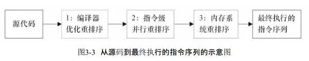

The Java memory model specifies how and when different threads can see values written to shared variables by other threads, and how to synchronize access to shared variables when necessary.

JMM规定了一个线程如何和何时可以看到由其他线程修改过后的共享变量的值，以及在必须时如何同步的访问共享变量。

> 总结成：JMM规定了并发情况下共享变量读写情况。

在了解JMM要解决的问题之前，需要了解一些相关的知识。

### 1. 相关知识

#### 1.1 缓存一致性

在多处理器系统中，每个处理器都有自己的高速缓存，而它们又共享同一主内存（MainMemory）。基于高速缓存的存储交互很好地解决了处理器与内存的速度矛盾，但是也引入了新的问题：缓存一致性（CacheCoherence）

当多个处理器的运算任务都涉及同一块主内存区域时，将可能导致各自的缓存数据不一致。如果真的发生这种情况，那同步回到主内存时该以谁的缓存数据为准呢？为了解决一致性的问题，需要各个处理器访问缓存时都遵循一些协议，在读写时要根据协议来进行操作，这类协议有MSI、MESI(Illinois Protocol)、MOSI、 Synapse、Firefly及Dragon Protocol等。

#### 1.2 指令重排序

在程序执行期间，为了提升性能，从程序编译阶段到最终解释执行阶段多个环节都可能会发生指令重排序：



#### 1.3 工作内存与主内存

线程拥有自己的工作内存（Working Memory），线程对变量的所有读写操作都必须在各自的工作内存中进行。对于主内存的操作，工作内存必须拷贝变量的副本到工作内存，不能直接读写主内存（Main Memory），线程之间也无法直接访问对方工作内存中的数据。


如上图所示，本地内存（工作内存）A和本地内存B由主内存中共享变量x的副本。假设初始时，这3个内存中的x值都为0。线程A在执行时，把更新后的x值(假设值为1)临时存放在自己的本地内存 A中。当线程A和线程B需要通信时，线程A首先会把自己本地内存中修改后的x值刷新到主内存中，此时主内存中的x值变为了1。随后，线程B到主内存中去读取线程A更新后的x值，此时线程B的本地内存的x值也变为了1。

> 主内存、工作内存并不等同于堆空间、线程栈。从更基础的层次上说，主内存直接对应于物理硬件的内存，而为了 获取更好的运行速度，虚拟机(或者是硬件、操作系统本身的优化措施)可能会让工作内存优先存储于寄存器和高速缓存中，因为程序运行时主要访问的是工作内存。

### 2. JMM解决的问题

#### 2.1 原子性（Atomicity）

JMM直接保证了基本数据类型的访问、读写都是具备原子性的(例外就是long和double的非原子性协定)。如果应用场景需要一个**更大范围的原子性保证**（经常会遇到），就需要使用synchronized关键字，因此在synchronized块之间的操作也具备原子性。

与原子性相关的2个概念，经常被提到，在这里列出来：
- **数据竞争**：当多个线程同时访问同一数据，同时至少有一个线程需要写这个数据，且没有任何排它锁来控制访问，称为数据竞争（Data Race），参考[链接](https://docs.oracle.com/cd/E19205-01/820-0619/geojs/index.html)。
- **竞态条件**（Race Condition）指的是程序的执行结果依赖于线程的执行顺序。数据竞争可能会导致竞态条件，但并非必要条件。

#### 2.2 可见性（ Visibility）

**可见性就是指当一个线程修改了共享变量的值时，其他线程能够立即得知这个修改**。Java内存模型是通过在变量修改后将新值同步回主内存，在变量读取前从主内存刷新变量值这种依赖主内存作为传递媒介的方式来实现可见性的，无论是普通变量还是volatile变量都是如此。普通变量与volatile变量的区别是，volatile的特殊规则保证了新值能立即同步到主内存，以及每次使用前立即从主内存刷新。因此我们可以说volatile保证了多线程操作时变量的可见性，而普通变量则不能保证这一点。

除了volatile之外，Java还有两个关键字能实现可见性，它们是synchronized和final。同步块的可见性是由“对一个变量执行unlock操作之前，必须先把此变量同步回主内存中(执行store、write操作)”这条规则获得的。而final关键字的可见性是指：被final修饰的字段在构造器中一旦被初始化完成，并且构造器没有把“this”的引用传递出去(this引用逃逸是一件很危险的事情，其他线程有可能通 过这个引用访问到“初始化了一半”的对象)，那么在其他线程中就能看见final字段的值。

#### 2.3 有序性（Ordering）

Java程序中天然的有序性可以总结为一句话：如果在本线程内观察，所有的操作都是有序的；如果在一个线程中观察另一个线程， 所有的操作都是无序的。前半句是指“线程内似表现为串行的语义”(Within-Thread As-If-Serial
 Semantics)，后半句是指“指令重排序”现象和“工作内存与主内存同步延迟”现象。

Java语言提供了volatile和synchronized两个关键字来保证线程之间操作的有序性，volatile关键字本身就包含了禁止指令重排序的语义，而synchronized则是由“一个变量在同一个时刻只允许一条线程对其进行lock操作”这条规则获得的，这个规则决定了持有同一个锁的两个同步块只能串行地进入。

### 3. Happens-Before

Happens-Before可以直观的理解为：前一个操作的结果对后续操作是可见的，它约束了编译器的优化行为，要求编译器优化后一定遵循Happens-Before规则。

```java
class VolatileExample {
  int x = 0;
  volatile boolean v = false;
  
  // 线程A执行该方法
  public void writer() {
    // 规则1：x=42 Happens-Before v=true
    x = 42;
    v = true;
  }
  
  // 线程B执行该方法
  public void reader() {
    if (v == true) {
      print(x);// 这里x会是多少呢？
      // 规则2：v=true Happens-Before x==true
      // 规则3：x=42 Happens-Before x==true
    }
  }
}
```

具体来说（参照上述代码）：

1. 在单个线程中，程序的执行结果是有序的。如代码所示，如果没有该规则，那么线程B打印的x可能是0（CPU缓存的原因导致），也可能是42。
2. volatile变量规则。对一个 volatile 变量的写操作， Happens-Before 于后续对这个 volatile 变量的读操作。
3. 传递性。如果 A Happens-Before B，且 B Happens-Before C，那么 A Happens-Before C。
4. 管程中的锁规则。管程是一种同步原语，在Java中指的是`synchronized`，这条规则指的是对一个锁的解锁 Happens-Before 于后续对这个锁的加锁。
5. 线程start()规则。指的是如果线程A启动线程B，那么start()操作Happens-Before于线程B的任意操作。
6. 线程join()规则。指的是在线程A中join()等待线程B，那么线程B中的任意操作Happens-Before于join()操作的返回。

> 单线程内JVM只规定了结果的正确性，并没有规定一定得按照代码的顺序执行。也就是说在某些情况下，编译器可能从性能的角度出发修改执行顺序，即使是单个线程！

### 4. 双检锁

上代码：

```java
public class DoubleCheckLock {
    private static volatile Instance instance;

    public static Instance getInstance() {
        // 从性能角度考虑，先判断是否已初始化
        if (instance == null) {
            // 加锁
            synchronized (DoubleCheckLock.class) {
                // 再次判断是否已初始化，防止上锁期间被其他线程初始化
                if (instance == null) {
                    // 创建实例（重点）
                    instance = new Instance();
                }
            }
        }
        return instance;
    }
}
```

如代码所示，`instance`变量需要标记`volatile`关键词，否则在并发情况下其他线程有可能使用了还未完全初始化的`instance`对象。

具体来说，一个对象的初始化分成3个步骤，伪代码如下：

```java
memory = allocate();   // 步骤1：申请内存
ctorInstance(memory);  // 步骤2：初始化内存 
instance = memory;     // 步骤3：将instance指向分配的内存
```

而JVM可能会对调步骤2、3的顺序。而这种对调就会导致其他线程能够使用正在初始化中的`instance`对象，也就会导致意外情况。

解决这个问题的方案有2种：第一种是使用volatile（上述例子就是这样的）；第二种就是基于类静态初始化，代码如下：

```java
public class InstanceFactory {
   
    private static class InstanceHolder {
        // 静态初始化
        public static Instance instance = new Instance();
    } 
    
    public static Instance getInstance() {
        return InstanceHolder.instance;
    }
}
```

如上述代码所示，这是一种线程安全的延迟初始化方案。JVM规定类在初始化时持有初始化锁，类初始化期间，所以其他访问该类的线程都会被阻塞，所以线程安全的。而instance初始化过程被重排的问题，由于其他线程此时都被阻塞，所以就不会存在能访问到中间状态的情况。