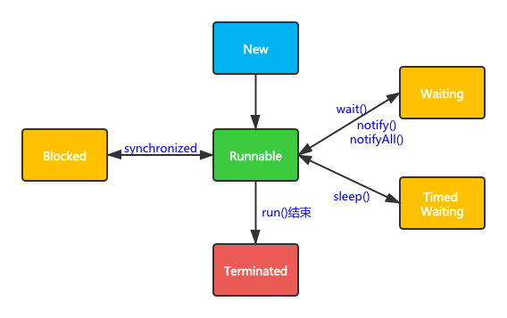

线程也叫轻量级进程，是CPU调度的最小单位。

### 1. 线程状态



- New 新创建但是还未启动时线程状态

- Runnable 就绪或运行中

- Blocked 线程阻塞于锁的状态

  使用synchronized将进入该状态

- Waiting 处于等待状态

  当执行`Object.wait()`、`Object.join()`、`LockSupport.park()`都会进入该状态，使用`Object.notify()`、`Object.notifyAll()`、`LockSupport.unpark(thread)`将会从该状态唤醒

- Time Waiting 带有超时时间的等待

  调用`Thread.sleep`、或`Object.wait(long)`、`Thread.join(long)`、`LockSupport.parkNanos()`、`LockSupport.parkUntil()`进入该状态

- Terminated 终止状态，表示程序已经运行结束

### 2. 线程打断

中断可以理解成线程的一个标识位，表示运行中的线程是否被其他线程中断。线程打断是协作式的，其他线程通过调用该线程的`interrupt()`方法来设置该线程的中断标识位置，线程需要通过`isInterrupted()`检测当前线程是否被中断，也可以通过静态方法`Thread.interrupted()`来重置中断标识位。注意：`isInterrupted()`对于已经处于`Terminated`状态的线程来说始终会返回`false`。

### 3. 被弃用的方法

suspend()、resume()和stop()方法分别表示堆线程执行暂停、恢复和终止操作。这3个方法均被标记为弃用，使用他们会非常危险：

- `suspend()`执行后不会释放占用的锁，容易导致死锁。
- `stop()` 方法会强行结束线程，以至于线程连释放资源的机会都没有，类似于强行杀死进程kill -9。假如线程持有`ReentrantLock`锁，当执行stop()后，锁不会被释放，其他线程永远没有机会获取到这把锁了。

### 4. 线程间通信

#### 4.1 等待通知机制

等待通知机制指的是一个线程A调用了某个对象O的`wait()`方法进入等待状态，而另一个线程B通过调用对象O的`notify()`或`notifyAll()`方法来唤醒线程A。这里需要说明的是，线程必须持有对象O的监视器（monitor）才能使用通知等待机制，否则将会抛出`java.lang.IllegalMonitorStateException`异常。

以下这段代码为例：

```java
public static void main(String[] args) throws Exception {
    Thread waitThread = new Thread(()->{
        synchronized (lock) {
            // 当条件不满足时，一直等待，等待期间lock锁会被释放
            while (!flag) {
                try {
                    lock.wait();
                } catch (InterruptedException e) {
                    e.printStackTrace();
                }
            }
            System.out.println("满足条件了，执行自定义逻辑...");
        }
    });
    
    Thread notifyThread = new Thread(()->{
        // 加锁，拥有lock的
        synchronized (lock) {
            // 获取lock的锁，然后进行通知，此时不会释放lock的锁
            // 直到当前线程释放了lock后，WaitThread才能从wait方法中返回
            lock.notifyAll();
            // 执行其他逻辑....
        }
    });

    waitThread.start();
    TimeUnit.SECONDS.sleep(1);
    notifyThread.start();
}
```

上述代码被前人总结成了一个经典的通知等待编程范式：

```java
// 等待-编程范式
synchronized(对象) { 
  while(条件不满足) {
    对象.wait();
  } 
  // 符合条件的处理逻辑
}

// 通知-编程范式
synchronized(对象) { 
  // 其他逻辑
  对象.notifyAll();
}
```

#### 4.2 管道输入/输出流

这个好像很少被人们提到，先忽略了

#### 4.3 Thread.jon()

如果一个线程A执行了thread1.join()语句，那么线程A会阻塞等待thread1运行终止。join内部使用的也是等待/通知机制，此时线程终止时会调用`notifyAll()`。

### 5. ThreadLocal

Java提供了ThreadLocal为了避免变量被多个多线程共享。ThreadLocal是面试中高频问题，所以需要理解内部的实现。下面的代码是一份精简的实现，代码结构与JDK提供的一致：

```java
class Thread {
  //内部持有ThreadLocalMap
  ThreadLocal.ThreadLocalMap threadLocals;
}
class ThreadLocal<T>{
  
  public T get() {
    //首先获取线程持有的ThreadLocalMap
    ThreadLocalMap map = Thread.currentThread().threadLocals;
    //在ThreadLocalMap中查找变量
    Entry e =  map.getEntry(this);
    return e.value;  
  }
  
  static class ThreadLocalMap{
    Entry[] table;
    //根据ThreadLocal查找Entry
    Entry getEntry(ThreadLocal key){
    }
    //Entry定义
    static class Entry extends WeakReference<ThreadLocal>{
      Object value;
      Entry(ThreadLocal<?> k, Object v) {
          // 调用super创建k的弱引用
          super(k);
          value = v;
      }
    }
  }
}
```

从上述代码可以看到：

1. `ThreadLocalMap`是用来存储线程本地变量的字典，它定义在Thread中，使用的是开放寻址法解决hash冲突的，这个与HashMap的链表发不太一样。
2. 字典中存储的Entry对象是弱引用类型，但是弱引用类型只针对`ThreadLocal`。也就是说当`ThreadLocal`不再使用时，`ThreadLocal`会被回收，但是value对象不会，因为它始终存在一条从Thread对象过来的引用，只有所属线程结束后value才会被GC，也就是存在内存泄露的可能。

当在线程池线程中使用ThreadLocal时，内存泄露会被放大，因为线程的生命周期很长。所以，在使用ThreadLocal后需要及时清理，像这样：

```java

ExecutorService es;
ThreadLocal tl;
es.execute(()->{
  //ThreadLocal增加变量
  tl.set(obj);
  try {
    // 省略业务逻辑代码
  }finally {
    //手动清理ThreadLocal 
    tl.remove();
  }
});
```

### 6. 线程上下文切换

#### 6.1 上下文切换概述

处理器给每个线程分配 CPU 时间片（Time Slice），线程在分配获得的时间片内执行任务。当一个线程的时间片用完了，或者因自身原因被迫暂停运行了，这个时候，另外一个线程（可以是同一个线程或者其它进程的线程）就会被操作系统选中，来占用处理器。这种一个线程被暂停剥夺使用权，另外一个线程被选中开始或者继续运行的过程就叫做**上下文切换**（Context Switch）。

在发生上下文切换时，操作系统需要保存当前线程的上下文信息，然后切换到另一个线程并且恢复它的上下文信息。

那上下文都包括哪些内容呢？具体来说，它包括了寄存器的存储内容以及程序计数器存储的指令内容。CPU 寄存器负责存储已经、正在和将要执行的任务，程序计数器负责存储 CPU 正在执行的指令位置以及即将执行的下一条指令的位置。

导致上下文切换的原因有：

- 线程状态切换，如从Running转换到Blocked
- 自发性上下文切换，如sleep、park等
- 非自发性上下文切换，如线程的时间片用完，GC的STW暂停线程

上述原因可以总结成线程的状态切换会导致上线文切换。

在Linux下可以使用`pidstat`来监控单个应用程序的上下文切换频率，也可以使用`vmstat`命令来监视所有应用的上下文切换频率。

#### 6.2 上下文切换优化

- 减少锁的持有时间，锁的持有时间越长，就意味着有越多的线程在等待该竞争资源释放。
- 降低锁的粒度，同步锁可以保证对象的原子性，我们可以考虑将锁粒度拆分得更小一些，以此避免所有线程对一个锁资源的竞争过于激烈。具体包括：
  - 锁分离，如使用读写锁
  - 锁分段，将锁分解
- 非阻塞乐观锁替代竞争锁
- wait/notify 优化，过早地唤醒等待的线程会导致很多没必要的上下文切换，建议使用Condition下的锁替代wait/notify
- 合理设置线程池线程数
- 优化/减少JVM垃圾回收

https://time.geekbang.org/column/article/102619

https://time.geekbang.org/column/article/102974