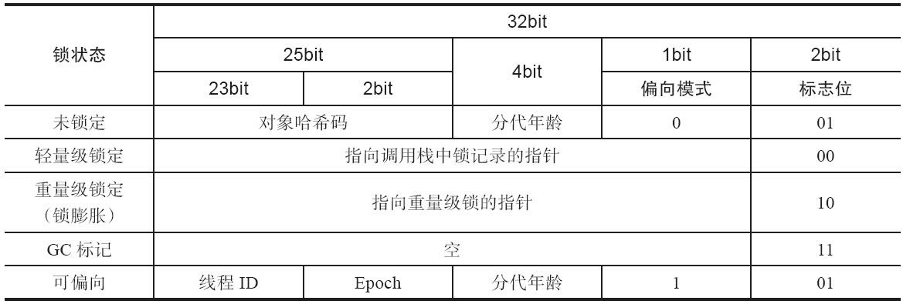
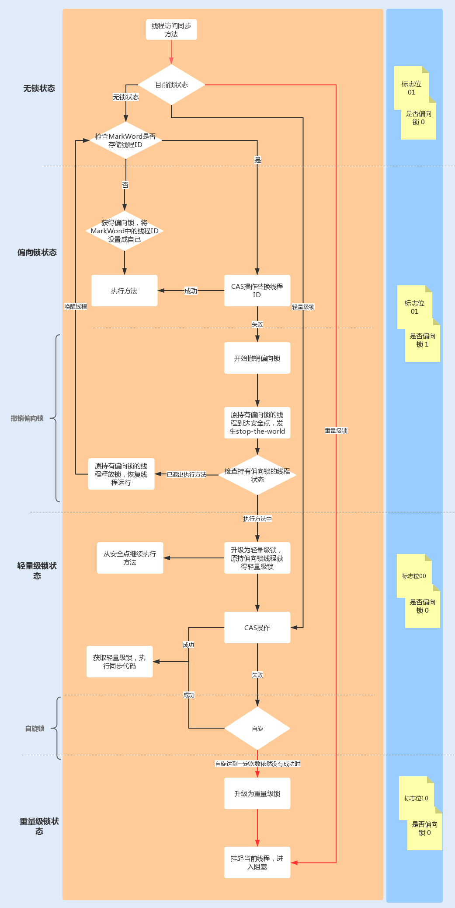

### 1. 自旋锁

### 2. 互斥锁synchronized

#### 2.1 synchronized的使用

Java中的每一个对象都可以作为锁，具体表现为以下3种形式：

- 对于普通方法，锁的是当前实例（即this）
- 对于静态方法，锁的是当前的Class对象
- 对于同步块，锁的是传递给synchronized的对象

以下是synchronized的使用示例：

```java
private Object locker = new Object();

// 关键字在代码块上，锁为括号里面的对象
public void method1() {
    synchronized (locker) {
        // code
    }
}

// 关键字在实例方法上，锁为当前实例
public synchronized void method2() {
    // code
}

// 关键字在静态方法上，锁为当前Class对象
public static synchronized void method3() {
    // code
}

```

接下来，我们通过字节码分析它的底层实现。可以通过以下命令查看生成的字节码：

```bash
javap -c -verbose SynchronizedTest.class
```

`method1`输出的字节码如下：

```assembly
public void method1();
    descriptor: ()V
    flags: ACC_PUBLIC
    Code:
      stack=2, locals=3, args_size=1
         0: aload_0
         1: getfield     
         4: dup
         5: astore_1
         6: monitorenter  #  monitorenter 指令
         7: aload_1
         8: monitorexit   # monitorexit 指令
         9: goto          17
        12: astore_2
        13: aload_1
        14: monitorexit   # monitorexit 指令
        15: aload_2
        16: athrow
        17: return
      ...
```

可以看到synchronized 在修饰同步代码块时，是由`monitorenter`和`monitorexit`指令来实现同步的。进入`monitorenter`指令后，线程将持有`Monitor`对象，退出`monitorenter`指令后，线程将释放该`Monitor`对象。注意第二个`monitorexit`是确保程序执行异常时仍然能退出同步。

接下来看看`method2`的字节码：

```assembly
public synchronized void method2();
    descriptor: ()V
    flags: ACC_PUBLIC, ACC_SYNCHRONIZED  # ACC_SYNCHRONIZED修饰
    Code:
      stack=0, locals=1, args_size=1
         0: return
      LineNumberTable:
        line 23: 0
      LocalVariableTable:
        Start  Length  Slot  Name   Signature
            0       1     0  this   Lme/hanrui/jvm/SynchronizedTest;
```

可以看到，当方法本身（签名）使用synchronized修饰时，编译器没有生成相应的monitor指令，而是在flag字段中加入了`ACC_SYNCHRONIZED`标识。JVM会使用了标识来区分一个方法是否是同步方法。当方法调用时，调用指令将会检查该方法是否被设置 ACC_SYNCHRONIZED 访问标志。如果设置了该标志，执行线程将先持有 Monitor 对象，然后再执行方法。在该方法运行期间，其它线程将无法获取到该 Mointor 对象，当方法执行完成后，再释放该 Monitor 对象。

synchronized的加锁、解锁机制是基于管程（Monitor）对象实现的，而管程的底层依赖于底层的操作系统的**互斥锁**（Mutex Lock），如果要阻塞或唤醒一个线程就需要操作系统的帮忙，这就不可避免的陷入用户态到内核态的转换中，而这种状态切换非常耗时而且浪费处理器时间，早期的synchronized被人诟病效率低下。

**在Java 6之后从JVM层面对synchronized较大优化，为了减少获得锁和释放锁所带来的性能消耗，引入了轻量级锁和偏向锁，当获取这2种类型的锁失败时转而使用重量级锁（也就是上面提到的互斥锁）**。

#### 2.2 synchronized内部实现

在具体介绍锁优化机制之前，需要先了解一些Mark Word，因为synchronized借助于Mark Word实现了锁优化机制。

##### 2.2.1 Mark Word结构介绍

Mark Word是对象头内部大小是32bit或64bit的动态数据结构，以便在极小的空间内存储尽量多的信息。下图是32位的HotSpot虚拟机Mark Word的存储结构：



接下来，我们**通过锁升级的顺序依次讲解**。

##### 2.2.2 偏向锁

**偏向锁主要用来优化同一线程多次申请同一个锁的竞争**，指的是这个锁会偏向于第一个获得他的线程，如果在接下来的执行过程中，该锁一直没有被其他线程获取，则持有偏向锁的线程永远不需要再进行同步。**偏向锁默认是开启的状态**，可以通过配置JVM参数`-XX:-UseBiasedLocking`来禁用。

当锁对象第一次被线程获取时，虚拟机将会把Mark Word中的标识位设为`01`，并且把偏向模式设为`1`，表示进入偏向模式。同时使用CAS操作把相应的线程ID记录在Mark Word中。如果CAS成功，持有偏向锁的线程每次进入同步块时虚拟机都不再进行任何同步操作。

但一旦出现其它线程竞争锁资源时，将会撤销（revoke）偏向锁（偏向模式置为0）。偏向锁的撤销需要等待全局安全点，暂停持有该锁的线程，同时检查该线程是否还在执行该方法，如果是，则升级锁，反之则被其它线程抢占。

> 一个值得注意的地方是哈希码。如果对象头中已经设置过哈希码，那么将无法获取偏向锁；如果对象处于偏向锁状态，然后收到了计算哈希码请求时，它的偏向锁会立即被撤销，转而膨胀成重量级锁。
>
> 具体内容参见《深入理解Java虚拟机》12.3.4 轻量级锁章节。

##### 2.2.3 轻量级锁

当有另外一个线程竞争获取这个锁时，由于该锁已经是偏向锁，当发现对象头 Mark Word 中的线程 ID 不是自己的线程 ID，就会进行 CAS 操作获取锁，如果获取成功，直接替换 Mark Word 中的线程 ID 为自己的 ID，该锁会保持偏向锁状态；如果获取锁失败，代表当前锁有一定的竞争，偏向锁将升级为轻量级锁。

虚拟机将首先将当前线程栈帧中建立一个名为锁记录（Lock Record）的空间，用于存储锁对象的Mark Word拷贝（官方管这个拷贝叫Displaced Mark Word）。然后虚拟机将使用CAS操作尝试把对象的Mark Word更新为指向Lock Record的指针，如果更新成功，表示这个线程拥有了这个对象的锁，此时会将对象的Mark Word锁标识为置为`00`。如果更新失败，意味着存在竞争线程，虚拟机首先会检查对象的Mark Word指向的是否是当前线程的栈帧，如果是说明是当前线程持有对象的锁，那直接进入同步块继续执行就可以了；否则，JVM将通过自旋方式不断尝试获取（轻量级）锁，自旋锁重试之后如果抢锁依然失败，同步锁就会升级至重量级锁。

轻量级锁解锁过程和加锁过程相反。当代码执行完同步块时，虚拟机将使用CAS操作将Displaced Mark Word替换回对象头中。

**轻量级锁适用于线程交替执行同步块的场景，绝大部分的锁在整个同步周期内都不存在长时间的竞争。**

##### 2.2.4 重量级锁

当进入重量级锁流程时，锁标志的状态值变为`10`，此时Mark Word中存储的就是指向重量级锁(互斥量)的指针，后面等待锁的线程也必须进入阻塞状态。

重量级锁使用C++结构如下：

```c++
ObjectMonitor() {
   _header = NULL;
   _count = 0; //记录个数
   _waiters = 0,
   _recursions = 0;
   _object = NULL;
   _owner = NULL;
   _WaitSet = NULL; //处于wait状态的线程，会被加入到_WaitSet
   _WaitSetLock = 0 ;
   _Responsible = NULL ;
   _succ = NULL ;
   _cxq = NULL ;
   FreeNext = NULL ;
   _EntryList = NULL ; //处于等待锁block状态的线程，会被加入到该列表
   _SpinFreq = 0 ;
   _SpinClock = 0 ;
   OwnerIsThread = 0 ;
}
```

注意到有2个队列：

- 阻塞队列EntryList，当线程A持有锁时，其他需要获取锁的线程会进入等待队列，处于Blocked状态
- 等待队列WaitSet，当线程持有锁后通过`lock.wait()`等主动进入等待时，线程将会被加入等待队列，并且释放持有的锁。

ObjectMonitor的这2个队列和后面要介绍的ReentrantLock在实现思路上差不多，其实应该有关于阻塞队列、等待队列合适被使用的介绍，但是由于这部分内容是C++实现，而且网上的内容乱七八糟，我无法甄别，所以就不再展开了。

##### 2.2.5 流程图

synchronized内部的锁升级流程图如下：



#### 2.3 synchronized的优缺点

优点：实现基于JVM层面，对用户不可见，不存在兼容性问题

缺点：

- 相比于ReentrantLock来说，synchronized不能以非阻塞的方式获取锁，不能设置锁超时时间
- 锁的粒度较粗，例如不支持读写锁，乐观锁；
- 重量级锁对性能影响较大；
- 无法做到公平锁；
- 被语言本身束缚，无法扩展；
- 不支持像Condition那样的多条件变量；

在性能方面，在并发量不高、竞争不激烈的情况下，synchronized同步锁由于具有分级锁的特性，性能与Lock锁差不多；但是在高并发、高负载的情况下，synchronized同步锁由于竞争激烈会升级成重量级锁，性能上没有Lock锁稳定。

### 3. 通知等待机制

等待通知机制允许一个线程处于等待（挂起）状态直到满足特定的条件为止。与之相关的方法有：

- `xxx.wait()` 阻塞当前线程，并且释放锁
- `xxx.notify()` 在相关临界区执行完成后，随机唤醒一个被阻塞的线程
- `xxx.notifyAll()` 唤醒所有被阻塞的线程

上述方法中的xxx表示的是锁对象，wait和notify操作的必须是同一个锁对象。

典型的使用场景是阻塞队列：

```java
public class BlockingQueue<T> {

    private Queue<T> queue = new LinkedList<T>();
    private int capacity;

    public BlockingQueue(int capacity) {
        this.capacity = capacity;
    }

    // 向队列中放入元素，当队列满时阻塞当前线程
    // 当成功放入一个元素时，通知等待的线程
    public synchronized void put(T element) throws InterruptedException {
        while(queue.size() == capacity) {
            wait();
        }

        queue.add(element);
        notify(); // notifyAll() for multiple producer/consumer threads
    }

    // 从队列中读取一个元素，当队列是空时阻塞当前线程
    // 当成功读取一个元素时，通知等待的线程
    public synchronized T take() throws InterruptedException {
        while(queue.isEmpty()) {
            wait();
        }

        T item = queue.remove();
        notify(); // notifyAll() for multiple producer/consumer threads
        return item;
    }
}
```

上述代码中的`synchronized`、`wait`、`notify`是Java中管程组成的一部分。**管程**（Monitor，也翻译成**监视器**）指的是管理共享变量以及对共享变量的操作过程，让他们支持并发。管程是一种更高级别的同步原语，由编程语言各自实现，Java中内置的管程实现是`synchronized`，Java SDK并发包中还提供了通过 Lock 和 Condition 两个接口来实现管程。

在并发编程领域，有2大核心问题：

- 互斥 同一时间只允许一个线程访问共享资源
- 同步 线程之间如何通信、协作

*我理解的管程应该是一种（指导）概念，就像一个规范一样，主要就是用于解决上述的互斥和同步问题。*
