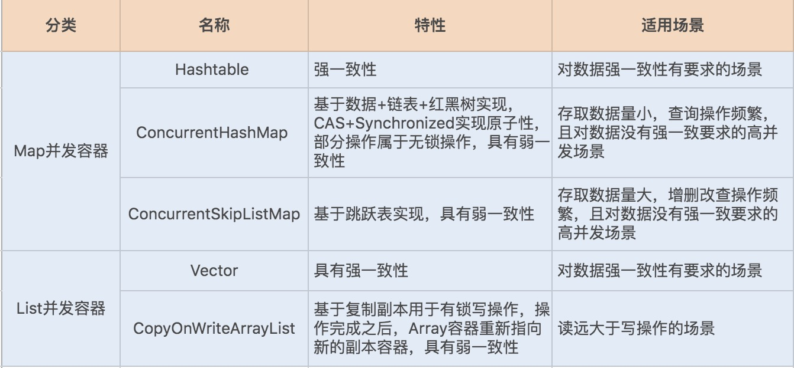

### 1. 并发集合对比



### 2. ConcurrentHashMap源码解析

#### 2.1 插入元素

ConcurrentHashMap使用的是分段锁技术,将ConcurrentHashMap将锁一段一段的存储，然后给每一段数据配一把锁（segment），当一个线程占用一把锁（segment）访问其中一段数据的时候，其他段的数据也能被其它的线程访问，默认分配16个segment。默认比Hashtable效率提高16倍。

在1.8中，ConcurrentHashMap取消了segment分段锁，而采用CAS和synchronized来保证并发安全。数据结构跟HashMap1.8的结构一样，**数组+链表/红黑二叉树**。synchronized**只锁定当前链表或红黑二叉树的首节点**，这样只要hash不冲突，就不会产生并发，效率又提升N倍。

插入元素核心的代码说明：

```java
final V putVal(K key, V value, boolean onlyIfAbsent) {
        // 不允许插入null值
        if (key == null || value == null) throw new NullPointerException();
        int hash = spread(key.hashCode());
        int binCount = 0;
        // 循环是为了一直尝试知道CAS成功
        for (Node<K,V>[] tab = table;;) {
            Node<K,V> f; int n, i, fh;
            if (tab == null || (n = tab.length) == 0)  // 判断是否需要初始化table
                tab = initTable();
            else if ((f = tabAt(tab, i = (n - 1) & hash)) == null) {
              // 如果元素位置是null，说明这里还没有元素插入
              // 使用CAS操作将元素插入
                if (casTabAt(tab, i, null,
                             new Node<K,V>(hash, key, value, null)))
                    break;
            }
            // 扩容的流程是将table的元素依次移动到新table中，并将table元素的hash设为MOVED
            // 如果正在扩容，就帮助扩容
            else if ((fh = f.hash) == MOVED)  
                tab = helpTransfer(tab, f);
            else {
                V oldVal = null;
                // 如果该位置已经有元素了，说明这里是链表或者红黑树结构
                // 此时就需要使用synchronized来锁住链表头部
                synchronized (f) {
                    if (tabAt(tab, i) == f) {
                        // 如果fh>=0 是链表节点
                        if (fh >= 0) {
                            binCount = 1;
                            for (Node<K,V> e = f;; ++binCount) {
                                K ek;
                                // 存在则更新
                                if (e.hash == hash &&
                                    ((ek = e.key) == key ||
                                     (ek != null && key.equals(ek)))) {
                                    oldVal = e.val;
                                    if (!onlyIfAbsent)
                                        e.val = value;
                                    break;
                                }
                                Node<K,V> pred = e;
                                // 不存在则插入
                                if ((e = e.next) == null) {
                                    pred.next = new Node<K,V>(hash, key,
                                                              value, null);
                                    break;
                                }
                            }
                        }
                        else if (f instanceof TreeBin) {
                        // 如果是红黑树结构
                            Node<K,V> p;
                            binCount = 2;
                            // 添加树节点
                            if ((p = ((TreeBin<K,V>)f).putTreeVal(hash, key,
                                                           value)) != null) {
                                oldVal = p.val;
                                if (!onlyIfAbsent)
                                    p.val = value;
                            }
                        }
                    }
                }
                if (binCount != 0) {
                    // 如果链表长度已经达到临界值8 就需要把链表转换为树结构
                    if (binCount >= TREEIFY_THRESHOLD)
                        treeifyBin(tab, i);
                    if (oldVal != null)
                        return oldVal;
                    break;
                }
            }
        }
        // 将当前ConcurrentHashMap的size数量+1
        // 并且判断是否需要扩容
        addCount(1L, binCount);
        return null;
    }
```

从上述的代码可以看出：当要插入的元素位置是null时，直接使用CAS插入；否则，使用synchronized锁住元素位置第一个对象。

由于锁的是每个元素，所以相对于JDK早期版本来说锁的粒度已经非常小了，所以从理论上来说，除非发送Hash碰撞，否则并发量非常小。正因为如此，synchronized由于具有锁优化机制，所以对于这种并发量不大的场景性能反而优于ReentrantLock。

另外一点需要注意的是，当ConcurrentHashMap数据量较大时，Hash碰撞的概率也会随之上升，此时链表会转换为红黑树。红黑树在并发情况下，删除和插入过程中有个平衡的过程，会牵涉到大量节点，因此竞争锁资源的代价相对比较高。

#### 2.2 扩容

在插入元素源码中最后一行是统计table大小的，如果超出了阈值就需要进行扩容。这个方法的源码：

```java
private final void addCount(long x, int check) {
    CounterCell[] as; long b, s;
    if ((as = counterCells) != null ||
        !U.compareAndSwapLong(this, BASECOUNT, b = baseCount, s = b + x)) {
        CounterCell a; long v; int m;
        boolean uncontended = true;
        if (as == null || (m = as.length - 1) < 0 ||
            (a = as[ThreadLocalRandom.getProbe() & m]) == null ||
            !(uncontended =
              U.compareAndSwapLong(a, CELLVALUE, v = a.value, v + x))) {
            fullAddCount(x, uncontended);
            return;
        }
        if (check <= 1)
            return;
        s = sumCount();
    }
    // 当上面计算出来的键值对个数超出sizeCtl时，触发扩容，调用核心方法transfer
    // sizeCtl 类似于HashMap中的threshold，当容量超过这个值时就需要扩容
    // 
    if (check >= 0) {
        Node<K,V>[] tab, nt; int n, sc;
        while (s >= (long)(sc = sizeCtl) && (tab = table) != null &&
               (n = tab.length) < MAXIMUM_CAPACITY) {
            int rs = resizeStamp(n);
            if (sc < 0) {
                if ((sc >>> RESIZE_STAMP_SHIFT) != rs || sc == rs + 1 ||
                    sc == rs + MAX_RESIZERS || (nt = nextTable) == null ||
                    transferIndex <= 0)
                    break;
                if (U.compareAndSwapInt(this, SIZECTL, sc, sc + 1))
                    transfer(tab, nt);
            }
            else if (U.compareAndSwapInt(this, SIZECTL, sc,
                                         (rs << RESIZE_STAMP_SHIFT) + 2))
                transfer(tab, null);
            s = sumCount();
        }
    }
}


```

接下来看看transfer方法：

```java
private final void transfer(Node<K,V>[] tab, Node<K,V>[] nextTab) {
    int n = tab.length, stride;
    // 计算单个线程允许处理的最少table桶首节点个数，不能小于 16
    if ((stride = (NCPU > 1) ? (n >>> 3) / NCPU : n) < MIN_TRANSFER_STRIDE)
        stride = MIN_TRANSFER_STRIDE; // subdivide range
    if (nextTab == null) {            // 初始化nextTab
        try {
            @SuppressWarnings("unchecked")
            Node<K,V>[] nt = (Node<K,V>[])new Node<?,?>[n << 1];
            nextTab = nt;
        } catch (Throwable ex) {      // try to cope with OOME
            sizeCtl = Integer.MAX_VALUE;
            return;
        }
        nextTable = nextTab;
        transferIndex = n;
    }
    int nextn = nextTab.length;
    ForwardingNode<K,V> fwd = new ForwardingNode<K,V>(nextTab);
    boolean advance = true;
    boolean finishing = false; // to ensure sweep before committing nextTab
    for (int i = 0, bound = 0;;) {
        Node<K,V> f; int fh;
        while (advance) {
            int nextIndex, nextBound;
            if (--i >= bound || finishing)
                advance = false;
            else if ((nextIndex = transferIndex) <= 0) {
                i = -1;
                advance = false;
            }
            else if (U.compareAndSwapInt
                     (this, TRANSFERINDEX, nextIndex,
                      nextBound = (nextIndex > stride ?
                                   nextIndex - stride : 0))) {
                bound = nextBound;
                i = nextIndex - 1;
                advance = false;
            }
        }
        if (i < 0 || i >= n || i + n >= nextn) {
            int sc;
            if (finishing) {
                nextTable = null;
                table = nextTab;
                sizeCtl = (n << 1) - (n >>> 1);
                return;
            }
            if (U.compareAndSwapInt(this, SIZECTL, sc = sizeCtl, sc - 1)) {
                if ((sc - 2) != resizeStamp(n) << RESIZE_STAMP_SHIFT)
                    return;
                finishing = advance = true;
                i = n; // recheck before commit
            }
        }
        else if ((f = tabAt(tab, i)) == null)
            advance = casTabAt(tab, i, null, fwd);
        else if ((fh = f.hash) == MOVED)
            advance = true; // already processed
        else {
            synchronized (f) {
                if (tabAt(tab, i) == f) {
                    Node<K,V> ln, hn;
                    if (fh >= 0) {
                        int runBit = fh & n;
                        Node<K,V> lastRun = f;
                        for (Node<K,V> p = f.next; p != null; p = p.next) {
                            int b = p.hash & n;
                            if (b != runBit) {
                                runBit = b;
                                lastRun = p;
                            }
                        }
                        if (runBit == 0) {
                            ln = lastRun;
                            hn = null;
                        }
                        else {
                            hn = lastRun;
                            ln = null;
                        }
                        for (Node<K,V> p = f; p != lastRun; p = p.next) {
                            int ph = p.hash; K pk = p.key; V pv = p.val;
                            if ((ph & n) == 0)
                                ln = new Node<K,V>(ph, pk, pv, ln);
                            else
                                hn = new Node<K,V>(ph, pk, pv, hn);
                        }
                        setTabAt(nextTab, i, ln);
                        setTabAt(nextTab, i + n, hn);
                        setTabAt(tab, i, fwd);
                        advance = true;
                    }
                    else if (f instanceof TreeBin) {
                        TreeBin<K,V> t = (TreeBin<K,V>)f;
                        TreeNode<K,V> lo = null, loTail = null;
                        TreeNode<K,V> hi = null, hiTail = null;
                        int lc = 0, hc = 0;
                        for (Node<K,V> e = t.first; e != null; e = e.next) {
                            int h = e.hash;
                            TreeNode<K,V> p = new TreeNode<K,V>
                                (h, e.key, e.val, null, null);
                            if ((h & n) == 0) {
                                if ((p.prev = loTail) == null)
                                    lo = p;
                                else
                                    loTail.next = p;
                                loTail = p;
                                ++lc;
                            }
                            else {
                                if ((p.prev = hiTail) == null)
                                    hi = p;
                                else
                                    hiTail.next = p;
                                hiTail = p;
                                ++hc;
                            }
                        }
                        ln = (lc <= UNTREEIFY_THRESHOLD) ? untreeify(lo) :
                            (hc != 0) ? new TreeBin<K,V>(lo) : t;
                        hn = (hc <= UNTREEIFY_THRESHOLD) ? untreeify(hi) :
                            (lc != 0) ? new TreeBin<K,V>(hi) : t;
                        setTabAt(nextTab, i, ln);
                        setTabAt(nextTab, i + n, hn);
                        setTabAt(tab, i, fwd);
                        advance = true;
                    }
                }
            }
        }
    }
}
```

好吧，扩容的流程我实在是没看到！从网上的信息了解到：

- 扩容时如果有并发操作，那么其他并发的线程将协助进行扩容（牛逼！破音）

#### 2.3 Java8中的改进

Java7中ConcurrentHashMap是用的是分段锁，Java8中使用的是更细粒度的锁，锁的对象是内部数组的每一个元素，或者链表的头元素。

#### 2.4 总结

1. ConcurrentHashMap 中的 get、size 等方法没有用到锁，ConcurrentHashMap 是弱一致性的，因此有可能会导致某次读无法马上获取到写入的数据。对于需要强一致的场景，考虑使用Hashtable。
2. 正如在2.1小节所说，红黑树在并发情况下，删除和插入过程中有个平衡的过程，会牵涉到大量节点，因此竞争锁资源的代价相对比较高。如果数据量在千万级别，且存在大量增删改操作，则可以考虑使用 ConcurrentSkipListMap，而且它的Key也是有序的。

这部分参考极客专栏：https://time.geekbang.org/column/article/103541，内容较多看不太懂，以后有时间可以参考：[解读Java 8 中为并发而生的 ConcurrentHashMap](https://mp.weixin.qq.com/s?__biz=MzU2NjIzNDk5NQ==&mid=2247490296&idx=1&sn=67eb185bbc4f8bab8cbd20b40bc2c76f&chksm=fcaec0e4cbd949f2b614b967d9d7e562b9a3a627b8e480c737ed245fd02fc8c01e6e8c3d235a&mpshare=1&scene=23&srcid&sharer_sharetime=1592870313038&sharer_shareid=8b6cce4aa7804cb52b9e5a9c08be2cf4%23rd)。

### 3. CopyOnWriteArrayList

CopyOnWriteArrayList是ArrayList的并发版本，它实现了读操作无锁，写操作则通过操作底层数组的新副本来实现，是一种读写分离的并发策略。因此对于读多写少的并发场景，使用CopyOnWriteArrayList再好不过了。

### 4. Queue

Java 并发包里面 Queue 这类并发容器是最复杂的，你可以从以下两个维度来分类。

一个维度是阻塞与非阻塞，所谓阻塞指的是**当队列已满时，入队操作阻塞；当队列已空时，出队操作阻塞**。

另一个维度是单端与双端，单端指的是只能队尾入队，队首出队；而双端指的是队首队尾皆可入队出队。

Java 并发包里阻塞队列都用 Blocking 关键字标识，单端队列使用 Queue 标识，双端队列使用 Deque 标识。

- 单端阻塞队列：
  1. `ArrayBlockingQueue` 有界队列，内部使用数组实现
  2. `LinkedBlockingQueue` **可选**有界队列，内部使用链表实现
  3. SynchronousQueue 同步阻塞，入队操作必须有出队操作，类似于rpc调用
  4. LinkedTransferQueue
  5. PriorityBlockingQueue 优先队列
  6. DelayQueue 延迟出队
- 双端阻塞队列：LinkedBlockingDeque
- 单端非阻塞队列：`ConcurrentLinkedQueue`，
- 双端非阻塞队列：ConcurrentLinkedDeque

阻塞队列常用的方法：

```java

// 获取并移除队列头结点，如果队列为空则阻塞等待
E take() throws InterruptedException;
// 与take相似，但不阻塞
E poll();
// 与take相似，但阻塞会有超时时间
E poll(long timeout, TimeUnit unit) throws InterruptedException;
// 从队列取一个元素，但是不删除
E peek();
// 与peek类似，但是如果队列为空则抛出异常
E element();

// 插入元素，如果队列已满，则等待直到队列出现空闲空间
void put(E e) throws InterruptedException;  
// 与put类似，但是队列已满时抛出异常
boolean add(E e);
// 与put类似，但队列已满时只会返回false，并不阻塞
boolean offer(E e);
```

#### 4.1 ArrayBlockingQueue源码解析

```java
public class ArrayBlockingQueue<E> extends AbstractQueue<E>
        implements BlockingQueue<E>, java.io.Serializable {
    // 存储队列元素的数组
    // 由于这里是一个环形队列，所以需要3个计数器来分别记录生产者、消费者进度，以及元素总数
    final Object[] items;
  
    // 消费者消费进度
    int takeIndex;
    // 生产者生产进度
    int putIndex;
    // 元素总数
    int count;
  
    // 重入锁
    final ReentrantLock lock;
    // 队列为空条件变量，此时需要视情况阻塞消费者，直到队列非空
    private final Condition notEmpty;
    // 队列已满条件变量，此时需要视情况阻塞生产者，直到队列容量低于阈值
    private final Condition notFull;
  
    // 添加元素，如果队列满了会阻塞当前线程（生产者）
    public void put(E e) throws InterruptedException {
          checkNotNull(e);
          final ReentrantLock lock = this.lock;
          lock.lockInterruptibly();
          try {
              // 如果队列满了，阻塞生产者
              while (count == items.length)
                  notFull.await();
              // 入队
              enqueue(e);
          } finally {
              lock.unlock();
          }
    }
  
    private void enqueue(E x) {
        final Object[] items = this.items;
        // 添加元素导致putIndex
        items[putIndex] = x;
        // 如计数已达数组长度，重置putIndex
        if (++putIndex == items.length)
            putIndex = 0;
        // 队列中元素数量
        count++;
        // 唤醒消费者
        notEmpty.signal();
    }
  
    // 从队列中获取一个元素，如果队列是空，那么阻塞当前线程（消费者）
    public E take() throws InterruptedException {
        final ReentrantLock lock = this.lock;
        lock.lockInterruptibly();
        try {
            // 队列是空，阻塞消费者
            while (count == 0)
                notEmpty.await();
            // 出队
            return dequeue();
        } finally {
            lock.unlock();
        }
    }
  
    private E dequeue() {
        final Object[] items = this.items;
        @SuppressWarnings("unchecked")
        // 从最新的消费进度处读取元素
        E x = (E) items[takeIndex];
        items[takeIndex] = null;
        // 如果已经到数组末尾则重置消费进度
        if (++takeIndex == items.length)
            takeIndex = 0;
      
        // 元素总数减一
        count--;
        if (itrs != null)
            itrs.elementDequeued();
        // 唤醒被阻塞的生产者
        notFull.signal();
        return x;
    }
}
```

ArrayBlockingQueue优点：

- 内部使用数组实现，内存结构紧凑
- 支持公平调度（源码中并未体现，其实就是用的公平锁）

缺点：最大的缺点就是锁的粒度太粗，没有单独针对生产者和消费者的锁

#### 4.2 LinkedBlockingQueue源码解析

LinkedBlockingQueue类定义：

```java
public class LinkedBlockingQueue<E> extends AbstractQueue<E>
        implements BlockingQueue<E>, java.io.Serializable {
  
   // 容量限制
   private final int capacity; 
   // 队列元素数量
   private final AtomicInteger count = new AtomicInteger();
  
   // 使用链表实现
   // 链表的第一个元素，注意第一个元素会一直是虚节点
   transient Node<E> head;
   // 链表的最后一个元素
   private transient Node<E> last;
  
   // 消费者锁
   private final ReentrantLock takeLock = new ReentrantLock();
   // 队列为空条件变量
   private final Condition notEmpty = takeLock.newCondition();
  
   // 生产者锁
   private final ReentrantLock putLock = new ReentrantLock();
   // 队列已满条件变量
   private final Condition notFull = putLock.newCondition();
  
   // 默认会创建成无界队列
   public LinkedBlockingQueue() {
        this(Integer.MAX_VALUE);
   }
  
   public LinkedBlockingQueue(int capacity) {
        if (capacity <= 0) throw new IllegalArgumentException();
        this.capacity = capacity;
        last = head = new Node<E>(null);
    }
}
```

添加元素源码：

```java
public void put(E e) throws InterruptedException {
    if (e == null) throw new NullPointerException();
    // Note: convention in all put/take/etc is to preset local var
    // holding count negative to indicate failure unless set.
    int c = -1;
    Node<E> node = new Node<E>(e);
    final ReentrantLock putLock = this.putLock;
    final AtomicInteger count = this.count;
    putLock.lockInterruptibly();
    try {
        /*
         * Note that count is used in wait guard even though it is
         * not protected by lock. This works because count can
         * only decrease at this point (all other puts are shut
         * out by lock), and we (or some other waiting put) are
         * signalled if it ever changes from capacity. Similarly
         * for all other uses of count in other wait guards.
         */
        // 如果队列已满，阻塞等待
        while (count.get() == capacity) {
            notFull.await();
        }
        // 入队
        enqueue(node);
        // 计数器增加
        c = count.getAndIncrement();
        // 尝试唤醒其他生产者（此时并发的其他生产者会被阻塞在此）
        if (c + 1 < capacity)
            notFull.signal();
    } finally {
        putLock.unlock();
    }
    if (c == 0)
        signalNotEmpty();
}

private void enqueue(Node<E> node) {
    // assert putLock.isHeldByCurrentThread();
    // assert last.next == null;
    last = last.next = node;
}
```

出队源码：

```java
public E take() throws InterruptedException {
    E x;
    int c = -1;
    final AtomicInteger count = this.count;
    final ReentrantLock takeLock = this.takeLock;
    takeLock.lockInterruptibly();
    try {
        // 如果队列为空，那么阻塞等待
        while (count.get() == 0) {
            notEmpty.await();
        }
        // 出队
        x = dequeue();
        // 计数器减一
        c = count.getAndDecrement();
        // 如果队列不为空，尝试唤醒其他的并行消费者
        if (c > 1)
            notEmpty.signal();
    } finally {
        takeLock.unlock();
    }
  
    // 如果队列仍然是满的（什么情况下会出现这种情况呢？）则阻塞生产者
    if (c == capacity)
        signalNotFull();
    return x;
}

private E dequeue() {
    Node<E> h = head;
    Node<E> first = h.next;
    h.next = h; // help GC
    head = first;
    // 将头元素设置成虚节点
    E x = first.item;
    first.item = null;
    return x;
}

private void signalNotFull() {
    final ReentrantLock putLock = this.putLock;
    putLock.lock();
    try {
        notFull.signal();
    } finally {
        putLock.unlock();
    }
}
```

LinkedBlockingQueue的优点：

- 生产、消费者分别使用不同的锁，在高并发的情况性能会比ArrayBlockingQueue好

缺点：

- 内部使用链表实现，内存不是连续的，CPU不友好（具体的说就是CPU缓存不友好）
- 不会预分配内存，所以添加元素时会产生一些开销

#### 4.3 ConcurrentLinkedQueue源码解析

ConcurrentLinkedQueue是一个无界的非阻塞队列

```java
public class ConcurrentLinkedQueue<E> extends AbstractQueue<E>
        implements Queue<E>, java.io.Serializable {
   private transient volatile Node<E> head;
   private transient volatile Node<E> tail;
}
```

**源码比较绕，需要花大量时间去研究，暂略过。**

ConcurrentLinkedQueue优点：

- 内部无锁结构，只使用了CAS操作

缺点：

- 不会阻塞生产者、消费者，对于需要阻塞的情况需要自行实现
- 无界队列，使用不善会导致OOM

### 参考

https://time.geekbang.org/column/article/103541