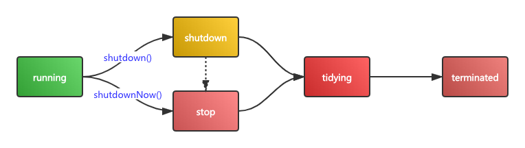
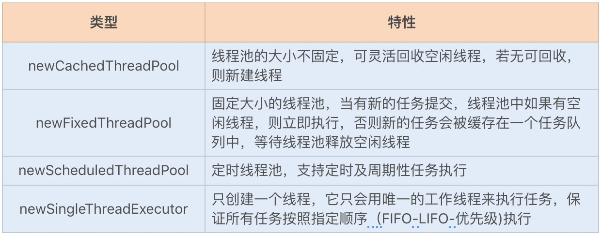

### 1. ThreadPoolExecutor使用介绍

#### 1.1 构造函数参数列表

```java
public ThreadPoolExecutor(int corePoolSize,//线程池的核心线程数量
                          int maximumPoolSize,//线程池的最大线程数
                          long keepAliveTime,//当线程数大于核心线程数时，多余的空闲线程存活的最长时间
                          TimeUnit unit,//时间单位
                          BlockingQueue<Runnable> workQueue,//任务队列，用来储存等待执行任务的队列
                          ThreadFactory threadFactory,//线程工厂，用来创建线程
                          RejectedExecutionHandler handler) //拒绝策略，当提交的任务过多而不能及时处理时，我们可以定制策略来处理任务
```
不知道为什么，面试的时候会问的问题会细致到第几个参数是什么含义，所以上面几个参数需要记住了。

有关于这些参数的最佳实践：

- keepAliveTime 不建议小于0，否则设置core线程可销毁时将抛异常，因为它不可设置为0
- workQueue 推荐设置成有界队列，否则非核心线程数将不会创建
- threadFactory 自定义线程名，方便排查问题，Spring提供了`CustomizableThreadFactory`
- handler 注意各种拒绝策略，默认策略是丢弃并抛出异常，应当按场景使用不同的策略

#### 1.2 线程池使用

##### 1.2.1 线程池的状态

线程池共计有5中状态，他们分别是：

- `RUNNING` 运行中，可以正常接收和消费任务
- `SHUTDOWN` 停止，不再接收新任务，但是队列还没消费完成的任务继续运行
- `STOP` 停止，不接收新任务，并且打断所有正在执行中的任务
- `TIDYING` 所有任务已终止，线程数清零，此时将回调terminated钩子方法
- `TERMINATED` 钩子方法已执行完毕，线程池彻底停摆

可以看到以上五种状态，正好对应线程池从启动到结束整个生命周期。状态流转过程：



如上图所示，当线程池处于running状态时，调用shutdown会进入shutdown状态；调用shutdownNow会进入stop状态。这2个方法的调用是幂等的，也就是可以多次重复调用。如线程池处于shutdown状态，此时调用shutdownNow会将状态变更为stop。

##### 1.2.2 提交任务

有两种方式提交任务：submit、execute，区别是submit的返回值是`Future<?>`，而execute没有返回值。所以对于需要使用返回值的场景请使用submit方法。

当线程池内部缓冲队列已满，或者线程数已达到最大值时，往线程池中添加任务会被拒绝，线程池允许我们自定义拒绝策略来应对这种情况。当前线程池中有以下拒绝策略：

- `AbortPolicy` 丢弃并抛出异常，这是默认的策略
- `DiscardPolicy` 丢弃并且不抛出异常，这会导致无法发现系统的异常状态
- `DiscardOldestPolicy` 丢弃队列中最久的任务
- `CallerRunsPolicy` 由调用者线程（提交任务的线程，这可能是非线程池线程）处理该任务，避免任务丢弃

##### 1.2.3 关闭线程池

关闭线程池的方法有shutdown和shutdownNow，它们的流程如下：

- shutdown 将线程池状态置为**SHUTDOWN**，打断所有的idle线程，**等待**队列中所有元素消费完成，然后依次将线程池状态设置成TIDYING、TERMINATED。
- shutdownNow 将线程池状态设置为**STOP**，打断所有的线程，将队列中未消费的元素保存起来，然后依次将线程池状态设置成TIDYING、TERMINATED。

从上面描述可以看出来，这两个方法的区别是是否等待队列中所有元素消费完成。

##### 1.2.4 线程池监控

以下方法/属性可以用来监控线程池：

- getTaskCount 累计的任务数（已完成+未完成）
- getCompletedTaskCount 已完成的累计任务数
- getLargestPoolSize 曾经创建的最大线程数
- getPoolSize 当前的核心线程数
- getActiveCount 活跃的线程数

此外还可以通过重写`beforeExecute`、`afterExecute`方法来监控任务执行情况，重写`terminated`方法来监控线程池关闭事件。

#### 1.3 工厂方法

由于构造函数参数太多，所以JDK提供了创建线程池的工厂方法：



如上图所示，这些工厂方法几乎覆盖了各种应用场景。但是阿里巴巴手册不推荐使用，因为这些工厂方法封装了内部细节，使用不善（无界队列）就会导致OOM。

#### 1.4 线程数计算公式

以下公式来源于《Java并发编程实战》。

##### 1.4.1 CPU密集型任务

这种类型线程数计算公式：

```java
线程数 = CPU核数 + 1
```
为了计算密集型的线程由于缺页或其他原因导致暂停，额外的线程用于确保CPU始终周期不会被浪费。

##### 1.4.2 IO密集型任务

IO密集型任务，由于线程不会一直执行，所以相对来说线程池的规模应该更大，通用计算公式为：

```java
线程数 = CPU核数 * CPU利用率 * (1 + W/C)
```

其中，`CPU利用率`是0~1的百分比值，`W`(wait)是线程的总等待时间，`C`(computer)是线程的总计算时间。

上述公式如果不考虑严谨性，可以简化成：

```java
线程数= 2 * CPU核数
```

这里做了以下2个假设：

- CPU利用率为100%
- 线程总是处于等待状态，所以W/C约等于1

#### 1.5 利特尔法则

Little's Law

### 2. 源码解析

#### 2.1 类结构

```java
public class ThreadPoolExecutor extends AbstractExecutorService {
   // ctl是JDK高效利用内存的又一体现，它的内存分成2部分：
   // 高3位：用于存储当前线程池的状态
   // 低29位：用于存储当前活跃的线程数
   private final AtomicInteger ctl = new AtomicInteger(ctlOf(RUNNING, 0));
   private final BlockingQueue<Runnable> workQueue;
  
   // 线程创建工厂
   private volatile ThreadFactory threadFactory;
   // 拒绝策略，当队列饱和或线程池已关闭时有新的消息进来该如何处理
   private volatile RejectedExecutionHandler handler;
   // 默认拒绝策略，直接抛出异常RejectedExecutionException
   private static final RejectedExecutionHandler defaultHandler =
        new AbortPolicy();
  
   ... // 字段太多，不再一一列举
}
```

#### 2.2 提交任务

```java
public Future<?> submit(Runnable task) {
    if (task == null) throw new NullPointerException();
    RunnableFuture<Void> ftask = newTaskFor(task, null);
    execute(ftask);
    return ftask;
}

public void execute(Runnable command) {
    if (command == null)
        throw new NullPointerException();
    
    int c = ctl.get();
    // 线程数少于预设的核心线程数时，创建一个新线程来处理任务
    if (workerCountOf(c) < corePoolSize) {
        // 创建新线程（worker），新创建的worker直接来处理这个task
        // 创建可能会失败，此时就需要走正常的处理逻辑了
        if (addWorker(command, true))
            return;
        c = ctl.get();
    }
    // 尝试添加任务到队列，队列满了会返回false
    if (isRunning(c) && workQueue.offer(command)) {
        int recheck = ctl.get();
        // 再次检测运行状态
        if (! isRunning(recheck) && remove(command))
            // 如果线程池不是运行中的状态，尝试回滚并并执行拒绝策略
            reject(command);
        else if (workerCountOf(recheck) == 0)
            // 如果线程数是0，则新增线程数，这个判断实际上是有问题的：
            // 也就是当使用无界队列时，这个逻辑永远不会执行
            // tomcat的就重载了相关逻辑，具体参见它的源码
            addWorker(null, false);
    }
    // 如果队列满了，尝试添加一个线程
    else if (!addWorker(command, false))
        // 如果添加线程失败，执行拒绝策略
        reject(command);
}


```

上述代码中，关于“当使用无界队列时，非核心线程永远都不会创建”的问题参见《Tomcat架构和源码》相关描述。

#### 2.3 添加worker

添加worker源码：

```java
// 添加线程（worker），此时会顺便执行触发此次新增的任务
private boolean addWorker(Runnable firstTask, boolean core) {
    // 很多的前置条件判断
    retry:
    for (;;) {
        int c = ctl.get();
        int rs = runStateOf(c);

        // Check if queue empty only if necessary.
        if (rs >= SHUTDOWN &&
            ! (rs == SHUTDOWN &&
               firstTask == null &&
               ! workQueue.isEmpty()))
            return false;

        for (;;) {
            int wc = workerCountOf(c);
            if (wc >= CAPACITY ||
                wc >= (core ? corePoolSize : maximumPoolSize))
                return false;
            if (compareAndIncrementWorkerCount(c))
                // 尝试增加workerCount计数，退出retry
                break retry;
            c = ctl.get();  // Re-read ctl
            if (runStateOf(c) != rs)
                continue retry;
            // else CAS failed due to workerCount change; retry inner loop
        }
    }

    boolean workerStarted = false;
    boolean workerAdded = false;
    Worker w = null;
    try {
        // 创建一个代表线程的worker
        w = new Worker(firstTask);
        final Thread t = w.thread;
        if (t != null) {
            final ReentrantLock mainLock = this.mainLock;
            mainLock.lock();
            try {
                // Recheck while holding lock.
                // Back out on ThreadFactory failure or if
                // shut down before lock acquired.
                int rs = runStateOf(ctl.get());

                if (rs < SHUTDOWN ||
                    (rs == SHUTDOWN && firstTask == null)) {
                    if (t.isAlive()) // precheck that t is startable
                        throw new IllegalThreadStateException();
                    // 启动worker代表的线程
                    workers.add(w);
                    int s = workers.size();
                    if (s > largestPoolSize)
                        largestPoolSize = s;
                    workerAdded = true;
                }
            } finally {
                mainLock.unlock();
            }
            if (workerAdded) {
                t.start();
                workerStarted = true;
            }
        }
    } finally {
        if (! workerStarted)
            addWorkerFailed(w);
    }
    return workerStarted;
}
```

上述代码虽然很长，很多都是前置条件判断，核心代码还是比较简单的。接下来看看`Worker`对象以及它是如何启动的：

```java
// Worker是ThreadPoolExecutor的内部类，它继承自AQS
// 同时它还实现了Runnable接口，封装了线程执行的所有逻辑
private final class Worker extends AbstractQueuedSynchronizer
    implements Runnable
{
    final Thread thread;
    Runnable firstTask;
    /** Per-thread task counter */
    volatile long completedTasks;

    Worker(Runnable firstTask) {
        setState(-1); // inhibit interrupts until runWorker
        this.firstTask = firstTask;
        // 使用线程工厂创建线程，并将自己作为线程的运行逻辑
        this.thread = getThreadFactory().newThread(this);
    }

    // 线程的执行逻辑
    public void run() {
        runWorker(this);
    }

    // Lock methods
    //
    // The value 0 represents the unlocked state.
    // The value 1 represents the locked state.

    protected boolean isHeldExclusively() {
        return getState() != 0;
    }

    protected boolean tryAcquire(int unused) {
        if (compareAndSetState(0, 1)) {
            setExclusiveOwnerThread(Thread.currentThread());
            return true;
        }
        return false;
    }

    protected boolean tryRelease(int unused) {
        setExclusiveOwnerThread(null);
        setState(0);
        return true;
    }

    public void lock()        { acquire(1); }
    public boolean tryLock()  { return tryAcquire(1); }
    public void unlock()      { release(1); }
    public boolean isLocked() { return isHeldExclusively(); }

    void interruptIfStarted() {
        Thread t;
        if (getState() >= 0 && (t = thread) != null && !t.isInterrupted()) {
            try {
                t.interrupt();
            } catch (SecurityException ignore) {
            }
        }
    }
}
```

可以看到Worker继承自AQS，而没有用ReentrantLock，原因是它会使用非重入功能去反应线程的运行状态。

线程的核心执行(run方法)逻辑调用的是runWorker方法，它定义在ThreadPoolExecutor中：

```java
final void runWorker(Worker w) {
    Thread wt = Thread.currentThread();
    Runnable task = w.firstTask;
    w.firstTask = null;
    w.unlock(); // allow interrupts
    boolean completedAbruptly = true;
    try {
        // 执行第一个任务，或者从队列中取
        while (task != null || (task = getTask()) != null) {
            w.lock();
            // If pool is stopping, ensure thread is interrupted;
            // if not, ensure thread is not interrupted.  This
            // requires a recheck in second case to deal with
            // shutdownNow race while clearing interrupt
            // 只有线程池状态是STOP时才会处理中断信号
            if ((runStateAtLeast(ctl.get(), STOP) ||
                 (Thread.interrupted() &&
                  runStateAtLeast(ctl.get(), STOP))) &&
                !wt.isInterrupted())
                wt.interrupt();
            try {
                // 执行前回调
                beforeExecute(wt, task);
                Throwable thrown = null;
                try {
                    // 执行任务
                    task.run();
                } catch (RuntimeException x) {
                    thrown = x; throw x;
                } catch (Error x) {
                    thrown = x; throw x;
                } catch (Throwable x) {
                    thrown = x; throw new Error(x);
                } finally {
                    // 执行后回调
                    afterExecute(task, thrown);
                }
            } finally {
                task = null;
                w.completedTasks++;
                w.unlock();
            }
        }
        completedAbruptly = false;
    } finally {
        processWorkerExit(w, completedAbruptly);
    }
}

// 从队列中取一个任务，如果返回值是null意味着相应的线程将会运行结束
private Runnable getTask() {
    boolean timedOut = false; // Did the last poll() time out?

    for (;;) {
        int c = ctl.get();
        int rs = runStateOf(c);

        // 如果线程池已停止，或者队列为空
        // 则返回null
        if (rs >= SHUTDOWN && (rs >= STOP || workQueue.isEmpty())) {
            decrementWorkerCount();
            return null;
        }

        int wc = workerCountOf(c);

        // Are workers subject to culling?
        boolean timed = allowCoreThreadTimeOut || wc > corePoolSize;

        // 如果读取任务超时，那么workerCount计数减一，且返回null
        if ((wc > maximumPoolSize || (timed && timedOut))
            && (wc > 1 || workQueue.isEmpty())) {
            if (compareAndDecrementWorkerCount(c))
                return null;
            continue;
        }

        try {
            // 从队列中取一个任务
            // 如果队列是空，那么线程会被阻塞
            // 当有消息入队时，会通过ReentrantLock锁机制唤醒一个线程而并非所有线程（注意！！）
            Runnable r = timed ?
                workQueue.poll(keepAliveTime, TimeUnit.NANOSECONDS) :
                workQueue.take();
            if (r != null)
                return r;
            timedOut = true;
        } catch (InterruptedException retry) {
            timedOut = false;
        }
    }
}
```

从上述代码可以看出，当线程在执行任务过程中会持有锁。也就是说如果线程持有锁就表明它现在正在工作，否则就是空闲状态。

> 有这样一个场景：线程池有500个核心线程，如果队列为空时这500个线程全部被阻塞。当有一条消息入队时，这500个线程是同时被唤醒，还是只唤醒一个？
>
> 答案参考代码中的注释

#### 2.4 线程池关闭

```java
public void shutdown() {
    final ReentrantLock mainLock = this.mainLock;
    mainLock.lock();
    try {
        checkShutdownAccess();
        // 将状态从RUNNING置为SHUTDOWN
        advanceRunState(SHUTDOWN);
        // 打断空闲中的线程
        interruptIdleWorkers();
        onShutdown(); // hook for ScheduledThreadPoolExecutor
    } finally {
        mainLock.unlock();
    }
    tryTerminate();
}

public List<Runnable> shutdownNow() {
    List<Runnable> tasks;
    final ReentrantLock mainLock = this.mainLock;
    mainLock.lock();
    try {
        checkShutdownAccess();
        // 将状态置为STOP
        advanceRunState(STOP);
        interruptWorkers();
        tasks = drainQueue();
    } finally {
        mainLock.unlock();
    }
    tryTerminate();
    return tasks;
}

private void interruptIdleWorkers(boolean onlyOne) {
    final ReentrantLock mainLock = this.mainLock;
    mainLock.lock();
    try {
        for (Worker w : workers) {
            Thread t = w.thread;
            // 如果能成功获取到锁，说明worker线程处于空闲状态，打断它
            if (!t.isInterrupted() && w.tryLock()) {
                try {
                    t.interrupt();
                } catch (SecurityException ignore) {
                } finally {
                    w.unlock();
                }
            }
            if (onlyOne)
                break;
        }
    } finally {
        mainLock.unlock();
    }
}
```

### 3. 线程池原理

> 看了源码后需要及时做总结，否则别人会问的你哑口无言。

线程池是一种池化思想来管理线程，它通过对线程的重复利用从而避免重复创建线程带来性能上的开销。线程池内部原理是较为典型的生产者消费者模型：生产者将待执行的任务提交到线程池，线程池首先会将其放到内部的**缓冲队列**，之后线程池线程通过强制式调度从缓冲池中获取任务并执行，在这个过程中，线程池会按照整体的运行情况去调整线程数。

### 4. 其他

#### 4.1 单个线程池的bug

- 问题 https://www.infoq.cn/article/BAMG55WHQt1iYrNSBRRh
- bug报告 https://bugs.openjdk.java.net/browse/JDK-8145304
- R大分析 https://www.zhihu.com/question/51244545/answer/126055789

```java
public static void main(String[] args) {
    for (int i = 0; i < 2000; i++) {
        try {
            Executors.newSingleThreadExecutor().submit(() -> {
            });
        } catch (RejectedExecutionException ex) {
            System.out.println("Exception happened at " + i + "th iteration");
            ex.printStackTrace();
        }
    }
}
```

### 5. ForkJoinPool

参见：https://mp.weixin.qq.com/s/KYh3EFJNoSkUv4YVWtMa6Q

### 6. 参考

1. https://time.geekbang.org/column/article/104094
2. https://www.bilibili.com/video/BV16J411h7Rd?p=281
3. [线程池源码解读](https://mp.weixin.qq.com/s?__biz=MzU2NjIzNDk5NQ==&mid=2247489427&idx=1&sn=2f1e844671c1b7230cdca72210b2cd16&chksm=fcaecd8fcbd944997b250ce20b64ffb12af677316f64f2eddb21b895fc1a08719880aaab509f&mpshare=1&scene=23&srcid&sharer_sharetime=1589284026669&sharer_shareid=8b6cce4aa7804cb52b9e5a9c08be2cf4%23rd)
4. [从ReentrantLock的实现看AQS的原理及应用](https://tech.meituan.com/2019/12/05/aqs-theory-and-apply.html)

