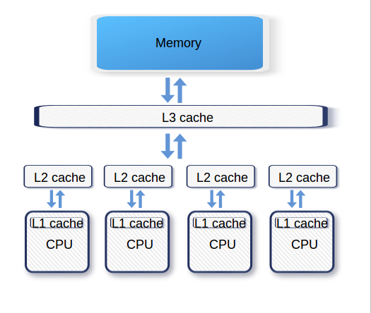

通常CPU有3级缓存，离CPU越近性能越高：



如上图所示，L1、L2级是各核心独占的，L3是共享的。CPU在执行指令时，会依次从L1、L2、L3级缓存中查找，如果在这些级别上都没有找到缓存数据，那么将会从主存中加载数据。

CPU在读取内存时以缓存行（Cache Line）为单位进行加载的，最常见的缓存行大小是64B。现代CPU中，为了保证缓存相对一致性，各个核心需要检测内存的变动，保证内存的一致性。而这种机制将会产生竞争关系，因为一个核心对内存的修改，将导致其他的核心在该内存位置的缓存失效，这就是**伪共享**（False sharing）。

在多线程并发执行的场景下，这种竞争关系可能会让性能大打折扣。举个例子，有这么一个阻塞队列：

```java
public class MyArrayBlockingQueue {
  ...
  /** 出队索引 */
  int takeIndex;
  /** 入队索引 */
  int putIndex;
  ...
}
```

takeIndex和putIndex是彼此独立的2个字段，对这2个字段的修改不会同时发生（程序保证）。

假设现在有线程A在CPU-1上运行，线程B在CPU-2上运行，这2个线程现在需要分别修改上述2个字段，此时CPU会将takeIndex和putIndex作为同一个缓存行从内存中加载进来（以64B为单位加载）:


接下来，无论对takeIndex、还是对putIndex的修改都会导致缓存失效，它们必须重新从内存中读取，这种情况下就不能很好的利用CPU缓存了。

解决办法就是让上述2个字段各自独享缓存行就行了，这种技术叫做缓存行填充。比如让takeIndex独占缓存行，可以在这个字段前后填充56个字节，这样就能保证takeIndex一定能独占缓存行。

类似的实现方式在Disruptor、Netty中都有体现。下面的示例代码出自 Disruptor，Sequence 对象中的 value 属性就能避免伪共享，因为这个属性前后都填充了 56 个字节：

```java
//前：填充56字节
class LhsPadding{
    long p1, p2, p3, p4, p5, p6, p7;
}
class Value extends LhsPadding{
    volatile long value;
}
//后：填充56字节
class RhsPadding extends Value{
    long p9, p10, p11, p12, p13, p14, p15;
}
class Sequence extends RhsPadding{
  //省略实现
}
```

上述代码虽然解决了缓存行失效的问题，但是看起来有点ugly，至少在很多代码检测工具里肯定是不通过的，而且更重要的是JIT在执行过程中可能会优化或重排那些看起来“没用”的字段。为此，在Java8中提供了避免伪共享的注解`@sun.misc.Contended`，参见[这里](http://mail.openjdk.java.net/pipermail/hotspot-dev/2012-November/007309.html)，关于这个注解，网络上没有太多的资料，所以我也不太清楚技术细节。

> 在JDK中，提供了[JOL工具](https://openjdk.java.net/projects/code-tools/jol/)来查看对象的内存布局。

在Linux下，可以使用perf工具检测伪共享：

```bash
#安装perf
yum install perf

// 执行报错
perf c2c record 
```

但是我在测试时发现报错，从网络上的文章来看似乎在Linux内核4.10后才提供。


### 参考：

1. https://time.geekbang.org/column/article/188047
2. https://time.geekbang.org/column/article/98134
3. https://coolshell.cn/articles/20793.html