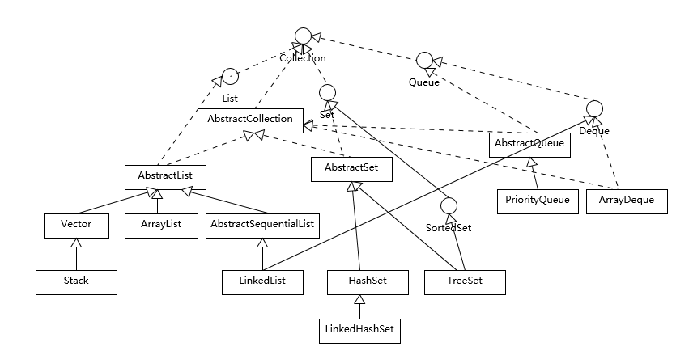

工具：

- 查看字节码：javap -c path/to/file.class

1. String、StringBuilder和StringBuffer的区别是什么？

   - String是Java的基础类，它是不可变的，类似于拼接、裁剪等操作都会产生新的String对象，大量操作可能会产生性能影响。
   - StringBuffer是为了解决字符串操作带来的性能损失而提供的，它是线程安全的，每一个操作都会上锁（`synchronized`），而锁也会带来性能开销。
   - StringBuilder是StringBuffer的无锁版本，因此是非线程安全的，它是绝大多数字符串拼接首选方式。

   

   面试要点：

   - 在Java8中，对于String拼接操作，编译器将优化成使用StringBuilder拼接。
   - `+`号可以拼接字符串、数字、null等，而`String.concat`只能拼接字符串，而且性能也没`+`好。
   - 字符串缓存方法`String.intern`在Java6之前将对象缓存在PermGen中，这个空间很小而且不会被GC，所以容易OOM，Java8后缓存在堆中，避免了OOM问题。
   - String内部实现在Java9中由`char[]`改成了`byte[]`，称为Compact Strings，它占用更小的内存，而且拥有更快的操作速度

   

2. int和Integer的区别是什么？

   int是Java中8大基础类型之一，Integer是int的包装类，二者之间的转换称为装箱/拆箱。JDK提供了`Integer.valueOf`方法对int装箱，同时缓存-128到127之间的对象以提升性能。

   

   同理，其他的基础类型，如果Boolean、Short、Byte、Character等都提供了缓存机制。

   

   面试要点：

   - 理解并分析Integer源码
   - 为什么需要Integer？因为1、泛型在编译期间需要将类型转换成特定的类型，因此必须保证所有的类型能转成Object；2、某些情况下需要传递null值。

   

3. Exception和Error有什么区别？

   二者皆继承于Throwable，Exception通常是可以预料到的意外情况，而Error是通常情况下不大可能会出现的错误（如JVM本身的错误，OutOfMemoryError等）。

   

   Exception又分为checked（可检查）异常和unchecked（不检查）异常，前者需要显示的捕获和处理；后者通常指的是运行时异常（如NullPointException、ArrayIndexOutOfBoundsException等），编译器不强制要求捕获。

   

   checked异常在业界有很大的争论，很多人认为这是一种设计上的错误，观点：

   - checked异常需要捕获和异常恢复，但大都情况下是不可恢复的
   - checked异常不支持函数式编程

   

   异常处理最佳实践：

   - 尽量不要捕获Exception，而应该捕获具体、特定的异常。因为捕获特定异常代表我们考虑到了特定的情况，而且直接捕获Exception可能会捕获意外的异常；有一些异常你希望继续扩散，而不是吞噬。
   - 不要生吞异常。至少得记录日志和异常出现时各个参数呢，尽量详细记录以帮助排查异常产生的原因。
   - 自定义异常。自定义异常使异常信息更加清晰。

   

   面试要点：

   - NoClassDefFoundError 和 ClassNotFoundException 有什么区别？

4. 强引用、软引用、弱引用、幻象引用有什么区别？

   不同的引用类型主要体现在不同的可达性（reachable）状态和对GC的影响

   - 强引用（Strong Reference）就是常见的普通对象引用，如果还有引用指向该对象，就表明它还活着，不能被GC
   - 软引用（Soft Reference）相对强引用来说弱化一些的引用，当内存不足时，会回收这部分对象。软引用通常用来实现缓存相关功能。
   - 弱引用（Weak Reference）弱引用指向的对象（且该对象只被弱引用指向）会在下一次GC时被回收，无论内存是否充足。弱引用通常用于维护一种非强制的映射关系，如果试图获取该对象，存在则使用，不存在则重新创建。常见的例子就是ThreadLocalMap的Entry就是弱引用类型。
   - 虚引用（Phantom Reference）虚引用对象通常无法访问到，虚引用存在的唯一作用就是当它指向的对象被回收时收到系统通知。一些profiler类的工具会使用到这个特性，如跟踪对象被销毁，检测是否有内存泄露（Jetty）等。

   

5. Java中常见的数据结构

   - Java集合关系图：
	
	  
	
	 - Java字典关系图：
	
	   
	
	详细介绍：
   - `Vector`是Java早期提供的线程安全的动态数组，因为线程同步开销较大，所以使用较少
   - `ArrayList`是使用更加广泛的动态数组，非线程安全。内存以数组形式存储，所以适合随机访问
   - `LinkList`是双向链表，使用链表结构实现，删除、插入非常高效
- `Hashtable`是Java早期实现的线程安全哈希表，不支持null键，同步开销较大，使用较少
	- `HashMap`是使用更加广泛的哈希表，非线程安全，支持null键。
   - `TreeMap`是基于红黑树实现的一种提供顺序访问的Map，它的get、put、remvoe等操作时间复杂度是`O(log(n))`
  
   
  
   关于排序：
  
   - 对于原始数据类型，目前使用的是所谓双轴快速排序（Dual-Pivot QuickSort），是一种改进的快速排序算法，早期版本是相对传统的快速排序
   - 而对于对象数据类型，目前则是使用TimSort，思想上也是一种归并和二分插入排序（binarySort）结合的优化排序算法。TimSort 并不是 Java 的独创，简单说它的思路是查找数据集中已经排好序的分区（这里叫 run），然后合并这些分区来达到排序的目的。
   - Java 8 引入了并行排序算法（直接使用 parallelSort 方法），这是为了充分利用现代多核处理器的计算能力，底层实现基于 fork-join 框架（专栏后面会对 fork-join 进行相对详细的介绍），当处理的数据集比较小的时候，差距不明显，甚至还表现差一点；但是，当数据集增长到数万或百万以上时，提高就非常大了，具体还是取决于处理器和系统环境。
  
   
  
   面试要点：
  
   - 理解 Map 相关类似整体结构，尤其是有序数据结构的一些要点。
   - 从源码去分析 HashMap 的设计和实现要点，理解容量、负载因子等，为什么需要这些参数，如何影响 Map 的性能，实践中如何取舍等。
  
6. ConcurrentHashMap如何实现高效地线程安全？ 
   
7. 动态代理是基于什么原理？

8. 

