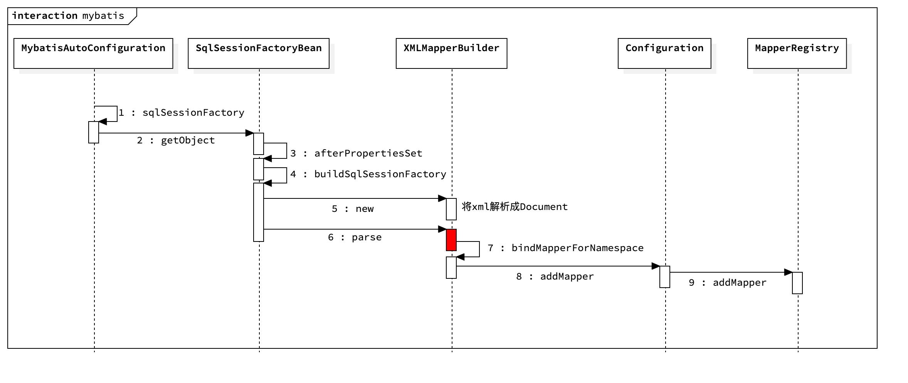
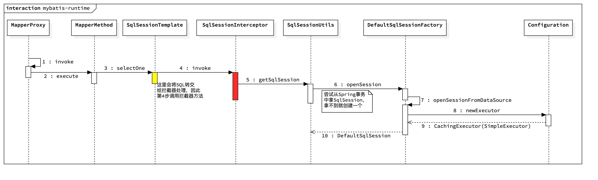
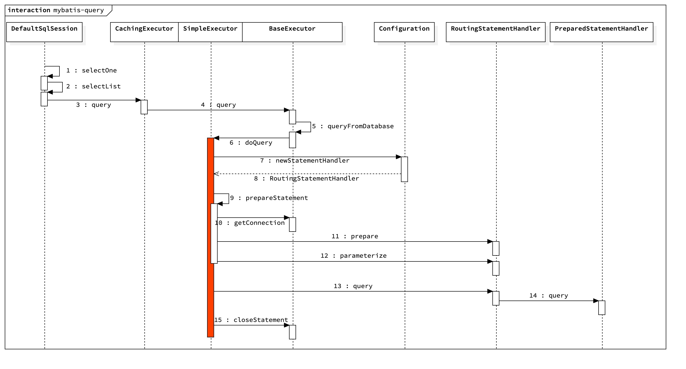

### 1. 使用示例

以一个简单的示例开始我们的调试之旅：

#### 1.1 XML配置

```xml
<?xml version="1.0" encoding="UTF-8"?>
<!DOCTYPE mapper PUBLIC "-//mybatis.org//DTD Mapper 3.0//EN" "http://mybatis.org/dtd/mybatis-3-mapper.dtd">
<mapper namespace="com.yiche.backend.template.mapper.NewsMapper">
    <resultMap id="BaseResultMap" type="com.yiche.backend.template.entity.NewsEntity">
        <id column="news_id" jdbcType="BIGINT" property="newsId"/>
        <result column="title" jdbcType="VARCHAR" property="title"/>
        <result column="summary" jdbcType="VARCHAR" property="summary"/>
        <result column="yc_useraccount_id" jdbcType="INTEGER" property="userId"/>
        <result column="createtime" jdbcType="TIMESTAMP" property="createTime"/>
        <result column="modify_time" jdbcType="TIMESTAMP" property="modifyTime"/>
    </resultMap>

    <select id="selectByPrimaryKey" parameterType="java.lang.Long" resultMap="BaseResultMap">
        select
          news_id,title,summary,yc_useraccount_id,createtime,modify_time
        from news where news_id = #{newsId,jdbcType=BIGINT}
    </select>
</mapper>
```

#### 1.2 Mapper对象

```java
package com.yiche.backend.template.mapper;

@Repository
public interface NewsMapper {
	NewsEntity selectByPrimaryKey(long newsId);
}
```

#### 1.3 Spring Boot配置

```java
@Configuration
@MapperScan("com.yiche.backend.template.mapper")
public class MybatisConfig {
}
```

### 2. 注册SqlSessionFactory

SqlSessionFactory的创建入口是`MybatisAutoConfiguration`注解，调用时序图如下：



创建SQLSessionFactory的过程也会解析XML，解析XML有3大对象：

- `XMLConfigBuilder` 解析配置文件，由于我使用的是Spring Boot，所以这一步省略
- `XMLMapperBuilder` mapper文件解析，对应图中第6步（标红）
- `XMLStatementBuilder` mapper文件解析中的增删改查语句解析

XML解析后的内容都是存在Configuration对象中的，所以可以想象Configuration是一个相当重量级的对象。由于XML解析过程很复杂，在此就不一一追究细节了，重点看看parse方法（第6步）：

```java
public class XMLMapperBuilder extends BaseBuilder {
  
  public void parse() {
    if (!configuration.isResourceLoaded(resource)) {
      // 解析mapper
      configurationElement(parser.evalNode("/mapper"));
      configuration.addLoadedResource(resource);
      // 将解析的mapper加入注册表
      bindMapperForNamespace();
    }

    parsePendingResultMaps();
    parsePendingCacheRefs();
    parsePendingStatements();
  }
  
  // 解析mapper文件
  private void configurationElement(XNode context) {
    try {
      String namespace = context.getStringAttribute("namespace");
      if (namespace == null || namespace.equals("")) {
        throw new BuilderException("Mapper's namespace cannot be empty");
      }
      // 解析mapper文件
      builderAssistant.setCurrentNamespace(namespace);
      cacheRefElement(context.evalNode("cache-ref"));
      cacheElement(context.evalNode("cache"));
      parameterMapElement(context.evalNodes("/mapper/parameterMap"));
      resultMapElements(context.evalNodes("/mapper/resultMap"));
      sqlElement(context.evalNodes("/mapper/sql"));
      // 解析SQL语句
      buildStatementFromContext(context.evalNodes("select|insert|update|delete"));
    } catch (Exception e) {
      throw new BuilderException("Error parsing Mapper XML. The XML location is '" + resource + "'. Cause: " + e, e);
    }
  }
  
  private void bindMapperForNamespace() {
    String namespace = builderAssistant.getCurrentNamespace();
    if (namespace != null) {
      Class<?> boundType = null;
      try {
        boundType = Resources.classForName(namespace);
      } catch (ClassNotFoundException e) {
      }
      if (boundType != null) {
        if (!configuration.hasMapper(boundType)) {
          configuration.addLoadedResource("namespace:" + namespace);
          // ！！将已解析的类型加入到mapper注册表中（重点关注）
          // 对应图中第8步
          configuration.addMapper(boundType);
        }
      }
    }
  }
  
}
```

将已解析的类型加入到mapper注册表中，最终调用的是`MapperRegistry`的`addMapper`方法：

```java
// 映射表
public class MapperRegistry {
  private final Map<Class<?>, MapperProxyFactory<?>> knownMappers = new HashMap<Class<?>, MapperProxyFactory<?>>();
  
  // 添加类型映射到映射表中
  public <T> void addMapper(Class<T> type) {
    if (type.isInterface()) {
      ...
      try {
        // 将已解析的类型放到字典中
        // 注意MapperProxyFactory，在bean初始化期间会通过这个工厂对象创建代理
        knownMappers.put(type, new MapperProxyFactory<T>(type));
        // 解析类型的注解
        MapperAnnotationBuilder parser = new MapperAnnotationBuilder(config, type);
        parser.parse();
        loadCompleted = true;
      } finally {
        if (!loadCompleted) {
          knownMappers.remove(type);
        }
      }
    }
  }
  
}
```

注意上面的`MapperProxyFactory`，在bean初始化期间会通过这个工厂对象创建代理。接下来看看bean对象是如何创建的。

### 3. 扫描所有Mapper

在Spring Boot中，我们会使用`@MapperScan`注解让MyBatis去扫描所有的`Mapper`（见1.3小节），而MapperScan会导入`MapperScannerRegistrar`（哈哈，这是常规的开发套路）：

```java
...
@Import(MapperScannerRegistrar.class)
public @interface MapperScan {
  ...
}
```

`MapperScannerRegistrar`的调用层级如下：

```java
MapperScannerRegistrar.registerBeanDefinitions(...)  //注册所有的bean定义
  ClassPathMapperScanner.doScan(...)  //扫描所有接口
    processBeanDefinitions(...) //注册bean定义，接口的实现类是MapperFactoryBean
```

如上述伪代码所示，在为mapper对象注册bean定义时，会将bean的类型设置为MapperFactoryBean，而MapperFactoryBean实现了FactoryBean接口。也就是创建bean对象的时候会调用MapperFactoryBean来创建对象：

```java
public class MapperFactoryBean<T> extends SqlSessionDaoSupport implements FactoryBean<T> {
  @Override
  public T getObject() throws Exception {
    // getSqlSession定义在父类中，返回的是SqlSessionTemplate类型
    return getSqlSession().getMapper(this.mapperInterface);
  }
}
```

接下来看看`SqlSessionTemplate`中`getMapper`方法定义：

```java
public class SqlSessionTemplate implements SqlSession, DisposableBean {
  @Override
  public <T> T getMapper(Class<T> type) {
    // 调用Configuration的方法
    // 第二个参数是SqlSession，传的是this，在4.1小节会和这联系起来
    return getConfiguration().getMapper(type, this);
  }
  
  @Override
  public Configuration getConfiguration() {
    return this.sqlSessionFactory.getConfiguration();
  }
}

// Configuration对象，这是个重量级对象
public class Configuration {
  
  protected final MapperRegistry mapperRegistry = new MapperRegistry(this);
  
  // 获取mapper对象
  public <T> T getMapper(Class<T> type, SqlSession sqlSession) {
    // 这里又会去调用MapperRegistry方法，后面会详细解释
    return mapperRegistry.getMapper(type, sqlSession);
  }
}
```

如上述代码所示，最终调用的是MapperRegistry的getMapper方法，瞧见没有，这就和第1小节对上号了。看看getMapper的实现：

```java
public class MapperRegistry {
  public <T> T getMapper(Class<T> type, SqlSession sqlSession) {
    // 从knownMappers字典中读取类型的mapper代理工厂
    final MapperProxyFactory<T> mapperProxyFactory = (MapperProxyFactory<T>) knownMappers.get(type);
    if (mapperProxyFactory == null) {
      throw new BindingException("Type " + type + " is not known to the MapperRegistry.");
    }
    try {
      // 使用mapper代理工厂创建对象实例
      return mapperProxyFactory.newInstance(sqlSession);
    } catch (Exception e) {
      throw new BindingException("Error getting mapper instance. Cause: " + e, e);
    }
  }
}
```

继续追踪newInstance方法：

```java
public class MapperProxyFactory<T> {

  @SuppressWarnings("unchecked")
  protected T newInstance(MapperProxy<T> mapperProxy) {
    // 创建动态代理
    return (T) Proxy.newProxyInstance(mapperInterface.getClassLoader(), new Class[] { mapperInterface }, mapperProxy);
  }

  public T newInstance(SqlSession sqlSession) {
    // mapper对象最终会被MapperProxy代理
    final MapperProxy<T> mapperProxy = new MapperProxy<T>(sqlSession, mapperInterface, methodCache);
    return newInstance(mapperProxy);
  }
}
```

多么简洁的代码：mapper（接口）最终会被`MapperProxy`代理。而对`MapperProxy`的解析又是另一个故事了。

### 4. Mapper方法执行流程

我将mapper方法的执行流程分成2部分：获取SqlSession和执行。

#### 4.1 获取SqlSession过程

从第2小节知道Mapper接口会被`MapperProxy`代理，也就是方法调用的入口。以下是获取调用流程：



1. 调用selectByPrimaryKey方法，请求被代理到MapperProxy
2. `MapperProxy`会将请求转交给`MapperMethod`
3. MapperMethod根据SQL类型，选择合适的查询，这里是selectOne，接下来请求转交给SqlSession，而SqlSession在这里的实际类型是SqlSessionTemplate
4. SqlSessionTemplate会将请求交给SqlSession代理来处理（标黄处
5. SqlSessionInterceptor会首先去实际的SqlSession，然后拿这个SqlSession去做真正的执行（表红处，4.2会展开讲这个流程），执行完成后提交事务、关闭SqlSession
6. 接下来会尝试从Spring事务中拿SqlSession，如果拿不到就创建一个，接下来进入SqlSession创建流程
7. 内部方法调用
8. 创建一个Executor对象
9. 最终创建的是SimpleExecutor，并且启用缓存时会被CachingExecutor代理，而缓存默认是启动的
10. 创建DefaultSqlSession

第5步代码如下：

```java
private class SqlSessionInterceptor implements InvocationHandler {
  @Override
  public Object invoke(Object proxy, Method method, Object[] args) throws Throwable {
    // 获取sqlSession
    SqlSession sqlSession = getSqlSession(
        SqlSessionTemplate.this.sqlSessionFactory,
        SqlSessionTemplate.this.executorType,
        SqlSessionTemplate.this.exceptionTranslator);
    try {
      // 通过反射执行目标方法，见4.2小节
      Object result = method.invoke(sqlSession, args);
      if (!isSqlSessionTransactional(sqlSession, SqlSessionTemplate.this.sqlSessionFactory)) {
        // force commit even on non-dirty sessions because some databases require
        // a commit/rollback before calling close()
        sqlSession.commit(true);
      }
      return result;
    } catch (Throwable t) {
      ...
    } finally {
      if (sqlSession != null) {
        // 最终关闭SqlSession
        closeSqlSession(sqlSession, SqlSessionTemplate.this.sqlSessionFactory);
      }
    }
  }
}
```

第7-10步代码如下：

```java
private SqlSession openSessionFromDataSource(ExecutorType execType, TransactionIsolationLevel level, boolean autoCommit) {
    Transaction tx = null;
    try {
      final Environment environment = configuration.getEnvironment();
      final TransactionFactory transactionFactory = getTransactionFactoryFromEnvironment(environment);
      tx = transactionFactory.newTransaction(environment.getDataSource(), level, autoCommit);
      // 创建Executor
      final Executor executor = configuration.newExecutor(tx, execType);
      // 创建SqlSession
      return new DefaultSqlSession(configuration, executor, autoCommit);
    } catch (Exception e) {
      closeTransaction(tx); // may have fetched a connection so lets call close()
      throw ExceptionFactory.wrapException("Error opening session.  Cause: " + e, e);
    } finally {
      ErrorContext.instance().reset();
    }
  }
```

对照时序图和代码，流程一目了然哈。

接下来讲讲获取到SqlSession后的执行逻辑。

#### 4.2 执行过程

接下来，将断点打到DefaultSqlSession的selectOne方法处。不停的debug、debug，最终执行流程图长这样：



1. -
2. 将请求转交给Executor（获取MappedStatement也在这里进行，但不影响大局所以可以忽略）
3. 根据参数将SQLSource对象解析成最终的SQL语句；创建CacheKey（缓存键），缓存中存在则直接走缓存，否则继续
4. 一些判断，调用queryFromDatabase方法
5. 缓存的一些操作，调用doQuery方法，SimpleExecutor重载了该方法
6. -
7. 创建RoutingStatementHandler
8. 返回第7步的值
9. -
10. -
11. 实例化Statement，设置超时时间等。这步调用的是基类方法，时序图内容太多就省略了
12. 参数化设置(?)
13. -
14. 执行最终的查询，并由DefaultResultSetHandler转换返回值
15. 关闭statement连接