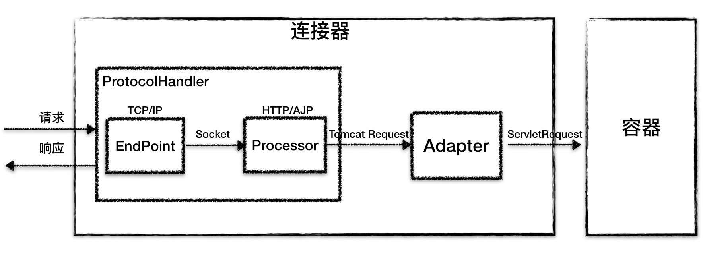
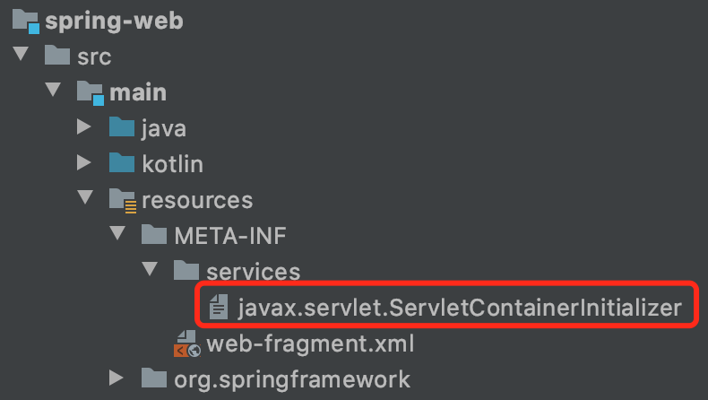

Tomcat作为一个Web服务器，经过了很长时间的发展，拥有非常广大的用户群，在面试中Tomcat原理也成为了必问问题。在一番了解后，我觉得Tomcat架构设计、层次划分很清晰，但比较庞大而复杂，在此一一记录，以便后续复习。

### 1. 架构概览

在了解整体架构之前，先回顾一下我们熟悉的`server.xml`配置：

```xml
<Server port="8005" ...>
  <Service name="Catalina">
    <Connector port="8080" protocol="HTTP/1.1"
               connectionTimeout="20000"
               redirectPort="8443" />
    <Connector port="8009" protocol="AJP/1.3" redirectPort="8443" />

    <Engine name="Catalina">
      <Host name="localhost"  appBase="webapps" ...>
        <Valve ... />
        <Context ... />
      </Host>
    </Engine>
  </Service>
</Server>
```

为了更加直观，我删除了一些无关配置。

整体上看，Server就是Tomcat应用服务器；Service是一组Connector（连接器）和一个Container（容器）的组合，没有太多含义。而Connector和Container是Tomcat的精华所在：

- Connector 负责开启并监听网络请求，并返回响应数据。在Tomcat里叫Coyote。
- Container 加载和管理Servlet，负责具体的请求处理。在Tomcat中有4种类型的Container，分别是 Engine、Host、Context 和 Wrapper（如xml配置所示，他们是父子关系）。

针对这2部分，又划分出了很多的子模块。下面详细介绍。

### 2. 连接器Coyote

连接器负责监听请求并响应，具体来说有以下功能点：

- 网络通信，支持NIO、NIO.2、APR
- 应用层协议解析，支持Http 1.1，Http 2，AJP
- Tomcat Request/Response对象与ServletRequest/ServletResponse对象的转换

Tomcat分别设计了3个组件来实现这些功能，他们分别是：`Endpoint`、`Processor`、`Adapter`。关系图如下：



由于网络通信和应用层协议解析需要组合使用，所以Tomcat提供了`ProtocolHandler`接口来定义如何处理连接和应用层协议解析，并提供了不同的实现，比如`Http11NioProtocol`、`Http11AprProtocol`等。

#### 2.1 探究ProtocolHandler

ProtocoHandler中包含2个非常重要的组件EndPoint和Processor，下面分别介绍其原理：

- Endpoint 用于通信监听，即具体的Socket接受和发送处理器。Endpoint的有一个抽象实现`AbstractEndpoint`，而在`AbstractEndpoint`的子类，比如 NioEndpoint 和 Nio2Endpoint 中，有两个重要的子组件：Acceptor 和 SocketProcessor。

  Acceptor用于接收Socket连接， 并最终提交到线程池，而SocketProcessor消费线程池里的Socket，将Socket转交给Processor来处理

- Processor 接受来自Endpoint的Socket，将字节流并转换成Tomcat的Request、Response对象，然后将其通过Adapter（`CoyoteAdapter`）提交给容器处理。

综上，连接器实际上是这样的：


### 3. 容器Catalina

容器是是请求的实际处理部分，在Tomcat中，包含以下4种类型的容器：

- Engine Servlet引擎，用来管理多个虚拟站点，一个Service最多只有一个Engine，但一个Engine下可以有多个Host
- Host 代表一个虚拟主机，或者说一个站点，可以给Tomcat配置多个虚拟主机，而一个虚拟主机下又可以配置多个Context
- Context 表示一个Web应用程序，一个Web应用程序下可以有多个Wrapper
- Wrapper 表示一个Servlet，作为容器中的最底层

它们之间的关系如下图所示：


#### 3.1 请求定位到Servlet的过程

在第2节提到，Adapter在接收到来自连接器的请求后，会调用容器的service方法来执行Servlet，最先拿到请求的是Engine容器，稍作处理后将请求传递给子容器Host进行处理，依次类推，最后请求会传递给Wrapper容器，由它来负责最终的处理，那这个调用过程是怎么实现的呢？答案是Pipeline-Valve管道。

Pipeline-Valve管道是一种责任链模式，责任链模式是指在一个请求处理的过程中有很多处理者依次对请求进行处理，每个处理者负责做自己相应的处理，处理完之后将再调用下一个处理者继续处理。

Pipeline（管道）用于构建责任链，Valve（阀）代表责任链上的每个处理器。

`Valve`接口定义如下：

```java
public interface Valve {
  public Valve getNext();
  public void setNext(Valve valve);
  public void invoke(Request request, Response response)
}
```

从定义中可以看出，`setNext`表示设定下一个处理者，而`invoke`表示执行当前的处理器逻辑。再看看`Pipeline`接口定义：

```java
public interface Pipeline extends Contained {
  public void addValve(Valve valve);
  public Valve getBasic();
  public void setBasic(Valve valve);
  public Valve getFirst();
}
```

其中`addValve`方法表示添加处理者到责任链尾部，`getFirst`用于获取第一个处理器。当Container执行时，会调用第一个处理器的`invoke`方法，并由他来决定什么时间点调用下一个Valve。

那`setBasic`又是什么意思呢？上面我们讲到4种类型的Container是父子关系，那他们之间的调用就是通过Basic Valve串联起来的。一图胜千言：


整个过程由连接器的Adapter触发：

```java
// Calling the container
connector.getService().getContainer().getPipeline().getFirst().invoke(
                        request, response);
```

它会执行Engine管道的第一个Valve，并依次将流程传递下去。

#### 3.2 Servlet是如何注册的

Servlet在 3.0版本中新增了`ServletContainerInitializer`接口：

```java
public interface ServletContainerInitializer {
    void onStartup(Set<Class<?>> c, ServletContext ctx) throws ServletException;
}
```

它用于在web容器启动时允许第三方执行自定义逻辑。注意`onStartup`方法第一个参数是我们感兴趣的类型集合，实现了这个接口的对象可以使用`@HandlesTypes`注解来申明感兴趣的类型。

实现了`ServletContainerInitializer`接口的对象必须配置在`META-INF/services/javax.servlet.ServletContainerInitializer`文件里，容器启动时会初始化并调用`onStartup`方法。

查看SpringMVC源码，发现也有这个文件：



它注册了`SpringServletContainerInitializer`：

```
org.springframework.web.SpringServletContainerInitializer
```

这个对象的定义：

```java
// 对WebApplicationInitializer感兴趣
@HandlesTypes(WebApplicationInitializer.class)
public class SpringServletContainerInitializer implements ServletContainerInitializer {

   // webAppInitializerClasses代表的是WebApplicationInitializer的实现类
   @Override
   public void onStartup(@Nullable Set<Class<?>> webAppInitializerClasses, ServletContext servletContext)
         throws ServletException {

      List<WebApplicationInitializer> initializers = new LinkedList<>();

      if (webAppInitializerClasses != null) {
         for (Class<?> waiClass : webAppInitializerClasses) {
            // Be defensive: Some servlet containers provide us with invalid classes,
            // no matter what @HandlesTypes says...
            if (!waiClass.isInterface() && !Modifier.isAbstract(waiClass.getModifiers()) &&
                  WebApplicationInitializer.class.isAssignableFrom(waiClass)) {
               try {
                  initializers.add((WebApplicationInitializer)
                        ReflectionUtils.accessibleConstructor(waiClass).newInstance());
               }
               catch (Throwable ex) {
                  throw new ServletException("Failed to instantiate WebApplicationInitializer class", ex);
               }
            }
         }
      }

      if (initializers.isEmpty()) {
         servletContext.log("No Spring WebApplicationInitializer types detected on classpath");
         return;
      }

      servletContext.log(initializers.size() + " Spring WebApplicationInitializers detected on classpath");
      AnnotationAwareOrderComparator.sort(initializers);
      for (WebApplicationInitializer initializer : initializers) {
         // 依次调用onStartup方法
         initializer.onStartup(servletContext);
      }
   }

}
```

在Tomcat中，当Context对象启动时，会依次初始化并调用它，具体的实现细节可以[参考这里](https://blog.csdn.net/wangyangzhizhou/article/details/52013779)。

### 4. Tomcat性能调优

#### 4.1 线程池优化

性能调优分成多个方面，在这里我主要关心NIO和线程池调优。文章第一部分提到Socket请求会被提交到Executors，并由SocketProcessor消费，后续的处理逻辑都在线程池线程中执行。

在阅读源代码后可知，Tomcat线程池对JDK线程池做了扩展。扩展的主要原因是JDK线程池线程只会在队列满了之后才会新增非核心线程，如果使用的是无界队列，那么非核心线程可能永远都创建不了。这种机制对于大多场景也许是合适的，但对Tomcat这种Web服务器来说却行不通，因为Tomcat线程处理的大都是IO型任务，它们很多都会阻塞等待IO完成，这就需要我们创建适量的线程来尽快消费线程池中的任务了。

Tomcat解决这个办法就是重写队列的offer方法，参见`TaskQueue`类：

```java
public class TaskQueue extends LinkedBlockingQueue<Runnable> {
    @Override
    public boolean offer(Runnable o) {
      //we can't do any checks
        if (parent==null) return super.offer(o);
        //we are maxed out on threads, simply queue the object
        if (parent.getPoolSize() == parent.getMaximumPoolSize()) return super.offer(o);
        //we have idle threads, just add it to the queue
        if (parent.getSubmittedCount()<=(parent.getPoolSize())) return super.offer(o);
        //if we have less threads than maximum force creation of a new thread
        // 如果线程数量小于任务数则返回false
        if (parent.getPoolSize()<parent.getMaximumPoolSize()) return false;
        //if we reached here, we need to add it to the queue
        return super.offer(o);
    }
}
```

如上述代码注释部分，当线程池线程数小于任务数时返回false，而一旦返回false，线程池将会创建新线程：

```java
public void execute(Runnable command) {
    ...
    if (isRunning(c) && workQueue.offer(command)) {
        int recheck = ctl.get();
        if (! isRunning(recheck) && remove(command))
            reject(command);
        else if (workerCountOf(recheck) == 0)
            addWorker(null, false);
    }
    else if (!addWorker(command, false))
        reject(command);
}
```

上述代码来自于`ThreadPoolExecutor`，当`workQueue.offer(command)`返回false时，将会进入else if逻辑来创建新的线程。

> 注意：上述问题可能在面试时将会问到

在Spring Boot中，与socket连接和线程池有关的配置如下：

```yaml
server:
  #从socket里读取字节流时间，或将数据流写入到socket的时间
  #注意这个时间并不是你接口响应超时时间，主要用来防止恶意攻击
  connection-timeout: -1
  tomcat:
    #线程池最大线程数
    max-threads: 200
    #线程池最小线程数
    min-spare-threads: 10
    #最大能处理的连接数，连接数是从拿到socket连接起，直到处理结束为止的数量
    #当达到最大值时，Acceptor将会被阻塞，新的请求将会堆积在tcp的backlog里
    max-connections: 10000
    #NIO socket的backlog数
    accept-count: 100
```

在阅读相关源码之后，我对于上面的参数有了更深刻的印象。

> 在生产环境中配置这些参数，需要用压测工具针对具体环境进行压测以找出最佳配置。

#### 4.2 其他优化

- 连接器优化，nio2 > nio > bio
- GC优化，通过gceasy.io等工具分析GC日志查找出性能瓶颈，性能指标包括
  - 吞吐量，计算公式：`1 - gc_time/app_run_time`
  - GC停顿时间，包括：平均停顿时间、最大停顿时间，以及停顿时间范围分布
  - 

### 5. Spring Boot中启动Tomcat流程

在Spring Boot中，应用启动时会自动探测需要使用的容器类型，对于Servlet程序来说，使用的是`AnnotationConfigServletWebServerApplicationContext`容器，它的父类重载了`onFresh`方法：

```java
// ServletWebServerApplicationContext.java
  
@Override
protected void onRefresh() {
   super.onRefresh();
   try {
      // 创建web服务器
      createWebServer();
   }
   catch (Throwable ex) {
      throw new ApplicationContextException("Unable to start web server", ex);
   }
}

private void createWebServer() {
	WebServer webServer = this.webServer;
	ServletContext servletContext = getServletContext();
	if (webServer == null && servletContext == null) {
    // 获取工厂对象，在这里是TomcatServletWebServerFactory
		ServletWebServerFactory factory = getWebServerFactory();
    // 创建web服务器，initializers会在tomcat启动时调用
		this.webServer = factory.getWebServer(getSelfInitializer());
	}
	else if (servletContext != null) {
		try {
			getSelfInitializer().onStartup(servletContext);
		}
		catch (ServletException ex) {
			throw new ApplicationContextException("Cannot initialize servlet context",
					ex);
		}
	}
	initPropertySources();
}

private org.springframework.boot.web.servlet.ServletContextInitializer getSelfInitializer() {
	return this::selfInitialize;
}

private void selfInitialize(ServletContext servletContext) throws ServletException {
	prepareWebApplicationContext(servletContext);
	registerApplicationScope(servletContext);
	WebApplicationContextUtils.registerEnvironmentBeans(getBeanFactory(),
			servletContext);
  // 从bean工厂中获取所有ServletContextInitializer对象
	for (ServletContextInitializer beans : getServletContextInitializerBeans()) {
    // 调用onStartup
		beans.onStartup(servletContext);
	}
}
```

`getServletContextInitializerBeans()`方法返回的bean包括`DispatcherServletRegistrationBean`，它就是用来注册和暴露`DispatcherServlet`的。

### 6. 参考

1. https://www.bilibili.com/video/BV1dJ411N7Um
2. https://time.geekbang.org/column/intro/180