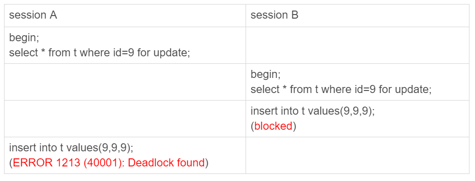

### 1. 事务隔离级别

#### 1.1 隔离级别分类

MySQL中事务功能是由引擎层实现的，InnoDB支持事务，而MyISAM不支持，这也是其被取代的原因之一。

在InnoDB事务中，支持以下隔离级别（isolation level）：

- **读未提交**（read uncommitted），能够读取到其他事务未提交的数据。此时，可能会发生脏读（dirty read）
- **读已提交**（read committed），只能读到其他事务已提交的数据，这种情况下会出现不可重复度（non-repeated read）
- **可重复读**（repeatable read），事务在开始时会创建一个视图，直到结束查询到的数据都用这个视图，也就是整个事务期间查询到的数据都不会变，这种情况下会发生幻读。InnoDB的**默认隔离级别**。
- **可串行读**（serializable），这种级别下读会持有读锁，写持有写锁。当出现读写冲突（写锁与读锁冲突）时，后面事务必须等待前一个事务释放锁才能继续。

> SELECT语句默认是无锁的，只是会创建一个快照，也就是使用可重复读隔离级别。

> 幻读指的是一个事务中SELECT语句前后查到的结果不一致，当其他事务往表中插入满足查询条件的新行时就会发生这种情况。幻读详细介绍参见专栏：[《20 | 幻读是什么，幻读有什么问题？》](https://time.geekbang.org/column/article/75173)。

> 虽然可重复读级别下会出现幻读，但是可以使用这种级别下特有的锁“间隙锁”来解决幻读的问题。

对于读已提交隔离级别，InnoDB会在每个SELECT语句开始执行时创建**一致性视图**（consistent read view），在这个事务中接下来的查询以这个视图的逻辑为准。而在可重复读级别下，会在事务开始时就创建视图，整个事务期间都用这个视图。对于读未提交直接使用的是最新值，没有视图的概念；而对于可串行读直接使用加锁的方式来避免并发访问。

#### 1.2 事务隔离级别的实现

假设一个值从 1 被按顺序改成了 2、3、4，在**回滚日志**（undo log）里面就会有类似下面的记录：


如图中看到的，在视图 A、B、C 里面，这一个记录的值分别是 1、2、4，同一条记录在系统中可以存在多个版本，每个数据版本有自己的 row trx_id，这就是数据库的**多版本并发控制**（MVCC）。对于 read-view A，要得到 1，就必须将当前值依次执行图中所有的回滚操作得到。

> MVCC中有2个较为重要的字段：事务ID、版本号。（京东面试问到了）

> 长事务会导致大量占用存储空间，应当尽量避免。

#### 1.3 一致性视图原理

一致性视图的原理简单来说，就是在事务开始时将当前所有活跃的事务保存到一个数组里，一致性读会根据 row trx_id 和一致性视图确定数据版本的可见性。详细原理参见：https://time.geekbang.org/column/article/70562。

#### 1.4 事务相关语法

##### 1. 查看隔离级别：

```mysql
show variables like 'transaction_isolation';
```

##### 2. 自动提交事务：

事务默认都是隐式开启，隐式提交的。例如SELECT、UPDATE语句会自动启动、自动提交事务。这个功能是由以下配置决定的：

```mysql
set autocommit=1
```

为了避免死锁、长事务等问题，建议一直将这个值设置为`1`。

##### 3. 启动事务、提交事务、回滚事务：

```mysql
begin /* 显式启动事务 - 方式一 */
start transaction /* 显式启动事务 - 方式二 */

-- 设置事务隔离级别
set session transaction isolation level repeatable read 
-- 查询当前事务隔离级别
SELECT @@tx_isolation;

commit /* 显式提交事务 */
commit work and chain /* 显式提交事务，并自动开始下一个事务 */

rollback /* 回滚事务 */
```

##### 4. SELECT语句锁保护

为满足条件的行设置共享锁：
```mysql
SELECT * FROM parent WHERE NAME = 'Jones' FOR SHARE;

```
为满足条件的行设置排它锁：
```mysql
SELECT * FROM t1 WHERE c1 = (SELECT c1 FROM t2) FOR UPDATE;
```

注意

- 在可重复读级别下，即使在事务开始时就创建了快照，但是这2种语句仍然会获取到最新的修改（然后加锁）
- 在可重复读，对于不存在的记录会加上**间隙锁**（gap lock，左开右闭区间），锁住不存在的记录

### 2. 锁

#### 2.1 锁分类

- **全局锁**：MySQL 提供了一个加全局读锁的方法，命令是 Flush tables with read lock (FTWRL)
- **表锁**：分为表锁和元数据锁（meta data lock，MDL）。其中MDL是自动的，当对表做增删改时自动加MDL读锁，当修改表结构时自动加MDL写锁。
- **行锁**：引擎层各自实现的，MyISAM不支持行锁。
- **间隙锁**（Gap Lock）：锁住2个值之间的间隙（不存在的行）。间隙锁与其他锁**不冲突**，而是与“往这个间隙中插入一个记录”这个操作互斥。
- **next-key lock**：行锁和间隙锁组成了next-key lock，它是一个左开右闭的区间。
- 自增锁：

#### 2.2 两阶段锁

行锁是在需要的时才加上的，但是直到事务结束后才释放，这就是两阶段锁协议。为了避免行锁造成锁冲突、影响并发度，你通常需要将行锁（或者影响并发度的锁）尽量往后放。

关于锁和事务造成SELECT语句非常慢的实例参见专栏：[《19 | 为什么我只查一行的语句，也执行这么慢？》](https://time.geekbang.org/column/article/74687)。

#### 2.3 间隙锁细节

##### 2.3.1 举例说明

间隙锁只在可重复读级别下才有效，当操作（增删改查）不存在的记录时就会产生间隙锁。它和行锁组成的next-key lock可以避免出现幻读。

以专栏上的表结构为例：

```mysql
CREATE TABLE `t` (
  `id` int(11) NOT NULL,
  `c` int(11) DEFAULT NULL,
  `d` int(11) DEFAULT NULL,
  PRIMARY KEY (`id`),
  KEY `c` (`c`)
) ENGINE=InnoDB;

insert into t values(0,0,0),(5,5,5),
(10,10,10),(15,15,15),(20,20,20),(25,25,25);
```

启动sessionA，并执行以下语句：

```mysql
start transaction
-- 设置事务级别为可重复读
set session transaction isolation level repeatable read

-- d为6的记录不存在，此时会产生间隙锁，锁住(5, 10]之间的记录
select * from t where d = 6 for update; /* 语句1 */
```

启动sessionB，并执行以下语句：

```mysql
-- 由于(5, 10]区间被sessionA锁住，所以这里会一直阻塞
insert into t values(6,6,6)
```

上述语句会一直阻塞，这就避免了sessionA语句1再次执行会出现结果不一致的情况，也就是避免了幻读。

##### 2.3.2 原则

索引上的等值查询，给唯一索引加锁的时候，next-key lock 退化为行锁。

索引上的等值查询，向右遍历时且最后一个值不满足等值条件的时候，next-key lock 退化为间隙锁。

#### 2.4 死锁

死锁的四个必要条件：互斥、占有且等待、不可强占用、循环等待。

MySQL有2种策略解决死锁：

- **直接等待**，直到超时，可以通过参数`innodb_lock_wait_timeout`来设置超时时间，默认值50s
- **死锁检测**，即由MySQL主动发起死锁检测，通过将参数`innodb_deadlock_detect=on`来开启该功能

直接等待这种策略超时时间设置是个难题，设置太短可能误伤正常等待的事务，设置太长影响性能。

死锁检测这种策略是在事务运行时主动检测可能发生的死锁：事务执行时，会主动检测它将要加锁的资源有没有被别人（其他线程）锁住，对于并发度较高的情况，会非常消耗CPU。

接下来看看死锁的案例：

**案例一：间隙锁导致死锁**



如上图所示，事务隔离级别是可重复度，且id=9的这条记录在数据库中不存在，所以session A、session B的select语句都会申请间隙锁，而间隙锁之间并不互斥，所以都能申请成功。接下来各自执行insert语句时，相互要求对方释放间隙锁，这就形成了死锁。

对于上述问题，我想到的解决方案就是降低隔离级别。

**案例二：索引导致死锁**


如上图所示，事务A会使用`idx_order_status`索引来更新记录，此时它会回表获取主键索引，然后尝试加行锁；事务B会使用主键索引，它尝试对id=4的行加锁，然后需要获取`idx_order_status`以更新status字段。

这个案例参考专栏：https://time.geekbang.org/column/article/117247