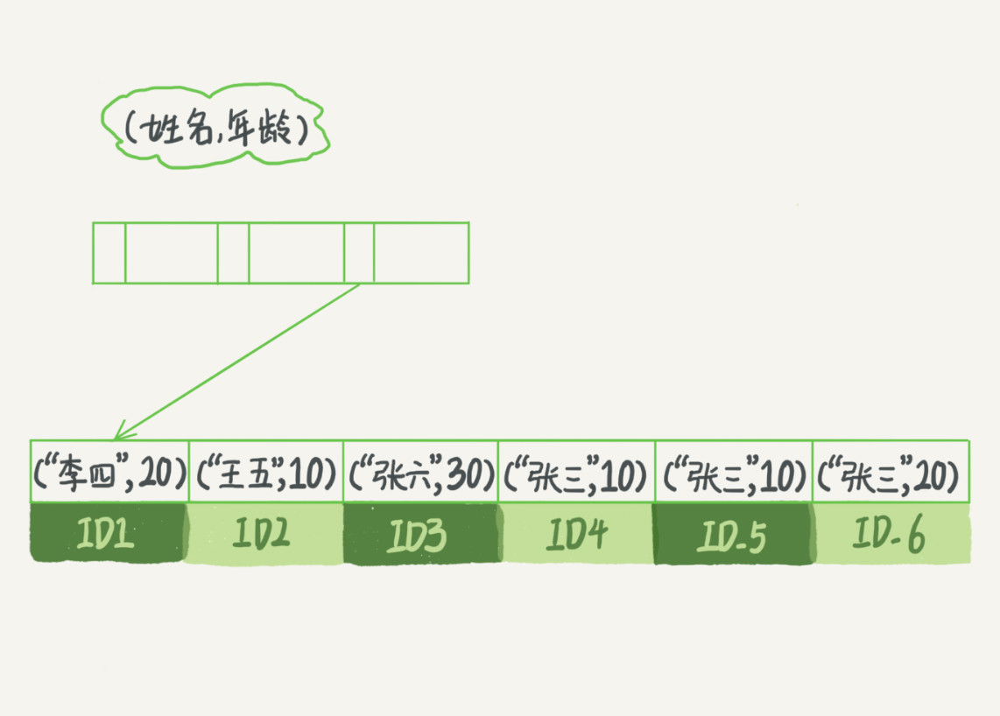

InnoDB使用B+数作为索引数据结构，优点如下：

- 相比于hash结构，它能支持等值查找、顺序查找、范围查找，而hash只适用于等值查找
- 相比于二叉搜索树，它能有效的避免多次访问磁盘，因为它是N叉树，树高比二叉低很多，在读取上有显著的优势

> b+树是b树的一种变形，它把数据都存储在叶子节点

> 假设b+树叶子节点存储的是整形字段，那么当数高度是4时，差不多可以存储17亿的数据。考虑到树根数据块总是在内存当中，查找一个值最多需要访问3次磁盘。其实树的第二层很大概率也在内存中，那么访问磁盘的平均次数就更少了。（高德面试题）

#### 1. 主键索引和普通索引

**主键索引**又称聚簇索引（cluster index）的叶子节点存储的是整行的数据；而普通索引叶子节点存储的是主键的值，这种索引也称为**二级索引**（secondary index）。

对于普通索引来说，当需要查询的字段不在当前索引时，它需要通过主键去查询主键索引，这个过程称为**回表**。也就是普通索引可能需要多扫描一个索引树。

唯一索引

#### 2. 索引的维护

B+树为了维护数据的有序性，插入新值时有可能会导致**页分裂**，当2个相邻的页有数据删除时会有**页合并**，这些操作对性能都会有一定的影响，而页分裂还会导致空间的利用率下降。

**自增主键**的插入模式，每次插入一条新纪录都是追加操作，不涉及到挪动其他记录，也不会触发页分裂。

#### 3. 索引和索引优化

##### 3.1 覆盖索引

单个索引可以满足SQL查询语句的索引称为覆盖索引。覆盖索引没有回表的过程，所以性能相对较高。

##### 3.2 最左前缀原则

B+树的叶子节点上的数据是按照顺序排列的，比如有这么一个索引：

```mysql
alter table t create index myidx(name, age)
```

那么这个索引的对应的B+树叶子节点可能是这样的：



可以看到，叶子节点数据是按照姓名、年龄顺序存储的，当需要按姓名查询时，可以很快定位到相应记录，当需要按姓名+年龄查询时也能很快定位。也就是满足最左前缀原则，就可以利用索引来加速检索。

而当索引不满足要求时，MySQL会使用**索引下推**优化（index condition pushdown)，例如：

```mysql
select * from tuser where name like '张%' and age=10 and ismale=1;
```

上述查询中，`myidx`不包含`ismale`字段，所以会有回表操作。而索引下推指的是先通过`myidx`查询到符合当前索引的数据后再进行回表，也就是直接过滤掉不符合查询的数据，减少回表操作次数。

##### 3.3 避免使用唯一索引

唯一索引（unique index）指的是索引中各列组成的行记录是唯一的。你可能会从直觉上认为唯一索引似乎要比非唯一索引要快一些，但事实上这两个类型的索引在性能上差异几乎可以忽略不计。

因为InnoDB的数据是按照数据页为单位来读取的，也就是说，即是你只需要一行记录，也需要加载一整页的数据。因此当你要查询`name`为`赵子龙`的记录时，无论是否是唯一索引，页数据都会被加载到内存中，只是非唯一索引可能需要多做一次“查找和判断下一条记录”的操作，而这只需要一次指针寻找和一次计算，对于性能的影响来说微乎其微。

但是，唯一索引在执行增、删、改操作时无法使用chang buffer优化机制从而造成磁盘随机读取开销（参见《SQL语句执行流程》中对change buffer的描述），因此对于写多读少的业务，通常建议不要使用唯一索引。

详情参见极客专栏《[9 | 普通索引和唯一索引，应该怎么选择](https://time.geekbang.org/column/article/70848)》

##### 3.4 查询优化器-表扫描行数预估

优化器的目的就是找出最优的执行方案，用最小的代价去执行语句。优化器会预估扫描行数、是否使用临时表、是否使用排序、是否需要回表等多个因素进行综合判断。此处着重说明扫描函数是如何预估的。

每个索引都会维护一些统计数据，通过以下SQL可以查看：

```mysql
show index from table_t;
```

在显示的结果中有一列`Cardinality`称为**基数**，基数越大说明索引的**区分度**越高，它是按照采样统计得出索引的不重复记录数：InnoDB会选择N个数据页，统计这些页上的不同值，得到一个平均值，然后乘以索引的页面数。对于统计信息如果和实际情况有较大误差时，可以使用`analyze`语句重新统计索引信息：

```sql
analyze table table_t;
```

> 关于区分度到底是如何影响扫描行数的作者没有多讲，这一块内容后续还需要补充。

其次优化器也会按索引预估扫描行数，预估扫描行数会考虑回表产生的代价，此时就有可能会选错索引，对于这种情况可以使用force index强制选择指定的索引：

```mysql
select * from t force index(a) where xxx...;
```

关于这一部分原作者通过举例说明的，原文非常经典，在这里不好总结，所以以后复习时需要重看原文[《10 | MySQL为什么有时候会选错索引？》](https://time.geekbang.org/column/article/71173)。

##### 3.5 索引选择字段不能太多

索引选取的越长，占用的磁盘空间就越大，相同的数据页能放下的索引值就越少，搜索的效率也就会越低。

##### 3.6 避免在索引字段使用函数

这个规则其实一直都记得，直到专栏老师说为什么要避免这样使用时，我觉得我有必要记一记了。

对于一个SQL查询语句，如：

```mysql
select count(*) from tradelog where month(t_modified)=7;
```

这种对索引字段使用函数的情况下会导致索引利用不上，因为索引使用的是B+树，正常情况下它是有序的，所以查询的非常快。但是对树上的数据应用一个函数时，会破坏索引值的有序性，**因此优化器决定放弃使用索引查找功能**（专栏上叫索引搜索）。

需要注意的是，并不是说优化器此时会放弃使用这个索引，只是说放弃了索引查找，优化器有可能在进行一些其他的衡量后仍然选择使用该索引，只是由搜索改成了全索引扫描。

相信很多程序员和我一样，把这条规则烂记于心，但是有时候这个问题会比较隐蔽。

###### 问题一：类型转换

当查询语句等号左右两边类型不一致时会进行适当的类型转换。特别的，当varchar遇到int类型时，MySQL会优先将varchar转成int类型，比如：

```mysql
-- tradeid是varchar类型
select * from tradelog where tradeid=110717;
```

此时，MySQL会将`tradeid`转换成int类型，实际上上面的SQL将会是这样的：

```mysql
select * from tradelog where CAST(tradeid as signed int)=110717;
```

bingo，无法使用索引查找了。

**类型转换可能还会导致查出来意想不到的数据**。比如下面SQL：

```mysql
-- orderid是varchar类型，但实际上存储的是数字，并且非常大
select * from orderlog where orderid = 170325171202362928;
```

我们期待只查出一条数据，但实际上却查出了2条记录：

```mysql
170325171202362928
170325171202362930
```

原因上一个案例类似，只不过这里MySQL会将orderid转换的float类型，而由于orderid都非常大导致多个不同的varchar数字转换成了相同的float值，所以查出来了多条数据。参见[网友的博文](https://mp.weixin.qq.com/s?__biz=MzIwMzY1OTU1NQ==&mid=2247493015&idx=1&sn=c832672dd24e8d7a0d8859c8c69e27c0&chksm=96cea5dba1b92ccdc12e67ca5ee4f7a051a766a2344e4e838d3771c1ee2a661e2bfd970688e4&mpshare=1&scene=23&srcid=0723GCxO7Ev51R2xatyU8oYL&sharer_sharetime=1595515969637&sharer_shareid=8b6cce4aa7804cb52b9e5a9c08be2cf4%23rd)。

###### 问题二：字符集编码转换

这个问题就更加隐蔽， 当专栏举了这个例子后，我都想拍案称赞。相应的SQL语句：

```mysql
-- 假设
-- tradelog的tradeid是utf8格式
-- trade_detail的tradeid是utf8mb4格式
select d.* from tradelog l, trade_detail d where d.tradeid=l.tradeid and l.id=2;
```

此时由于2个表的字段编码不一致，所以也会导致类型转换，在查询trade_detail表时，SQL语句将类似于：

```mysql
select * from trade_detail  where CONVERT(traideid USING utf8mb4)=$L2.tradeid.value; 
```

显而易见，无法使用索引查找了。

> utf8mb4是utf8的扩充，因此在做类型转换时会由utf8转成utf8mb4，而不是相反。
>
> 这个可以按java类型转换理解，byte类型可以隐式的转换成范围更大的int类型。

除了上面的2个例子外，即使是 `where id+1=1000` 这样简单的SQL，索引查找功能也会失效，所以可以总结成MySQL有偷懒之嫌，😃。

这部分内容参见专栏：[《18 | 为什么这些SQL语句逻辑相同，性能却差异巨大？》](https://time.geekbang.org/column/article/74059)。

##### 3.7 or关键字