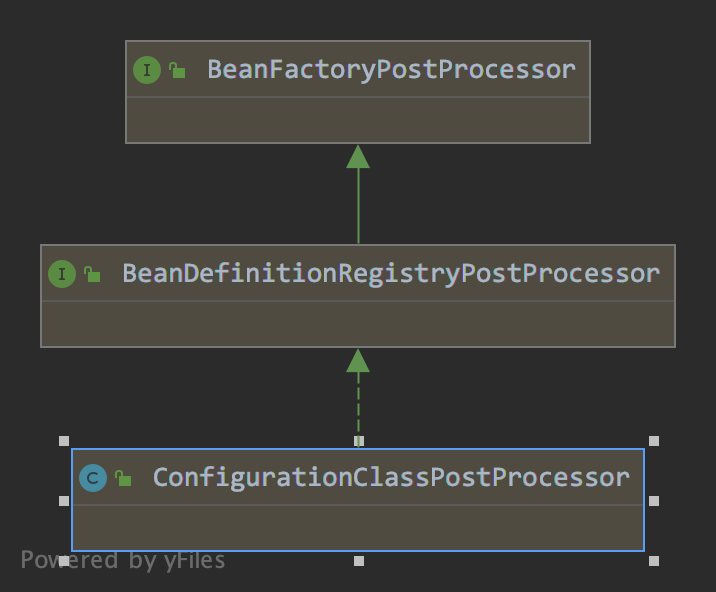
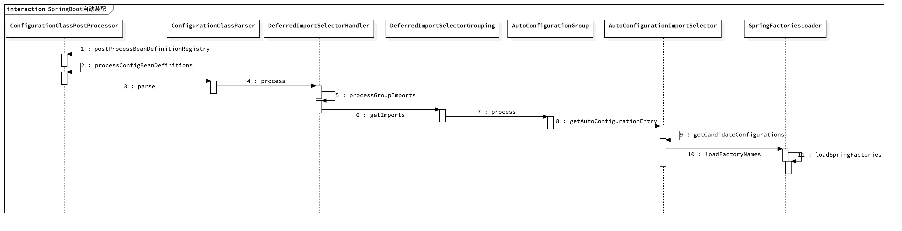

### 1. 简单的示例

以下面这段最简单的Spring Boot代码为例开启我们的调试之旅：

```java
@SpringBootApplication
public class SpringBootSourceLearningApplication {

    public static void main(String[] args) {
        SpringApplication.run(SpringBootSourceLearningApplication.class, args);
    }
}
```

> 注意：为了调试方便，最好不要依赖Spring Cloud相关的东西，因为它会创建一些子容器，这样会打乱我们的调试节奏。

`SpringApplication.run`是整个Spring Boot执行的入口，这个方法内部会去创建容器对象（ApplicationContext），然后将入口类（`SpringBootSourceLearningApplication`）的bean定义注册到容器中，然后接下去就是容器初始化的那套流程了，整个流程的源码分析参见《Spring源码解析》。

### 2. Spring Boot自动装配

Spring Boot之所以这么流行，我想最大的原因就是提供了按需自动装配这个简单而好用的功能吧。这篇文章的重点就是围绕自动装配流程展开。

### 3. 自动装配的起点

记得以前学习反射的时候，印象非常深刻的是typeof是反射API的起点：

```csharp
System.Reflection.MemberInfo info = typeof(MyClass);
```

类似的，Spring Boot自动装配的起点是`@SpringBootApplication`注解。接下来，快速过一下这个注解是在什么时候执行的。

在《Spring源码解析》中有提到容器初始化时，会注册`ConfigurationClassPostProcessor`类，这个类实现了`BeanDefinitionRegistryPostProcessor`接口，它会在bean definition factory执行时被调用。继承层级如下：

`ConfigurationClassPostProcessor`主要做的事是解析所有的`@Configuration`，或者间接被`@Configuration`标注的对象，同时它会查找对象是否包含`@Import`注解，如果是-----------待补充。而`@SpringBootApplication`注解正好就是这样的：

```java
...
// 间接标注了@Configuration
@SpringBootConfiguration
// 间接标注了@Import
@EnableAutoConfiguration
@ComponentScan(excludeFilters = { @Filter(type = FilterType.CUSTOM, classes = TypeExcludeFilter.class),
      @Filter(type = FilterType.CUSTOM, classes = AutoConfigurationExcludeFilter.class) })
public @interface SpringBootApplication {
}

// 这里标记了@Configuration
...
@Documented
@Configuration
public @interface SpringBootConfiguration {
}

// 这里标记了@Import注解
@AutoConfigurationPackage
@Import(AutoConfigurationImportSelector.class)
public @interface EnableAutoConfiguration {
}
```

如上述代码所示，`@SpringBootApplication`间接被标注了`@Configuration`和`@Import`。

### 4. 自动装配原理

接下来就从`ConfigurationClassPostProcessor`开始调试。

> 从容器初始化到`ConfigurationClassPostProcessor`被调用的过程参见《Spring源码解析》。

呃，源码太长，都贴出来肯定是不行的了。对于面试而言，记住主要的步骤就行了，所以这里我就只列出主要的逻辑了：

1. `ConfigurationClassPostProcessor`会找到`@SpringBootApplication`（间接继承了`@Configuration`），然后进入解析`@Configuration`流程
2. 主要是解析@Import注解，而`@SpringBootApplication`最终导入的是`AutoConfigurationImportSelector`，所以会走它相关的逻辑
3. 查找所有的`spring.factories`文件，按properties格式解析，之后会做一些过滤。然后将这些解析后的字符串转换成Class对象，如果对象有`@Configuration`注解，将会被递归解析
4. 将扫描到的所有对象注册到bean定义中
5. 接下来走正常的bean初始化逻辑
6. 对了，@Configuration修饰的类默认会生成一个动态代理

从`ConfigurationClassPostProcessor`到加载`spring.factories`的调用层级如下：



### 5. application.yaml解析流程

配置文件的加载是通过监听EnvironmentPrepeared事件后才加载的，逻辑在`ConfigFileApplicationListener`中。


