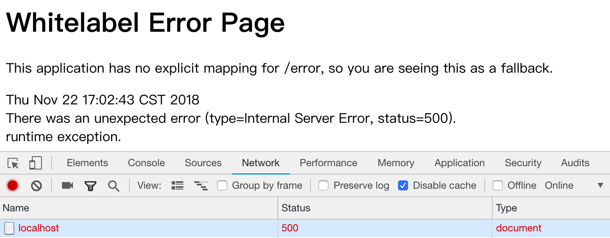

## Spring Boot MVC中的错误处理

### 1. 默认方式
默认情况下，Spring Boot提供了`/error`映射用来处理所有的错误处理，也就是我们经常看到的“Whitelabel Error Page”：

如果Api的方式（请求Accept头不包含“text/html”）访问，那么返回的json类似于：

```json
{
    "timestamp": 1542883447683,
    "status": 500,
    "error": "Internal Server Error",
    "message": "runtime exception.",
    "path": "/"
}
```

Spring Boot提供了控制默认方式的配置，如是否包含异常堆栈信息、是否启用Whitelabel页等，这些配置在`server.error`配置节点下：

```yaml
server:
  error:
    whitelabel.enabled: false #禁用whitelabel页
    include-stacktrace: always #总是包含异常堆栈信息
```

### 2. ErrorAttributes

如果您需要在默认方式的基础上自定义属性，即添加、修改属性，那么可以使用`ErrorAttributes`，它提供了页面（接口）在最终呈现前控制异常属性的机会。`DefaultErrorAttributes`是`ErrorAttributes`的默认实现，它用于帮助解析异常属性。

比如在测试、开发环境中，我们需要添加一个cause字段，表示引起异常的原因，那么可以这样：

```java
@Bean
public ErrorAttributes errorAttributes() {
    return new DefaultErrorAttributes(false) {
        @Override
        public Map<String, Object> getErrorAttributes(WebRequest webRequest, boolean includeStackTrace) {
            Map<String, Object> errorAttributes = super.getErrorAttributes(webRequest, includeStackTrace);
            
            //设置cause字段
            Throwable error = super.getError(webRequest);
            if (error.getCause() != null) {
                errorAttributes.put("cause", error.getCause().getMessage());
            }
            
            return errorAttributes;
        }
    };
}
```

注意，新增的属性只能以Api方式查看，在Whitelabel页面无法呈现，为此您需要自定义错误页。

### 3. 自定义错误页 与 BasicErrorController

自定义错误页有多种方式，下面分别介绍。

#### 1. 自定义视图

最简洁的方式是定义一个名为`error`、类型是`View`的bean：

```java
/**
 * 自定义错误视图页
 * 参照ErrorMvcAutoConfiguration，只需要注册自己的bean（name=error）即可
 */
@Bean(name = "error")
public View customError(ThymeleafViewResolver thymeleafViewResolver) throws Exception {
    return thymeleafViewResolver.resolveViewName("error", Locale.getDefault());
}
```

#### 2. 根据Http状态码自定义错误页

根据Http状态码来自定义错误页是Spring Boot的默认行为，您仅需要将自定义视图页按状态码命名，并放在`/resources/public/error`路径即可。

### 4. @ControllerAdvice


## Spring Cloud Zuul中的错误处理

## 参考

https://spring.io/blog/2013/11/01/exception-handling-in-spring-mvc
https://github.com/chanjarster/spring-mvc-error-handling-example
https://docs.spring.io/spring-boot/docs/current/reference/htmlsingle/#boot-features-error-handling
https://docs.spring.io/spring/docs/current/spring-framework-reference/web.html#mvc-exceptionhandlers
https://zhuanlan.zhihu.com/p/37132105

https://github.com/spring-cloud/spring-cloud-netflix/issues/1151
http://blog.didispace.com/spring-cloud-zuul-exception/