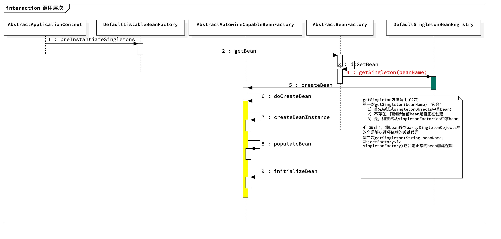
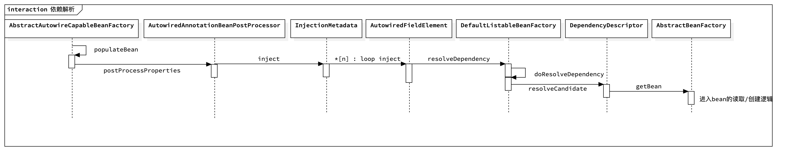
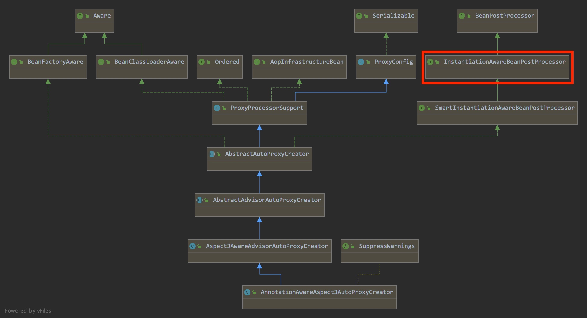
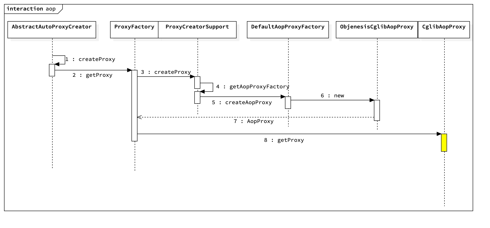
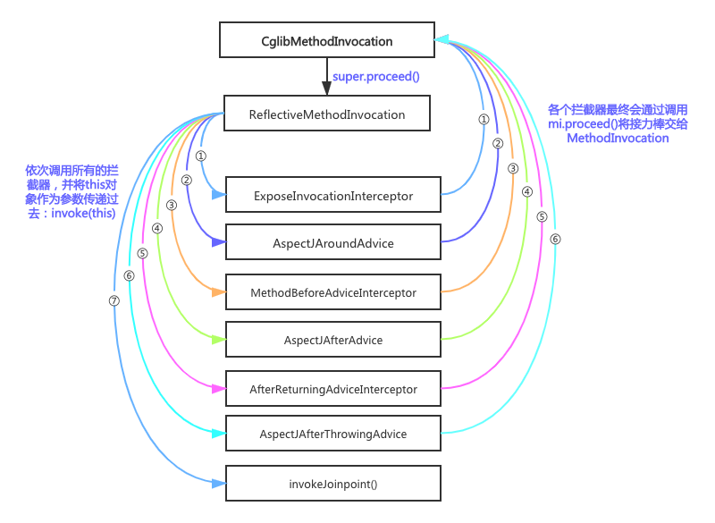

### 1. bean的创建

创建bean的工厂接口：`FactoryBean`

单利的bean在容器启动时就创建完成

> bean factory和factory bean的区别？

### 2. bean的生命周期

- 通过@Bean的方式注册bean可以指定`initMethod`和`destroyMethod`，但`destroyMethod`仅支持单例bean，Spring不保证其他类型的生命周期能够调用到该方法。
- bean后置处理器接口`BeanPostProcessor`，在bean初始化前后执行的钩子，这个接口在Spring中有大量的实现类，很多的功能，如Autowire、PostConstruct等都是基于这个接口的
- 如果需要在bean中注入`ApplicationContext`对象，只需要给bean实现`ApplicationContextAware`接口即可
- 实现了`Aware` 的子接口的bean对象，会在对象创建时，自动调用xxxAware接口的方法，xxxAware的功能一般都是由xxxProcessor来实现的

### 3. bean扩展

- `BeanPostProcessor` bean后置处理器，允许修改、替换bean

- `BeanFactoryPostProcessor` 在BeanFactory标准初始化之后创建，允许调整bean定义，此时bean定义信息已经加载但bean实例还未创建

  - `BeanDefinitionRegistryPostProcessor` 在bean定义信息被加载时执行

- `ApplicationListener` 监听容器中发布的事件，事件驱动模型开发。也可以直接使用@EventListener注解

  ​	ContextRefreshedEvent 容器刷新完成事件

  ​    ContextClosedEvent 容器关闭事件

### 4. bean创建源码解析

在debug源码之前添加一些测试类：

```java
package me.hanrui.me.hanrui.man;

import org.springframework.beans.factory.annotation.Autowired;
import org.springframework.stereotype.Component;

@Component
public class Person {
    private final String name;

    public Person() {
        this.name = "rgshare";
    }

    public String getName() {
        return name;
    }
}

@Configuration
@ComponentScan(basePackages = "me.hanrui")
public class DemoApplication {
  
	public static void main(String... args) {
		val ctx = new AnnotationConfigApplicationContext(DemoApplication.class);
		val person = ctx.getBean(Person.class);
		person.walk();
	}
}
```

上述代码中，`DemoApplication`是入口类，它配置了包扫描路径；另外还定义了`Person`对象，它用于测试bean注册过程。

#### 4.1 容器创建流程解析

接下来，启动应用，首先进入的是容器的创建流程：

```java
// 无参构造函数
public AnnotationConfigApplicationContext() {
    // 初始化所有的Root Bean Definition，包括：
    //  ConfigurationClassPostProcessor，用于解析@Configuration
    //  AutowiredAnnotationBeanPostProcessor，用于解析@Autowired和@Value注解
		this.reader = new AnnotatedBeanDefinitionReader(this);
    // 初始化scanner，它会使用AnnotationTypeFilter来判断对象是否使用了@Component、@Repository、@Service、@Controller等
		this.scanner = new ClassPathBeanDefinitionScanner(this);
}

public AnnotationConfigApplicationContext(Class<?>... annotatedClasses) {
  // 调用无参构造器
  this();
  // 将启动类注册到reader中
	register(annotatedClasses);
  // 更新容器对象
	refresh();
}

```

接下来，进入鼎鼎大名的`refresh`方法，它定义在父类`AbstractApplicationContext`中，里面的逻辑包含了完整的bean初始化流程：

```java
@Override
public void refresh() throws BeansException, IllegalStateException {
	synchronized (this.startupShutdownMonitor) {
		prepareRefresh();

		// 获取bean工厂：DefaultListableBeanFactory
    // 里面有2个配置需要留意一下：
    // allowBeanDefinitionOverriding 是否允许重写bean定义
    // allowCircularReferences 是否允许循环引用
		ConfigurableListableBeanFactory beanFactory = obtainFreshBeanFactory();
    
		// 配置bean工厂
    // 其中添加除了Aware的处理器，包括
    // ApplicationContextAwareProcessor 用于处理 ApplicationContextAware
    // ApplicationListenerDetector 用于处理监听事件(?)
		prepareBeanFactory(beanFactory);

		try {
      // 允许子类在bean工厂创建后执行自定义逻辑
			postProcessBeanFactory(beanFactory);

      // ！重点
      // 初始化并执行所有实现了BeanFactoryPostProcessor接口的对象
      //
      // 首先，获取所有的BeanDefinitionRegistryPostProcessors对象并执行
      // 其次，获取所有的BeanFactoryPostProcessor对象并执行
      // 上述执行会按PriorityOrdered、Ordered、other顺序执行
      // ConfigurationClassPostProcessor在这里会被调用，它会扫描并加载所有的bean定义信息
      // 它是bean初始化的前锋，我觉得非常重要，后面还需要细细研究
			invokeBeanFactoryPostProcessors(beanFactory);

      // 注册bean processor，以拦截bean的创建
			registerBeanPostProcessors(beanFactory);
			// 初始化MessageSource（做国际化、消息绑定、消息解析等工作）
			initMessageSource();
			// 初始化事件广播
			initApplicationEventMulticaster();
			// 执行子类的onRefresh()
     // 如果是web项目，那么这里面会创建web服务器，进入初始化tomcat流程
			onRefresh();
			// Check for listener beans and register them.
			registerListeners();

      // ！重点
      // 实例化所有的非lazy的单例对象
      // 首先，它会实例化所有的bean对象，此时还不是完整的bean
      // 其次，它会给实例化的对象填充bean
			finishBeanFactoryInitialization(beanFactory);

			// 发布事件
			finishRefresh();
		}
		...
	}
}
```

#### 4.2 bean创建流程解析

`finishBeanFactoryInitialization`方法是实例化bean的流程：

```java
protected void finishBeanFactoryInitialization(ConfigurableListableBeanFactory beanFactory) {
   // Initialize conversion service for this context.
   if (beanFactory.containsBean(CONVERSION_SERVICE_BEAN_NAME) &&
         beanFactory.isTypeMatch(CONVERSION_SERVICE_BEAN_NAME, ConversionService.class)) {
      beanFactory.setConversionService(
            beanFactory.getBean(CONVERSION_SERVICE_BEAN_NAME, ConversionService.class));
   }
   // Register a default embedded value resolver if no bean post-processor
   // (such as a PropertyPlaceholderConfigurer bean) registered any before:
   // at this point, primarily for resolution in annotation attribute values.
   if (!beanFactory.hasEmbeddedValueResolver()) {
      beanFactory.addEmbeddedValueResolver(strVal -> getEnvironment().resolvePlaceholders(strVal));
   }
   // Initialize LoadTimeWeaverAware beans early to allow for registering their transformers early.
   String[] weaverAwareNames = beanFactory.getBeanNamesForType(LoadTimeWeaverAware.class, false, false);
   for (String weaverAwareName : weaverAwareNames) {
      getBean(weaverAwareName);
   }
   // Stop using the temporary ClassLoader for type matching.
   beanFactory.setTempClassLoader(null);
   // Allow for caching all bean definition metadata, not expecting further changes.
   beanFactory.freezeConfiguration();
   // Instantiate all remaining (non-lazy-init) singletons.
   // 重点！调用beanFactory的方法
   beanFactory.preInstantiateSingletons();
}
```

接下来进入了`preInstantiateSingletons`的逻辑，由于它的调用层级复杂，为了避免在调试过程中陷入混乱，我画了一个调用层次图：



可以看到核心的逻辑主要在第6步`doCreateBean`方法中，包括：
- createBeanInstance 通过调用对象的构造函数来创建实例，如果对象实现了InstantiationAwareBeanPostProcessor，那么实例化过程交给该接口的实现来处理
- populateBean 填充bean，主要是解析@Autowired依赖注入
- initializeBean 执行Aware接口及子接口方法、BeanPostProcessor接口方法、InitializingBean接口方法。提醒一下：BeanPostProcessor允许修改、替换bean

由于代码量太大就不贴具体实现了。

整个流程中有一些需要留意的细节：

##### 4.2.1 三级缓存

需要注意的是图中标红的方法`getSingleton`，这里会涉及到一个面试题“Spring是如何解决循环依赖的”。这个方法的作用就是根据beanName查找bean对象，代码如下：

```java
public class DefaultSingletonBeanRegistry extends SimpleAliasRegistry implements SingletonBeanRegistry {
  
  // 用于保存已创建完成的bean对象
  private final Map<String, Object> singletonObjects = new ConcurrentHashMap<>(256);
  // 提前曝光的单例对象，这些对象已经创建，但尚未填充属性，也就是正在创建中
  private final Map<String, Object> earlySingletonObjects = new HashMap<>(16);
  // 单例对象工厂，key是bean名字，value是现实ObjectFactory的对象，调用getObject方法会返回bean
  // 正在创建的对象会被放到这个字典中
  private final Map<String, ObjectFactory<?>> singletonFactories = new HashMap<>(16);
  // 正在创建的bean名字集合
  private final Set<String> singletonsCurrentlyInCreation =
			Collections.newSetFromMap(new ConcurrentHashMap<>(16));
  
  @Override
  @Nullable
  public Object getSingleton(String beanName) {
    // 调用另一个重载，第二个参数allowEarlyReference为true
  	return getSingleton(beanName, true);
  }
  
  @Nullable
  protected Object getSingleton(String beanName, boolean allowEarlyReference) {
     // 从singletonObjects中读取
     Object singletonObject = this.singletonObjects.get(beanName);
     // 如果没有，但是这个对象正在创建中
     if (singletonObject == null && isSingletonCurrentlyInCreation(beanName)) {
        synchronized (this.singletonObjects) {
           // 尝试从earlySingletonObjects中读取
           singletonObject = this.earlySingletonObjects.get(beanName);
           // 如果没有，但是allowEarlyReference=true
           if (singletonObject == null && allowEarlyReference) {
              // 尝试从singletonFactories中获取singletonFactory对象
              // 如果对象正在创建中，那么会加入到singletonFactory中：
              // addSingletonFactory(beanName, () -> getEarlyBeanReference(beanName, mbd, bean));
              // 代码参见doCreateBean方法
              ObjectFactory<?> singletonFactory = this.singletonFactories.get(beanName);
              if (singletonFactory != null) {
                 // 所以这里执行的是getEarlyBeanReference方法
                 // 里面的逻辑其实就是返回正在创建的对象
                 singletonObject = singletonFactory.getObject();
                 // 将这个对象加入到earlySingletonObjects
                 this.earlySingletonObjects.put(beanName, singletonObject);
                 // 从singletonFactories中移除
                 this.singletonFactories.remove(beanName);
              }
           }
        }
     }
     return singletonObject;
  }
  
	public boolean isSingletonCurrentlyInCreation(String beanName) {
		return this.singletonsCurrentlyInCreation.contains(beanName);
	}
  
  ...
  
}
```

秘密都在代码里了，请看其中的注释。

##### 4.2.2 动态代理入口

在上图第5步`createBean`方法精简后的代码如下：

```java
@Override
protected Object createBean(String beanName, RootBeanDefinition mbd, @Nullable Object[] args)
      throws BeanCreationException {

   ...

   try {
      // 在对象的实例创建之前给BeanPostProcessors一个返回代理对象的机会
      // 它会调用实现了InstantiationAwareBeanPostProcessor接口的方法
      // 而AOP中的核心类AnnotationAwareAspectJAutoProxyCreator实现了这个接口
      Object bean = resolveBeforeInstantiation(beanName, mbdToUse);
      // 如果这个方法有返回值，说明代理对象已经创建了bean，流程就在此结束了
      if (bean != null) {
         return bean;
      }
   }
   ...

   try {
      // 创建对象实例
      Object beanInstance = doCreateBean(beanName, mbdToUse, args);
      ...
      return beanInstance;
   }
   ...
}
```

如上述代码所示，在bean对象创建之前会调用InstantiationAwareBeanPostProcessor接口实现，这是实现AOP的切入点之一。resolveBeforeInstantiation方法没太多内涵，就不在这里贴出来了。

#### 4.3 populateBean流程

在上面的层次图中，还有一个精华方法`populateBean`，它做的事情就是填充bean对象的信息，比如填充有`@Autowired`注解的字段等。它的调用层级也是比较多的，大都集中在注入字段相关逻辑，下面是我画的层次图：



相关的代码就不贴了，主要是捋清楚相关逻辑即可。

### 5. Spring AOP源码解析

#### 5.1 使用

- `@EnableAspectJAutoProxy` 启用基于CGLIB的代理功能
- `@Aspect` 标注当前类是配置类
- `@Before` 前置通知
- `@After` 后置通知，无论方法是否异常返回
- `@AfterReturning` 正常返回通知
- `@AfterThrowing` 方法异常通知
- `@Around` 环绕通知
- `@Pointcut` 公共切入点表达式

使用示例：

```java
@EnableAspectJAutoProxy
@Configuration
public class AspectConfig {
}

@Component
@Aspect
public class HomeControllerAspects{

	@Pointcut("execution(public String defaultPage())")
	public void pointCut() {}

	@Before("pointCut()")
	public void before() {
		System.out.println("before call");
	}

	@After("pointCut()")
	public void after() {
		System.out.println("after call");
	}
  
  @AfterReturning(value = "pointCut()", returning = "result")
	public void afterReturning(Object result) {
		System.out.println("after returning call, return value: "+ result);
	}
}
```

#### 5.2 源码解析

整个源码解析包含AOP入口、调用层次、代理创建逻辑，以及代理对象运行时逻辑。具体来说，包含以下几个部分：

- 首先会介绍AOP功能的入口，以及入口对象的类继承层次
- 接下来会介绍从入口对象到创建代理对象的调用层次，这个过程会解析我们的切面配置
- 然后介绍代理对象的创建流程
- 最后就是代理对象的运行时流程，这个过程会执行我们的切面逻辑

##### 5.2.1 类继承层次

AOP功能入口在`@EnableAspectJAutoProxy`注解中，它导入了`AspectJAutoProxyRegistrar`，而这个registrar作用就是注册了`AnnotationAwareAspectJAutoProxyCreator`的bean定义。毫无悬念，接下来的重点就是对`AnnotationAwareAspectJAutoProxyCreator`一探究竟。

首先，来看看这个类的继承层次：



如上图标红的地方所示，它实现了`InstantiationAwareBeanPostProcessor`接口，这个接口的定义如下：

```java
public interface InstantiationAwareBeanPostProcessor extends BeanPostProcessor {
   // 在bean实例创建之前调用
   @Nullable
   default Object postProcessBeforeInstantiation(Class<?> beanClass, String beanName) throws BeansException {
      return null;
   }

   // 在bean实例创建之后字段填充（autowired）之前调用
   default boolean postProcessAfterInstantiation(Object bean, String beanName) throws BeansException {
      return true;
   }

   ...
}
```

可以看到，它在继承自`BeanPostProcessor`之上新增了2个方法，这个接口会在bean实例对象创建之前调用（参见4.2.2小节）。

##### 5.2.2 类调用层次

接下里，看看这个接口的实现类`AbstractAutoProxyCreator`：

```java
public abstract class AbstractAutoProxyCreator extends ProxyProcessorSupport
		implements SmartInstantiationAwareBeanPostProcessor, BeanFactoryAware {
  
    private final Map<Object, Object> earlyProxyReferences = new ConcurrentHashMap<>(16);
    private final Map<Object, Class<?>> proxyTypes = new ConcurrentHashMap<>(16);
    // 增强器集合
    private final Map<Object, Boolean> advisedBeans = new ConcurrentHashMap<>(256);
  
    @Override
    public Object postProcessBeforeInstantiation(Class<?> beanClass, String beanName) {
       Object cacheKey = getCacheKey(beanClass, beanName);

       // 这里主要是尽可能的将增强器加入到advisedBeans，没有太多需要注意的地方
       if (!StringUtils.hasLength(beanName) || !this.targetSourcedBeans.contains(beanName)) {
          if (this.advisedBeans.containsKey(cacheKey)) {
             return null;
          }
          // 判断当前类是否是基础类或者需要被跳过，这些类不会被代理。
          // 基础类包括：
          //   Advice、Pointcut、Advisor、AopInfrastructureBean
          //   或者类标注了@Aspect（子类中重写了isInfrastructureClass方法）
          // 以下情形会被跳过：
          //   AspectJPointcutAdvisor类型的增强器
          //   original类指的是名字是以“.ORIGINAL”为后缀的bean
          if (isInfrastructureClass(beanClass) || shouldSkip(beanClass, beanName)) {
             this.advisedBeans.put(cacheKey, Boolean.FALSE);
             return null;
          }
       }
       ...
    }
  
    // 在bean实例创建之后，属性填充之前调用
    @Override
    public Object postProcessAfterInitialization(@Nullable Object bean, String beanName) {
      if (bean != null) {
        Object cacheKey = getCacheKey(bean.getClass(), beanName);
        if (this.earlyProxyReferences.remove(cacheKey) != bean) {
          // 找到这个bean的所有增强器，如果找到则创建代理对象
          return wrapIfNecessary(bean, beanName, cacheKey);
        }
      }
      return bean;
    }
  
    // 视情况添加代理对象
    protected Object wrapIfNecessary(Object bean, String beanName, Object cacheKey) {
      ...

      // 找到这个bean的所有的拦截器
      // 主要包括我们在HomeControllerAspects中定义的那些拦截器
      // 这些拦截器的类型是InstantiationModelAwarePointcutAdvisor
      Object[] specificInterceptors = getAdvicesAndAdvisorsForBean(bean.getClass(), beanName, null);
      if (specificInterceptors != DO_NOT_PROXY) {
        this.advisedBeans.put(cacheKey, Boolean.TRUE);
        // 接下来进入创建代理对象的流程
        Object proxy = createProxy(
            bean.getClass(), beanName, specificInterceptors, new SingletonTargetSource(bean));
        this.proxyTypes.put(cacheKey, proxy.getClass());
        return proxy;
      }

      this.advisedBeans.put(cacheKey, Boolean.FALSE);
      return bean;
    }
  
}
```

##### 5.2.3 代理创建流程

接着上面的跟踪，进入代理对象的创建流程，创建的调用层级比较多，我画了一个时序图：



如上图所示，最终调用的是`CglibAopProxy`的`getProxy`方法，这个方法里面设置了一大堆东西（没看懂），对我们源码走查来说最重要的就是注册了`DynamicAdvisedInterceptor`回调。`DynamicAdvisedInterceptor`对象实现了`MethodInterceptor`接口，对象运行期间会调用其中定义的`intercept`方法。

##### 5.2.4 代理对象运行流程

代理对象在运行时会创建一个拦截器调用链，然后按照调用链的顺序依次执行：

```java
private static class DynamicAdvisedInterceptor implements MethodInterceptor, Serializable {

   ...

   @Override
   @Nullable
   public Object intercept(Object proxy, Method method, Object[] args, MethodProxy methodProxy) throws Throwable {
     ...
      try {
         ...
         // 创建拦截器调用链
         List<Object> chain = this.advised.getInterceptorsAndDynamicInterceptionAdvice(method, targetClass);
         Object retVal;
         // 如果调用链为空，直接执行目标对象方法
         if (chain.isEmpty() && Modifier.isPublic(method.getModifiers())) {
            Object[] argsToUse = AopProxyUtils.adaptArgumentsIfNecessary(method, args);
            retVal = methodProxy.invoke(target, argsToUse);
         }
         else {
            // 否则创建CglibMethodInvocation对象
            // 并执行proceed方法
            retVal = new CglibMethodInvocation(proxy, target, method, args, targetClass, chain, methodProxy).proceed();
         }
         retVal = processReturnType(proxy, target, method, retVal);
         return retVal;
      }
      ...
   }

   ...
}
```

上述代码中的`proceed`就是调用链的执行入口：

```java
// CglibMethodInvocation继承自ReflectiveMethodInvocation
// 最终调用的是父类的proceed方法
private static class CglibMethodInvocation extends ReflectiveMethodInvocation {
  ...
	public Object proceed() throws Throwable {
   ...
		return super.proceed();
		...
	}
}

public class ReflectiveMethodInvocation implements ProxyMethodInvocation, Cloneable {
  // 所有的拦截器
  protected final List<?> interceptorsAndDynamicMethodMatchers;
  // 拦截器调用计数，表示当前调用到了第几个拦截器
  private int currentInterceptorIndex = -1;
  
  @Override
  @Nullable
  public Object proceed() throws Throwable {
    // 如果计数器达到了最大值，也就是执行到了最后一个拦截器
    if (this.currentInterceptorIndex == this.interceptorsAndDynamicMethodMatchers.size() - 1) {
      // 最后一个拦截器，这里才真正执行目标对象的方法
      // 注意，执行完成直接返回到上一个拦截器
			return invokeJoinpoint();
		}
    
    // 从列表中取下个待执行的拦截器
    Object interceptorOrInterceptionAdvice =
				this.interceptorsAndDynamicMethodMatchers.get(++this.currentInterceptorIndex);
    
    if (...) {} else {
      // 执行拦截器
      return ((MethodInterceptor) interceptorOrInterceptionAdvice).invoke(this);
    }
  }
}
```

如上述代码所示，proceed首先会调用第一个拦截器，并且将自己作为参数传过去。而拦截器在执行完自己的逻辑后，会调用proceed方法，而proceed会继续调用第二个拦截器，以此类推。整个流程类似于一个for循环，只是由各个拦截器来决定循环是否要结束：



如上图所示，按流程依次执行各拦截器。在最后一个拦截器（invokeJoinpoint方法）执行完成后，调用栈会依次回退，接下来就会执行倒数第二个拦截器，依次类推。

#### 5.3 AOP的实现区别

Spring AOP的实现包括Java动态代理和CGLIB，它们2者的区别如下：

- 动态代理只能对接口实现代理，不能针对类
- CGLIB通过字节码增强的方式，既可以对接口、也可以对类实现代理
- CGLIB采用ASM字节码技术，在一些情况下速度会比基于反射的JDK动态代理速度要快

### 6. Spring 事务源码解析

#### 6.1 使用

使用示例：

```java
@EnableTransactionManagement
@Configuration
public class TxConfig{
}
```

#### 6.2 源码解析

和AOP流程一样，@EnableTransactionManagement注解会导入TransactionManagementConfigurationSelector类，

### 参考

1. https://juejin.im/post/5e927e27f265da47c8012ed9
2. https://www.bilibili.com/video/BV1gW411W7wy


滴滴一面：

1. redis使用场景有哪些？

   缓存、分布式锁、发布订阅（消息队列）、布隆过滤器、session、计数器

2. 你们redis都使用了哪些数据结构？分别在哪些业务场景用到？

   `String`：缓存或计数器

   `List`：最新的10条数据

   `Set`：被删除的物料列表

   `Sorted Set`：排名，按时间倒序存储；用户点击历史、车型按价格倒序列表

   `Hash`：映射关系，比如车型对应的论坛

3. redis缓存的过期策略有哪些？

   - （被动）当客户端访问过期key时，会被动的删除这个key。
   - （主动）redis会每隔10s随机抽查20key，删除其中过期的key，如果过期key超过25%，则重复该操作

4. redis空间不足时有哪些回收策略？

   内存淘汰算法有LRU、LFU

   策略有：不淘汰、lru（所有key）、lru（设置了过期时间的key）、随机（所有key）、随机（设置了过期时间的key）

5. MySQL表结构设计需要考虑哪些点？

   - 选择合适的存储引擎、字符集
   - 表中必须有主键，不要使用外键约束和触发器
   - 选择合适的数据类型：尽量小，保持可读，避免null
   - 总是有创建时间、更新时间、是否删除等字段
   - 添加合适的索引

6. 创建索引需要考虑哪些点？

   索引主要是为了提升查询的性能，所以考虑的点都是围绕索引性能展开，比如：

   - 使用覆盖索引避免回表
   - 最左前缀原则避免索引失效导致索引扫描

7. 事务底层的实现原理是什么？

   首先需要了解各个日志类型：undo log用于实现事务回滚和MVCC，redo log用于实现事务持久性

   - 原子性：要么成功，要么失败，失败时使用undo log回滚
   - 一致性：数据库的完整性约束没有改变，事务执行前后是合法的状态，由数据库本身做出保障，如主外键关系等
   - 隔离性：不同事物之间互不干扰，使用锁和隔离级别（MVCC）保证隔离性
   - 持久性：事务提交应该永久性存储，redo log + 刷盘

8. redo log和binlog保证了事务的哪些特性？

   见第7题

9. redo log和bin log的区别？

   redo log用于保证crash safe，binlog记录的是数据变更日志，用于数据库恢复等

   redo log作用于引擎层，binlog作用于server层

10. 介绍一下kafka的使用场景

11. kafka用来解决什么问题？

    消息队列的特征

12. kafka的架构有了解吗？

    生产者；消费者；broker，主题，分区，副本，ISR

13. kafka数据的存储格式是什么样的？

    回答要点：存储的格式，以及为什么要这么存储（快）

14. kafka和其他消息队列的对比（rabbitmq）

15. http请求从开始到收到响应的流程都有哪些？

16. 说说tcp协议三次握手。为什么不是2次或4次？

17. udp和tcp的区别是什么？udp的使用场景有哪些？

18. session和cookie的区别于联系是什么？

19. HashMap和Hashtable的区别？

20. java中创建线程的方式有哪些？

21. 为什么要使用线程池？

22. 线程池的参数有哪些，通过这些参数来介绍一下线程池的原理？

23. java保证线程安全的方法有哪些？

24. synchronized的内部实现原理是什么？

25. volatile的实现原理是什么？它保证了并发中的哪些问题？

   

