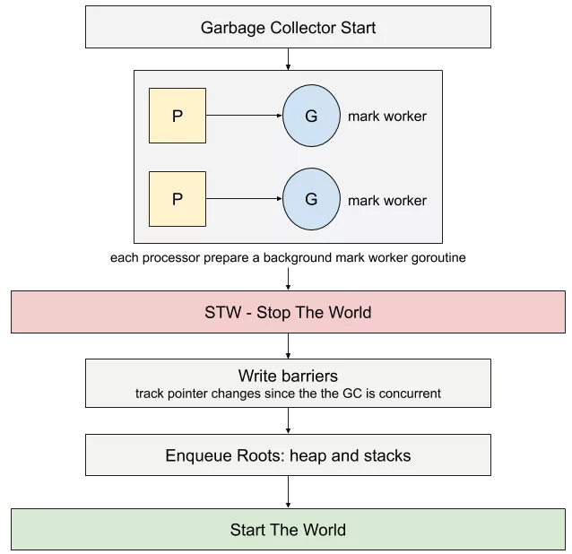

golang中的gc采用的是三色标记法，这种方式主要是为了减少停顿时间。和CMS一样，golang的gc主要是以低延迟为目标。

如上图所示，垃圾回收主要包括以下步骤：

1. 程序启动时，Go 也在每个 processor 起了一个标记 worker 来辅助标记内存。
2. STW阶段，会为所有的对象添加写屏障，写屏障通过跟踪任何指针的修改，来解决在标记期间对象的并发读写导致状态的改变
3. 开始时，所有对象都被认为是白色
4. root 对象（栈，堆，全局变量）被标记为灰色
5. 接下来，选择一个灰色的对象，标记为黑色，追踪对象引用的所有指针，标记为黑色
6. 重复第5步，直到没有对象可以被标记为止。此时对象的颜色非黑即白
7. GC 最终 STW，清除每一次写屏障对 work pool 做的改变，继续后续的标记。

参考：[Go GC 怎么标记内存？颜色是什么含义？图解三色标记法](https://mp.weixin.qq.com/s?__biz=MzAxMTA4Njc0OQ==&mid=2651440436&idx=1&sn=4c45ca5c87e8a16e799472b70a714cca&chksm=80bb1bc6b7cc92d0ac0e33c10537f5f81ac44d958c44f01e9b752d2c82aa1d87172b2929f9d6&mpshare=1&scene=23&srcid=0709d04AYUbWEiPisr1PYdFM&sharer_sharetime=1594269707150&sharer_shareid=8b6cce4aa7804cb52b9e5a9c08be2cf4%23rd)