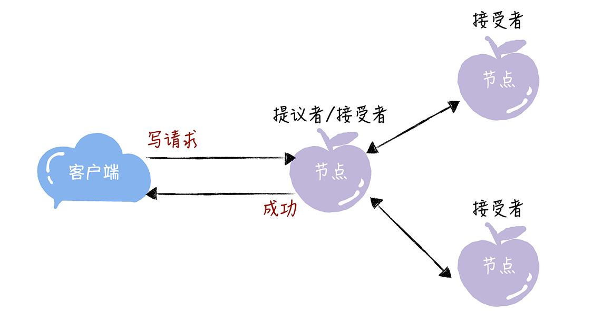
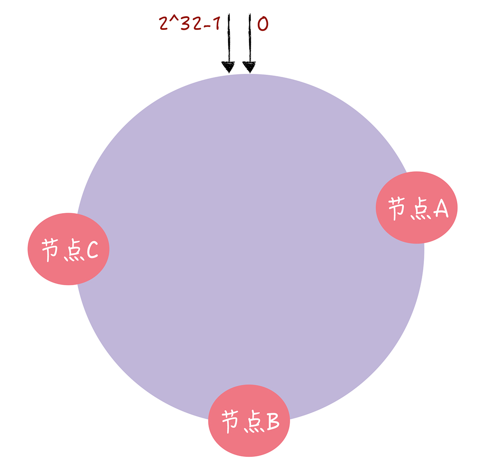
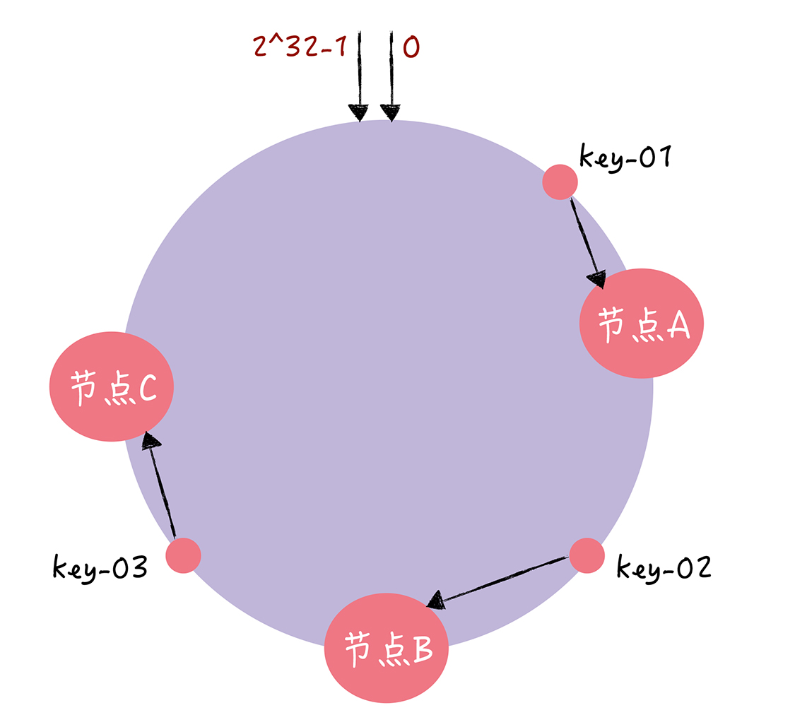
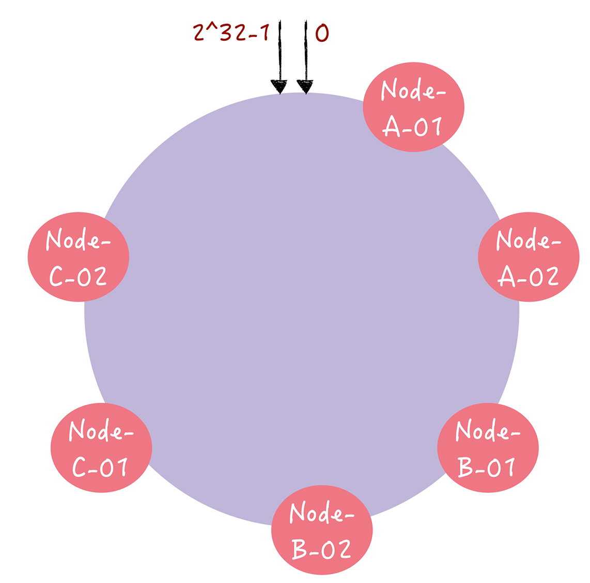

### 1. CAP理论

CAP对分布式系统进行了高度抽象，形成了3个指标：

- 一致性（Consistency）
- 可用性（Available）
- 分区容错性（Partition Tolerance）

一致性指的是客户端每次读取，无论是哪个节点，返回的数据都是一致的。可用性指的是集群本身发送故障时还能对外提供服务，强调数据的可用性，会牺牲数据的一致性。分区容错性强调的是集群对分区故障的容错能力。

因为分布式系统与单机系统不同，它涉及到多节点间的通讯和交互，节点间的分区故障是必然发生的，所以我要提醒你的是，在分布式系统中分区容错性是必须要考虑的。

现在就只剩下一致性（C）和可用性（A）可以选择了：要么选择一致性，保证数据正确；要么选择可用性，保证服务可用。那么 CP 和 AP 的含义是什么呢？

- 当选择了一致性（C）的时候，一定会读到最新的数据，不会读到旧数据，但如果因为消息丢失、延迟过高发生了网络分区，那么这个时候，当集群节点接收到来自客户端的读请求时，为了不破坏一致性，可能会因为无法响应最新数据，而返回出错信息。
- 当选择了可用性（A）的时候，系统将始终处理客户端的查询，返回特定信息，如果发生了网络分区，一些节点将无法返回最新的特定信息，它们将返回自己当前的相对新的信息。

这里我想强调一点，大部分人对 CAP 理论有个误解，认为无论在什么情况下，分布式系统都只能在 C 和 A 中选择 1 个。其实，在不存在网络分区的情况下，也就是分布式系统正常运行时（这也是系统在绝大部分时候所处的状态），就是说在不需要 P 时，C 和 A 能够同时保证。只有当发生分区故障的时候，也就是说需要 P 时，才会在 C 和 A 之间做出选择。而且如果读操作会读到旧数据，影响到了系统运行或业务运行（也就是说会有负面的影响），推荐选择 C，否则选 A。

### 2. 两阶段提交

两阶段提交又称**2PC（two-phase commit protocol**）,2pc是一个非常经典的**强一致、中心化的原子提交协议**。这里所说的中心化是指协议中有两类节点：一个是中心化**协调者节点（coordinator）**和**N个参与者节点（partcipant）**。

两阶段提交分成2个步骤：

- precommit：协调者会询问每个参与者是否能提交事务，参与者需要做资源预留（锁定），此时事务已执行但未提交
- commit：如果上一阶段所有参与者都能成功预留资源，那么协调者要求所有参与者提交事务，否则回滚事务

两阶段提交的缺点：

- 资源锁定意味着事务提交之前其他人无法操作该资源。
- 整个流程是同步阻塞的，对资源消耗较大（这条是我总结的，后面可以改改）
- 在最后的commit阶段如果发生网络故障，可能部分事务提交，部分未提交，进而导致数据不一致

### 3. 三阶段提交

三阶段提交在二阶段提交基础上做了2点改进：引入超时时间，添加cancommit阶段。三阶段包括以下步骤：

- cancommit：询问所有的参与者是否能提交事务
- precommit：执行事务但不提交
- commit：提交事务

cancommit是为了避免资源浪费，假设有这样一个场景：

> **假设有1个协调者，9个参与者。其中有一个参与者不具备执行该事务的能力。**
> 协调者发出prepare消息之后，其余参与者都将资源锁住，执行事务，写入undo和redo日志。
> 协调者收到相应之后，发现有一个参与者不能参与。所以，又出一个roolback消息。其余8个参与者，又对消息进行回滚。这样子，是不是做了很多无用功？
> 所以**，**引入can-Commit阶段，**主要是为了在预执行之前，保证所有参与者都具备可执行条件，从而减少资源浪费**。

### 4. TCC

TCC 是 Try（预留）、Confirm（确认）、Cancel（撤销） 3 个操作的简称，它包含了预留、确认或撤销这 2 个阶段：

- Try阶段，做业务一致性检查和资源预留（资源隔离）
- Confirm阶段，确认执行真正的逻辑，不做任何业务检查，只使用Try阶段预留的资源
- Cancel阶段，释放Try阶段预留的业务资源

其中Confirm、Cancel要求幂等性，因为执行失败时会进行重试。

TCC的本质是事务补偿机制，它要求每个事务参与者实现确认和撤销（补偿）操作。与2PC相比（数据库事务），TCC是在业务服务中实现的，更灵活但是对业务方的要求较高。

### 5. Saga

Saga通常是事件驱动的，每个参与者异步执行事务。Saga的核心思想是将长事务拆分为多个本地短事务，由Saga事务协调器协调，如果正常结束那就正常完成，如果某个步骤失败，则根据业务场景**正向补充**或者**逆向回滚**，使分布式事务达到正常状态。

Saga的组成：

- 每个Saga由一系列sub-transaction Ti组成
- 每个Ti都有对应的补偿动作Ci，补偿动作用于撤销Ti造成的结果，这里的每个T，都是一个本地事务

执行过程中，依次执行各参与者的正向操作，如果所有正向操作均执行成功，那么分布式事务提交。如果任何一个正向操作执行失败，那么分布式事务会退回去执行前面各参与者的逆向回滚操作，回滚已提交的参与者，使分布式事务回到初始状态。

和TCC相比，Saga没有“预留 try”动作，也就是不能保证隔离性，因为没有锁住资源，其他事务依然可以覆盖或者影响当前事务。

### 6. BASE

BASE的核心就是基本可用（Basically Available）和最终一致性（Eventually consistent）。

#### 基本可用

基本可用在本质上是一种妥协，也就是在出现节点故障或系统过载的时候，通过牺牲非核心功能的可用性，保障核心功能的稳定运行。在系统过载情况，一方面考虑提供有损服务，弃朱保帅，另一方面积极寻求资源扩容，提升整体系统的吞吐量：

1. 流量错峰（不同地区售票时间错峰出售）
2. 异步处理（买票排队，基于队列先收到用户买票请求，排队异步处理，延迟响应）
3. 服务降级（看到非实时数据，采用缓存数据提供服务）
4. 过载保护（熔断/限流，直接拒绝掉一部分请求，或者当请求队列满了，移除一部分请求，保证整体系统可用）
5. 故障隔离（出现故障，做到故障隔离，避免影响其他服务）
6. 弹性扩容（基于Metric和Monitor实现系统态势感知，做到弹性伸缩）

#### 最终一致性

最终一致性是说，系统中所有的数据副本在经过一段时间的同步后，最终能够达到一个一致的状态。也就是说，在数据一致性上，存在一个短暂的延迟。

实现最终一致性的方式常用的有这样几种：

- 读时修复：在读取数据时，检测数据的不一致，进行修复。比如 Cassandra 的 Read Repair 实现，具体来说，在向 Cassandra 系统查询数据的时候，如果检测到不同节点的副本数据不一致，系统就自动修复数据。
- 写时修复：在写入数据，检测数据的不一致时，进行修复。比如 Cassandra 的 Hinted Handoff 实现。具体来说，Cassandra 集群的节点之间远程写数据的时候，如果写失败就将数据缓存下来，然后定时重传，修复数据的不一致性。
- 异步修复：这个是最常用的方式，通过定时对账检测副本数据的一致性，并修复（更多信息可以参考11 讲的反熵）。

### 7. Paxos

在 Basic Paxos 中，有提议者（Proposer）、接受者（Acceptor）、学习者（Learner）三种角色，他们之间的关系如下：

- 提议者（Proposer）：提议一个值，用于投票表决。集群中收到客户端请求的节点，才是提议者。
- 接受者（Acceptor）：对每个提议的值进行投票，并存储接受的值。一般来说，集群中的所有节点都在扮演接受者的角色，参与共识协商，并接受和存储数据。
- 学习者（Learner）：被告知投票的结果，接受达成共识的值，存储保存，不参与投票的过程。一般来说，学习者是数据备份节点，比如“Master-Slave”模型中的 Slave，被动地接受数据，容灾备份。

### 8. Raft

从本质上说，Raft （木筏）算法是通过一切以领导者为准的方式，实现一系列值的共识和各节点日志的一致。领导者就是 Raft 算法中的霸道总裁，通过霸道的“一切以我为准”的方式，决定了日志中命令的值，也实现了各节点日志的一致。

成员身份，又叫做服务器节点状态，Raft 算法支持领导者（Leader）、跟随者（Follower）和候选人（Candidate） 3 种状态：

- 跟随者：就相当于普通群众，默默地接收和处理来自领导者的消息，当等待领导者心跳信息超时的时候，就主动站出来，推荐自己当候选人。
- 候选人：候选人将向其他节点发送请求投票（RequestVote）RPC 消息，通知其他节点来投票，如果赢得了大多数选票，就晋升当领导者。
- 领导者：蛮不讲理的霸道总裁，一切以我为准，平常的主要工作内容就是 3 部分，处理写请求、管理日志复制和不断地发送心跳信息，通知其他节点“我是领导者，我还活着，你们现在不要发起新的选举，找个新领导者来替代我。”

#### 选举领导者的过程

首先，在初始状态下，集群中所有的节点都是跟随者的状态。

### 9. 一致哈希算法

在分布式系统中，为了将数据存储到具体的节点上，一般会使用hash算法，如mod(key, n)，key是键，n是机器数。**对于这种算法，如果集群内有节点退出或新增，那么集群内存储的数据全都要重新计算hash并迁移**。

**一致性哈希（Consistent Hashing）算法解决了普通hash算法伸缩性差的问题，可以保证在上线、下线服务器的情况下尽量有多的请求命中原来路由到的服务器**。

一致性hash将2^32内的数字映射到一个圆环内，然后对节点的某个属性进行hash计算，它会落在圆环内的某个位置。如下图所示，对节点A、B、C的名字进行取模运算，即`hash(node-A)`：

当需要对key进行读写的时候，通过下面 2 步进行寻址：

- 首先，将 key 作为参数执行 hash(key) 计算哈希值，并确定此 key 在环上的位置；
- 然后，从这个位置沿着哈希环顺时针“行走”，遇到的第一节点就是 key 对应的节点。

整个流程如下图所示：

可以想象，当需要新增节点时，只会影响新增的这个节点到前面一个节点之间的数据；当需要删除节点时，只影响节点删除前的这2个节点的数据。（想象一下把）

在一致哈希中，如果节点太少，容易因为节点分布不均匀造成数据访问的冷热不均，也就是说大多数访问请求都会集中少量几个节点上。**对于这种情况，可以每一个服务器节点计算多个哈希值，在每个计算结果位置上，都放置一个虚拟节点，并将虚拟节点映射到实际节点**。如下图所示：

### 10. Gossip

Gossip 协议，顾名思义，就像流言蜚语一样，利用一种随机、带有传染性的方式，将信息传播到整个网络中，并在一定时间内，使得系统内的所有节点数据一致。

Gossip 的三板斧分别是：

- 直接邮寄（Direct Mail）：就是直接发送更新数据，当数据发送失败时，将数据缓存下来，然后重传。
- 反熵（Anti-entropy）：就是集群中的节点，每隔段时间就随机选择某个其他节点，然后通过互相交换自己的所有数据来消除两者之间的差异，实现数据的最终一致性。
- 谣言传播（Rumor mongering）。

#### 10.1 反熵细节

反熵中的熵是指混乱程度，反熵就是指消除不同节点中数据的差异，提升节点间数据的相似度，降低熵值。在实现反熵的时候，主要有推、拉和推拉三种方式。

- 推方式，就是将自己的所有副本数据，推给对方，修复对方副本中的熵
- 拉方式，就是拉取对方的所有副本数据，修复自己副本中的熵
- 二者综合，这个方式就是同时修复自己副本和对方副本中的熵

因为反熵需要节点两两交换和比对自己所有的数据，执行反熵时通讯成本会很高，所以我不建议你在实际场景中频繁执行反熵，并且可以通过引入校验和（Checksum）等机制，降低需要对比的数据量和通讯消息等。

虽然反熵很实用，但是执行反熵时，相关的节点都是已知的，而且节点数量不能太多，如果是一个动态变化或节点数比较多的分布式环境（比如在 DevOps 环境中检测节点故障，并动态维护集群节点状态），这时反熵就不适用了。那么当你面临这个情况要怎样实现最终一致性呢？答案就是谣言传播。

#### 10.2 谣言传播细节

谣言传播，广泛地散播谣言，它指的是当一个节点有了新数据后，这个节点变成活跃状态，并周期性地联系其他节点向其发送新数据，直到所有的节点都存储了该新数据

### 参考

1. [再有人问你什么是分布式事务，把这篇文章扔给他](https://mp.weixin.qq.com/s?__biz=MzA5OTAyNzQ2OA==&mid=2649709335&idx=1&sn=9024c5ac663b9dc11c3886fb8bbe962e&chksm=88936474bfe4ed623a2f541e072c8e7ca3837a508bf5799ae39ae1a5b9e43d881af78f6bbc8f&mpshare=1&scene=23&srcid=0710iWvQuaNjb6fmS5iEx4yU&sharer_sharetime=1594338758765&sharer_shareid=8b6cce4aa7804cb52b9e5a9c08be2cf4%23rd)