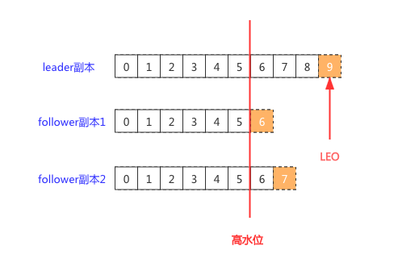

### 1. kafka术语

- 消息：Record，Kafka处理的主要对象。
- 主题：Topic。主题是承载消息的逻辑容器，在实际使用中多用来区分具体的业务。
- 分区：Partition。一个有序不变的消息序列。每个主题下可以有多个分区。
- 消息位移：Offset。表示分区中每条消息的位置信息，是一个单调递增且不变的值。
- 副本：Replica。Kafka 中同一条消息能够被拷贝到多个地方以提供数据冗余，这些地方就是所谓的副本。副本还分为领导者副本和追随者副本，各自有不同的角色划分。副本是在分区层级下的，即每个分区可配置多个副本实现高可用。
- 生产者：Producer。向主题发布新消息的应用程序。
- 消费者：Consumer。从主题订阅新消息的应用程序。
- 消费者位移：Consumer Offset。表征消费者消费进度，每个消费者都有自己的消费者位移。
- 消费者组：Consumer Group。多个消费者实例共同组成的一个组，同时消费多个分区以实现高吞吐。
- 重平衡：Rebalance。消费者组内某个消费者实例挂掉后，其他消费者实例自动重新分配订阅主题分区的过程。Rebalance 是 Kafka 消费者端实现高可用的重要手段。

### 2. kafka版本号

Kafka 目前总共演进了 7 个大版本，分别是 0.7、0.8、0.9、0.10、0.11、1.0 和 2.0。

### 3. broker使用和原理

影响性能的因素：操作系统（网络模型）、磁盘、带宽。

#### 3.1 broker参数配置

```properties
auto.create.topics.enable=false
# 当副本选举leader时一般都是选保存数据较多的副本，但如果这个副本挂了该如何选举？
# false表示不选，后果分区就不可用了；true表示选一个，后果就是数据有丢失的可能
unclean.leader.election.enable=false
# 是否需要定期换leader，代价会很大
auto.leader.rebalance.enable=false

# 消息保存多久
log.retention.{hours|minutes|ms}=256
# broker保存的消息占用最大的磁盘空间
log.retention.bytes= -1
# 单条消息的最大大小
message.max.bytes=1000012
```

#### 3.2 命令行使用

##### 3.2.1 创建topic

```bash
# 创建topic
bin/kafka-topics.sh --bootstrap-server localhost:9092 --create --topic transaction --partitions 1 --replication-factor 1 --config retention.ms=15552000000 --config max.message.bytes=5242880

#修改topic配置
bin/kafka-configs.sh --zookeeper localhost:2181 --entity-type topics --entity-name transaction --alter --add-config max.message.bytes=10485760
```

#### 3.3 分区和副本

分区（Partition）的作用就是提供负载均衡的能力，或者说对数据进行分区的主要原因，就是为了实现系统的高伸缩性（Scalability）。不同的分区能够被放置到不同节点的机器上，而数据的读写操作也都是针对分区这个粒度而进行的，这样每个节点的机器都能独立地执行各自分区的读写请求处理。并且，我们还可以通过添加新的节点机器来增加整体系统的吞吐量。

不同的分布式系统对分区的叫法也不尽相同。比如在 Kafka 中叫分区，在 MongoDB 和 Elasticsearch 中就叫分片 Shard，而在 HBase 中则叫 Region，在 Cassandra 中又被称作 vnode。

在Producer端，通过`partitioner.class`参数配置消息该发送到哪个分区。默认的分区策略是`DefaultPartitioner`，它的逻辑是：

- 如果record指定了分区，则使用指定的分区
- 如果设置了key，那么使用murmur2算法计算key的hash，然后分区
- 如果既没有指定分区、也没有指定key，那么使用轮询策略

分区在Kafka中又分成多个副本，副本分成**领导者副本**（Leader replica）和**追随者副本**（Follower replica），只有领导者副本能够对外提供服务，追随者副本用作冗余备份。它们之间的同步步骤如下：


接下来，了解一下选举leader的过程。

Kafka维护了一个**ISR副本集合**（In-sync Replicas）。ISR 中的副本都是与 Leader 同步的副本，相反，不在 ISR 中的追随者副本就被认为是与 Leader 不同步的。通过Broker端的参数配置`replica.lag.time.max.ms`来决定副本是否能进入ISR中。具体来说，当追随者副本同步在连续n毫秒内一直落后领导者的话，追随者将会从ISR集合中剔出；当追随者赶上领导者的进度时会再次加入ISR集合。

在领导者副本挂掉之后，会优先从ISR中选举出一位新的领导者。当ISR为空时，Kafka就需要从非同步副本（不在ISR中）选出领导者，但是此副本的内容可能会远落后于之前领导者，从而导致消息丢失。可以通过`unclean.leader.election.enable`配置禁用该功能。当然，这个功能需要视具体场景来确定是否启用。

#### 3.4 文件存储机制

在 Kafka 文件存储中，同一个 topic 下有多个不同的 partition，**每个 partiton 为一个目录**，partition 的名称规则为：topic 名称 + 有序序号，第一个序号从 0 开始计，最大的序号为 partition 数量减 1，partition 是实际物理上的概念，而 topic 是逻辑上的概念。

 **partition 还可以细分为 segment**，相当于将partition分成很多部分，避免单个partition占用体积过大，而且segment也使得删除旧数据更加容易。

**segment 文件由两部分组成，分别为“.index”文件和“.log”文件，分别表示为 segment 索引文件和数据文件**。这两个文件的命令规则为：partition 全局的第一个 segment 从 0 开始，后续每个 segment 文件名为上一个 segment 文件最后一条消息的 offset 值，数值大小为 64 位，20 位数字字符长度，没有数字用 0 填充，如下：

```bash
00000000000000000000.index
00000000000000000000.log
00000000000000170410.index
00000000000000170410.log
00000000000000239430.index
00000000000000239430.log
```

“.index”文件存储的是指向“.log”文件中 message 的物理偏移地址。

#### 3.5 高水位和Leader Epoch

首先明确，**HW**（High Watermark，高水位）的作用是是为了**保证消息的可见性**。

与高水位有关的另一个名词是**LEO**（Log End Offset，日志末端位移），指的是当前副本最后写入消息的位移。而高水位表示的成功写入到ISR中的各副本的最新一条消息，也就是各个副本最低的LEO。



如上图所示，每个副本均有一个LEO（上图橘黄色），高水位表示的是最小的LEO。消费者永远只能消费高水位以下的消息。

高水位还有另一个作用，就是在重新选举leader时，日志会被截断到HW位置。此时就可能会发生数据丢失，为了应对这个问题，社区新增了Epoch概念。

> 高水位的资料网上都是千篇一律，我无法甄别真假，甚至高水位的意义到底在哪儿我都没搞懂，对于这一块内容以后还需要查找更权威的资料才行！

#### 3.5 kafka为什么这么快？

- Kafka在磁盘上只做Sequence I/O，由于消息系统读写的特殊性，这并不存在什么问题。关于磁盘I/O的性能，引用一组Kafka官方给出的测试数据(Raid-5，7200rpm)：

  Sequence I/O: 600MB/s

  Random I/O: 100KB/s

- Kafka重度依赖底层操作系统提供的**PageCache**功能。当上层有写操作时，操作系统只是将数据写入PageCache，同时标记Page属性为Dirty。当读操作发生时，先从PageCache中查找，如果发生缺页才进行磁盘调度，最终返回需要的数据。实际上PageCache是把尽可能多的空闲内存都当做了磁盘缓存来使用。同时如果有其他进程申请内存，回收PageCache的代价又很小，所以现代的OS都支持PageCache。使用PageCache功能同时可以避免在JVM内部缓存数据，JVM为我们提供了强大的GC能力，同时也引入了一些问题不适用于Kafka的设计。

- Kafka为了进一步的优化性能还采用了**Sendfile**技术，也就是传说中的零拷贝

- Partition是Kafka可以很好的横向扩展和提供高并发处理以及实现Replication的基础。

- Producer端批量发送、消息压缩

参考：https://mp.weixin.qq.com/s/rXWXGLsqcwl3oQenfjYYSg

### 4. Producer端使用

#### 4.1 ack机制

producer端有三种ack机制：

- `acks=0` 消息发送不等服务端响应，这种方式吞吐量最优，但无法确认服务端是否成功收到消息。
- `acks=1` 默认值。只要分区中的leader副本成功写入消息，那么producer就会收到服务端的成功响应。这种情况下，如果leader副本发生故障需要重新选举leader时可能会发生消息丢失，因为没有确保所有副本均成功写入消息。
- `acks=-1`或`acks=all` 消息发送后，服务端需等待ISR中所有副本写入成功后才返回成功。这种方式相对于其他的2种ack机制来说，吞吐量最低但最可靠。 

即使配置了`acks=all`也无法保证消息的可靠性，因为它只保证了ISR中的副本写入成功，如果ISR中只有leader副本，当leader发送故障重新选举leader时就可能会丢消息。那如何才能保证不丢消息呢？

#### 4.2 如何做到消息不丢失？

保证消息不丢失需要producer、broker和consumer共同努力，因为从消息发送的那一刻起，任何一个环节都可能会发生故障。具体来说，要保证不丢消息需要做到以下几个方面的保障：

- producer消息发送失败重试，避免网络抖动导致消息丢失
- producer设置`acks=all`，确保ISR中所有的副本写入成功
- broker设置`unclean.leader.election.enable=false`，避免非同步副本成为leader
- broker设置`replication.factor >= 3`，防止消息丢失的主要机制就是冗余
- broker设置`min.insync.replicas > 1`，这依然是 Broker 端参数，控制的是消息至少要被写入到多少个副本才算是“已提交”。设置成大于 1 可以提升消息持久性。在实际环境中千万不要使用默认值 1。
- consumer避免自动提交位移。

#### 4.3 Producer如何做到精确一次？

对于生产者，需要开启幂等和事务。幂等处理只需要配置一个参数即可：

```java
props.put("enable.idempotence", ture)
```

幂等处理只能保证单个分区内消息不重复，要做多分区不重复还需要启用事务：

```java
producer.initTransactions();
try {
    producer.beginTransaction();
    producer.send(record1);
    producer.send(record2);
    producer.commitTransaction();
} catch (KafkaException e) {
    producer.abortTransaction();
}
```

上述代码，要么全部提交成功，要么全部写入失败，像这种使用事务的Producer称为**事务型Producer**。实际上即使写入失败，Kafka 也会把它们写入到底层的日志中，也就是说 Consumer 还是会看到这些消息。因此在Consumer端，还需要配置隔离级别，Kafka提供了2种隔离级别：

- read_uncommitted 默认值，可以读取任何消息，无论producer端的事务成功与否
- read_committed 只会读取到成功提交事务写入的消息。当然了，它也能看到非事务型 Producer 写入的所有消息。

### 5. Consumer端使用和原理

#### 5.1 Consumer Group

Consumer Group是一组客户端的组合，它们可以消费多个Topic，一个分区只会被分配到一个Consumer消费，多余的Consumer将会处于空闲状态。

比如说，一个 Consumer Group 订阅了 3 个主题，分别是 A、B、C，它们的分区数依次是 1、2、3。当设置的消费者数小于6时，可能会存在一个消费者消费多个分区的情况；但是，当消费者数大于6时，多余的消费者将不会被分配任何分区，它们永远处于空闲状态。

Consumer Group的消费进度保存在Kafka内一个特殊的主题__consumer_offsets下，叫**位移主题**，即 Offsets Topic。当Consumer Group数量发生变化，或订阅的主题数发生变化（按正则匹配订阅主题时存在这种情况），或分区数发生变化时，会触发Rebalance。Rebalance会尽力保证每个分区被平均消费。但是Rebalance的代价也非常大：在 Rebalance 过程中，所有 Consumer 实例都会停止消费，等待 Rebalance 完成，类似于JVM的STW。

Rebalance是由Coordinator（协调者）来提供位移管理和组成员管理等工作的。

#### 5.2 提交位移

Consumer 需要向 Kafka 汇报自己的位移数据，这个汇报过程被称为**提交位移**（Committing Offsets）。位移提交是 Kafka 提供给你的一个工具或语义保障，你负责维持这个语义保障，即如果你提交了位移 X，那么 Kafka 会认为所有位移值小于 X 的消息你都已经成功消费了。

位移提交分为自动提交和手动提交。Consumer 端默认启用自动提交。以下代码演示了自动提交的过程：

```java
Properties props = new Properties();
...
// 自动提交
props.put("enable.auto.commit", "true");
// 自动提交间隔
props.put("auto.commit.interval.ms", "5000");
...
KafkaConsumer<String, String> consumer = new KafkaConsumer<>(props);
consumer.subscribe(Arrays.asList("foo", "bar"));
while (true) {
    ConsumerRecords<String, String> records = consumer.poll(Duration.ofSeconds(1));
    process(records); // 处理消息
}
```

如上述代码所示，**poll 方法返回时会提交上一批消息的位移**，它能保证不出现消费丢失的情况，它可能会出现重复消费。默认情况下，位移是5秒，如果第3秒发生了Rebalance，那么Rebalance完成后，所有的Consumer会从上次提交的位移处继续消费，但该位移已经是 3 秒前的位移数据了，也就是这期间的消息会被重复消费。

而手动提交位移可以避免该问题：

```java
while (true) {
    ConsumerRecords<String, String> records = consumer.poll(Duration.ofSeconds(1));
    process(records); // 处理消息
    try {
                consumer.commitSync();
    } catch (CommitFailedException e) {
                handle(e); // 处理提交失败异常
    }
}
```

手动提交位移更加灵活，但此时Consumer 程序会处于阻塞状态，直到 Broker 返回提交结果，这个状态才会结束。鉴于这个问题，Kafka 社区为手动提交位移提供了另一个 API 方法：

```java
while (true) {
ConsumerRecords<String, String> records = consumer.poll(Duration.ofSeconds(1));
process(records); // 处理消息
consumer.commitAsync((offsets, exception) -> {
    if (exception != null)
    handle(exception);
  });
}
```

commitAsync会立即返回，不会阻塞，因此不会影响 Consumer 应用的 TPS。commitAsync 的问题在于，出现问题时它不会自动重试。因为它是异步操作，倘若提交失败后自动重试，那么它重试时提交的位移值可能早已经“过期”或不是最新值了。

对于这2种提交方式，具体使用时还需要视具体场景而定。

#### 5.3 监控消费进度

Consumer Lag可以反馈出消费者的进度，通过以下3种方式可以监控到该值：

- 使用kafka-consumer-groups脚本：

  ```bash
  bin/kafka-consumer-groups.sh --bootstrap-server <Kafka broker连接信息> --describe --group <group名称>
  ```

- 使用编程API

  代码太长，详见：https://time.geekbang.org/column/article/109238

- 使用JMX监控


### 6. 参考

1. Kafka 数据可靠性深度解读：https://www.infoq.cn/article/depth-interpretation-of-kafka-data-reliability
2. kafka在内存和磁盘IO方面的优化实践：https://mp.weixin.qq.com/s/rXWXGLsqcwl3oQenfjYYSg