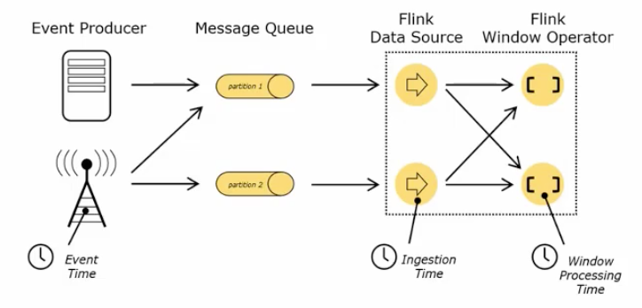

#### 1. 特点

低延迟、高性能

#### 2. 与Spark对比

#### 3. 流处理快速入门

```scala
object StreamWordCount {
  def main(args: Array[String]): Unit = {
    val params = ParameterTool.fromArgs(args)
    val host = params.get("host")
    val port = params.getInt("port")
    
    val env = StreamExecutionEnvironment.getExecutionEnvironment
    val stream = env.socketTextStream(host, port)

    val ds = stream.flatMap(_.split("\\s"))
      .filter(_.nonEmpty).map((_, 1))
      .keyBy(0).sum(1)

    ds.print()

    // 执行任务
    env.execute("stream-wc")
  }
}
```

打开控制台，使用`nc -lk 6666`命令启动端口。然后启动应用，并传入启动参数`--host localhost --port 6666`。

接下来在nc窗口输入以下字符串：

```bash
hello flink
hello scala
```

可以看到应用会输出以下内容：

```log
2> (hello,1)
4> (flink,1)

1> (scala,1)
2> (hello,2)
```

注意，最前面的数字是线程的id，默认情况下并行度（最大线程数）和CPU核数一致，可以通过`setParallelism`方法设置并行度：

```scala
ds.print().setParallelism(2)
```

> 每一个算子都可以设置并行度。

#### 4. 部署

1. Standalone模式

2. YARN

   ```bash
   #启动yarn session
   ./yarn-session.sh -n 2 -s 2 -jm 1024 -tm1024 -nm test -d
   #提交任务
   #ycrc账号密码：SCL2dw09C;E
   bin/flink run -m yarn-cluster -ynm ycrc-flink-streaming \
--allowNonRestoredState -s hdfs://bdp/bitauto/sdpc/yiche_recommend/debug/flink/realtimectr/savepoints
   -d -yjm 1024 -ytm 8192 \
   -c com.yiche.bdc.streaming.FlinkRealtimeStreaming ./recommend-flink-1.0-SNAPSHOT-jar-with-dependencies.jar
   
   
   #触发savepoint
   bin/flink savepoint a2556c484e3d3975d809e58d59383f88 hdfs://bdp/bitauto/sdpc/yiche_recommend/debug/flink/realtimectr/savepoints -yid application_1589509356612_117512
   
   #取消作业
   bin/flink cancel -s hdfs://bdp/bitauto/sdpc/yiche_recommend/debug/flink/realtimectr/savepoints a2556c484e3d3975d809e58d59383f88
   
   #从savepoint恢复
   
   ```
   
   

#### 5. 运行架构

- JobManager
- ResourceManager
- Dispatcher

任务提交流程：

具体来说，提交到YARN步骤有些差异：

#### 6. 流处理API

##### 6.1 Environment

- getExecutionEnvironment
- createLocalEnvironment
- createRemoteEnvironment

##### 6.2 Source

注意：**在Source关闭后，整个应用程序也会停止**，所以有可能产生算子还没处理完但Source已经关闭的情况。我在本次测试时，使用的Source是Collection，时间窗口是5s，结果永远都没有输出，因为此时source已经读取完成而关闭。

- 从集合读取数据

  ```scala
  // 定义样例类，传感器id，时间戳，温度
  case class SensorReading(id: String, timestamp: Long, temperature: Double)
  
  object ListSource {
  
    def main(args: Array[String]): Unit = {
      val env = StreamExecutionEnvironment.getExecutionEnvironment
      val stream = env.fromCollection(List(
        SensorReading("sensor_1", 1547718199, 35),
        SensorReading("sensor_2", 1547718199, 35),
        SensorReading("sensor_3", 1547718199, 35)
      ))
  
      stream.print("stream").setParallelism(1)
  
      env.execute()
    }
  }
  ```

- 从文件中读取数据

- 从socket中读取数据

- 从kafka中读取数据（无界流）

  首先需要添加包依赖：

  ```xml
  <dependency>
      <groupId>org.apache.flink</groupId>
      <artifactId>flink-connector-kafka-0.11_2.11</artifactId>
      <version>1.10.0</version>
      <scope>provided</scope>
  </dependency>
  ```

  上代码：

  ```scala
  object KafkaSource {
    def main(args: Array[String]): Unit = {
      val props = new Properties()
      props.setProperty("bootstrap.servers", "localhost:9092")
      props.setProperty("group.id", "consumer-group")
      props.setProperty("auto.offset.reset", "latest")
  
      val env = StreamExecutionEnvironment.getExecutionEnvironment
      val source = env.addSource(new FlinkKafkaConsumer011[String]("topic1",
        new SimpleStringSchema(), props))
    }
  }
  ```

- 自定义source

  自动以source通常用于测试环境，上代码：

  ```scala
object CustomSource {
  
    class MySensorSource extends SourceFunction[SensorReading] {
  
      // 表示数据源是否还在正常运行
      var running: Boolean = true
  
      override def run(ctx: SourceFunction.SourceContext[SensorReading]): Unit = {
        val rand = new Random()
        var curTemp = 1.to(10).map(
          i => ("sensor_" + i, 60 + rand.nextGaussian() * 20)
        )
  
        while (running) {
          curTemp = curTemp.map(
            t => (t._1, t._2 + rand.nextGaussian())
          )
  
          val curTime = System.currentTimeMillis()
          curTemp.foreach(
            t => ctx.collect(SensorReading(t._1, curTime, t._2))
          )
  
          Thread.sleep(500)
        }
      }
  
      override def cancel(): Unit = {
        running = false
      }
    }
  }
  ```

##### 6.3 Transform

- map
- flatMap
- filter
- keyBy 分区
- 滚动聚合 只能针对KeyedStream
  - sum
  - min
  - max
  - minBy
  - maxBy
  - reduce
- 多流转换算子
  - split
  - select
- connect和coMap
- union

#### 7. UDF

#### 8. Sink

#### 9. Window API

##### 9.1 窗口类型

- 时间窗口（Time Window）
  - 滚动时间窗口
  - 滑动时间窗口
  - 会话窗口
- 计数窗口（Count Window）
  - 滚动计数窗口
  - 滑动计数窗口

##### 9.2 窗口API

`window()`方法必须在keyBy之后才能使用，更简单的方式`timeWindow`、`countWindow`。

##### 9.3 窗口函数

窗口函数定义了要对窗口中收集的数据进行的计算操作，可以分成2类：

- 增量聚合函数（incremental aggregation functions）
  - 每条数据到来就进行计算，保持一个简单的状态
  - ReduceFunction，AggregateFunction
- 全窗口函数（full window functions）
  - 先把窗口所有数据收集起来，等到计算的时候会遍历所有数据
  - ProcessWindowFunction

##### 9.4 其他可选API

- trigger() 触发器，定义window什么时候关闭，关闭触发计算输出结果
- evitor() 移除器，定义移除某些数据的逻辑
- allowedLateness() 允许处理迟到的数据
- slideOutputLateDate() 将迟到的数据放入侧输出流
- getSideOutput() 获取侧输出流

#### 10. Flink中的时间

##### 10.1 时间语义



- Event Time：事件创建的时间
- Ingestion Time：数据进入Flink的时间
- Processing Time：执行操作算子的本地系统时间，与机器相关

可以直接在代码中，对执行环境设置流的时间特性：

```scala
env.setStreamTimeCharacteristic(TimeCharacteristic.EventTime)
```

当然，具体的时间，还需要从数据中提取时间戳（timestamp）。

##### 10.2 水位线（Watermark）

Watermark是一种衡量Event Time进展的机制，可以设定延迟触发：

```scala
// 基于周期性设定Watermark
stream.assignTimestampsAndWatermarks(
  new BoundedOutOfOrdernessTimestampExtractor[SensorReading]
  // 等待延迟时间
  (Time.milliseconds(1000)) {
    override def extractTimestamp(t: SensorReading): Long = {
      // 时间戳
      t.timestamp * 1000
    }
  }
)
```

#### 11. 底层API

#### 12. Flink中的状态

 状态后端：

- MemoryStateBackend 内存级状态后端，将键控状态作为内存中的对象进行管理，他们存储在TaskManager的JVM堆上，而将checkpoint存储在JobManager的内存中
- FsStateBackend 将checkpoint存储到远程的持久化文件系统上，对于本地状态，和MemoryStateBackend一样，也会存储在TaskManager的JVM
- RocksDBStateBackend 将所有状态序列化后，存储在本地的RocksDB中

设置方式：

```scala
env.enableCheckpointing(1000)
env.setStateBackend(new MemoryStateBackend())
```

#### 13. Flink的容错机制

##### 13.1 状态一致性
- 状态一致性分类
  - AT-MOST-ONCE（最多一次） 当出现故障时，什么都不干，数据会丢失。实时性最好。
  - AT-LEAST-ONCE（至少一次）保证不会丢失数据，但事件有可能会被多次处理。
  - EXACTLY-ONCE（精确一次）恰好处理一次性，意味着没有事件丢失，而且针对每一条数据，内部状态仅更新一次。
  
- 端到端（end-to-end）的状态一致性

  flink通常只用于处理流，它需要数据源source和sink，那如何确保每一个步骤的的状态一致性呢？对于source来说可能没什么问题，因为常用的kafka支持checkpoint。对于sink来说就不太好解决了，有幂等写入和事务写入两种解决方案。


  事务写入分成2种方式：

  - 预写日志（Write-Ahead-Log，WAL） 把数据当成状态保存，然后在收到checkpoint完成通知时一次性写入sink系统，DataStream API提供了模板类`GenericWriteAheadSink`来实现这种事务性sink

  - 两阶段提交（Two-Phase-Commit，2PC） 对于每个checkpoint，sink任务会启动一个事务，接下来所有接收到的数据添加到事务；然后这些数据写入外部sink系统（预提交）；当收到checkpoint完成通知时，它才正式提交事务，实现真正写入，这种方式真正实现了exactly-once，flink提供了`TwoPhaseCommitSinkFunction`接口。

    这种方式要求外部sink支持事务。

##### 13.2 一致性检查点（Checkpoints）

- Flink故障恢复机制的核心，就是应用状态的一致性检查点
  - 有状态应用的一致检查点，其实就是所有任务的状态，在某个时间点的一份快照；这个时间点，应该是所有任务都恰好处理完一个相同的输入数据的时候
- 检查点分界线（Checkpoint Barrier）

  - Flink的检查点算法用到了一种称为分界线（barrier）的特殊数据形式，用来把一条流上的数据按照不同的检查点分开
  - 分界线之前到来的数据导致的状态更改，都会被包含在当前分界线所属的检查点中；而基于分界线之后的数据导致的所有更改，会被包含在之后的检查点中


和检查点相关的配置：

```scala
// 启用检查点，间隔10s
env.enableCheckpointing(10 * 1000)
// 设置检查点模式
env.getCheckpointConfig.setCheckpointingMode(CheckpointingMode.EXACTLY_ONCE)
// 设置超时时间
env.getCheckpointConfig.setCheckpointTimeout(60000)
env.getCheckpointConfig.setTolerableCheckpointFailureNumber(10)
// 设置同时运行的checkpoint数，有可能同时存在多个checkpoint
env.getCheckpointConfig.setMaxConcurrentCheckpoints(1)
// 设置2个checkpoint之间的时间间隔
// 这个配置如果大于0，那么永远不会存在并发执行checkpoint的问题
env.getCheckpointConfig.setMinPauseBetweenCheckpoints(10 * 1000)
// 外部持久化配置，当job被手动取消时，不保存checkpoint
env.getCheckpointConfig.enableExternalizedCheckpoints(ExternalizedCheckpointCleanup.DELETE_ON_CANCELLATION)
// 设置重启策略
// 固定延迟重启策略
env.setRestartStrategy(RestartStrategies.fixedDelayRestart(5, 1000 * 60))
```

##### 13.3 保存点（Savepoints）

保存点使用的算法与检查点完全相同，但相较来说，它能存储一些额外的元数据，且保存点不会自动创建，需要手动触发。

保存点的一般用于有计划的手动备份、更新应用程序，版本迁移，暂停和重启应用等等。

#### 14. Table API与SQL


### 参考

- https://www.bilibili.com/video/BV1gJ411Q72x
- https://mp.weixin.qq.com/s/Nf4iV_sNitOMQkw7PGgvOQ