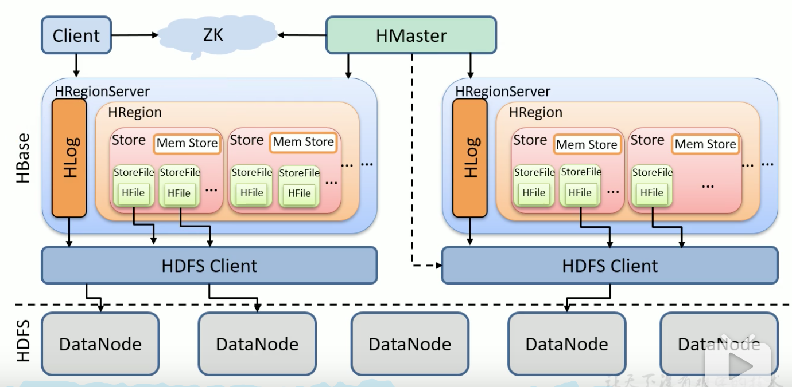

1. HBASE逻辑结构

1. 列
2. 列族，即将多个列绑定到一起，不同的列族放到不同的文件夹
3. 行键（Row key），按位比较，即字典序
4. Region，按row key横向切分
5. store 实际存储的数据

#### 2. HBASE物理结构

hbase是以列为基本单位存储的

#### 3. 数据模型

- Name Space 类似于MySQL的database概念。hbase安装完后有2个默认的命名空间：hbase和default，前者存储hbase元数据，后者是用户默认使用的命名空间。
- Region 类似于MySQL表的概念。hbase定义表时只需要声明列族即可，列（字段）可以动态、按需指定。
- Row 每行数据都由一个RowKey和多个Column组成，数据按照RowKey的字典序存储的，并且查询数据时只能根据RowKey进行检索，所以RowKey的设计十分重要。
- Column 列由于列族（Column Family）和列限定符（Column Qualifier）进行限定。
- Time Stamp 用于表示数据的不同版本
- Cell 由{rowkey, column family, time stamp}唯一确定的单元

#### 4. 数据操作

```bash
# 增/改
put 'namespace:table', 'row key', 'column-family:column', 'value' [, timestamp]
# 扫描
scan 'namespace:table'
# 查找
get  'namespace:table', 'row key'
```

### 5. HBASE架构图



- 底层存储HDFS，元数据管理ZK。
- 客户端直接从ZK获取HBASE集群信息
- HRegionServer维护Region
- HLog WAL，保证crash safe
- HRegion 表，列族数据存储在Store中，多个列族可以存到一个Store
- 数据存储在内存里叫MEM Store，文件中叫StoreFile，格式是HFile

##### 5.1 写入数据流程

写步骤：

1. 从ZK中获取元数据，根据元数据定位到表对应的机器
2. 连接RegionServer
3. 先写WAL，再写MEM Store，然后将WAL刷新到磁盘
4. MEM Store的数据会按以下规则刷到磁盘
   - 当MEM Store达到阈值时会触发
   - 当单个Region的MEM Store到达阈值
   - 当WAL文件个数达到阈值

由于MEM Store每次刷盘都会生成一个新的HFile文件，且同一个字段的不同版本都可能会分布到不同的HFile中，所以为了减少HFile的个数，会进行StoreFile的合并（Compaction）。

合并分成2种：

- Minor Compaction 将小文件合并成文件，它不会删除那些已经删除或过期的数据版本
- Major Compaction 将所有文件合并成一个大文件，会删除已删除的数据和旧版本，触发时机：定期合并（不建议启用）；Store File达到阈值

如果合并后的文件过大（可能是由于数据倾斜导致），那么将会被切分成2个文件。通常在建表的时候会设置预分区，在设计row key时可尽量避免这个问题。

##### 5.2 读取数据流程

由于HBASE中的数据是按时间戳区分版本的，所以为了能查到最新数据，通常会从磁盘加载数据，同时和MEM Store进行合并。为了减少磁盘IO，HBASE会在首次读取磁盘数据后缓存到内存中，这部分内存叫做Block Cache。

但通常Block Cache起的作用不是很大，这也是为什么HBASE的读操作比写慢的原因。

##### 5.3 预分区

手动设定预分区：

```bash
create 'staff', 'info', 'partition1', SPLITS => ['100', '200', '300']
```

会产生4个Region，每个Region都会有一个范围，这个范围叫做分区键，判断一个row key是否在该范围是通过字典序判断的，并不是数字大小。

##### 5.4 RowKey设计原则

