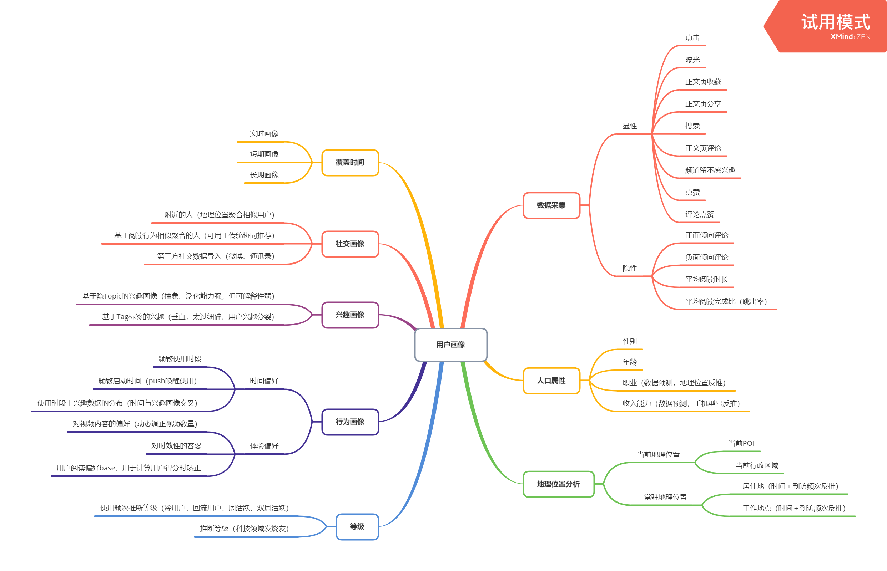

#### 来源

https://mp.weixin.qq.com/s/_leltatv8UhlYZ6FjXoEdQ

#### 指标

用户连续使用 = 点击率 + 刷新次数

文章跳出率 = 用户最后一刷曝光/文章总曝光

互动率：点赞、收藏、评论比例

指标权衡

1. 优化CTR：CTR提升，阅读时长，阅读完成比下降
2. 优化阅读完成比：CTR下降，阅读时长下降，系统将倾向于推荐短的视频和文章
3. 优化阅读时长：CTR下降，阅读完成比下降，系统将倾向于推荐长的视频和文章
4. 优化CTR+阅读时长+交互：CTR稳定，阅读时长提升，互动率提升，系统倾向于推荐品质相对较好的视频和文章，且能够激发用户互动，助推留存提升

#### 特征工程

用户画像：

内容画像：

	- NLP：一级分类，二级分类，Topic，实体，图谱
	- 统计类：点击率，时长，完成比，转评赞，跳出率
	- 质量类：软文广告，标题党，质量得分，账号评级
	- 向量类：Item2Vec，图像的Embedding等

上下文特征：

- 手机型号，品牌网络，时间，日期，节日，天气，地域

#### 抑制标题党

标题党是利用各种颇具创意的标题吸引网友眼球，文章标题严重夸张，内容通常与标题无关或联系不大。**“标题党”会大量影响用户时常，降低内容品质，跳出率高，影响留存**。

标题党文章特征：高转化率，低时长，低完成比

优质文章特征：中等转化率、高时长，高完成比

#### 缩略图优化

标题和缩略图是非常核心的信息传达元素，如何优化缩略图对信息流提升效果至关重要。

1. 智能缩略图裁剪
2. 智能缩略图选择
3. 智能配图