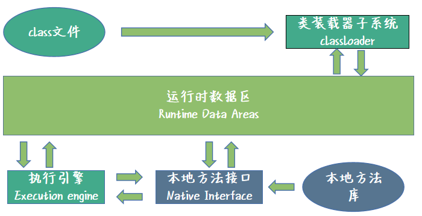
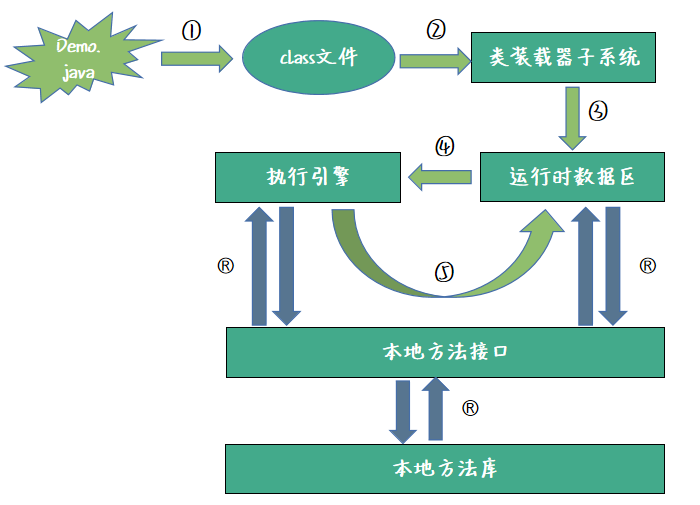
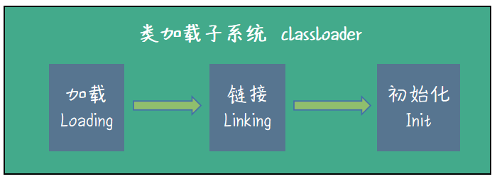
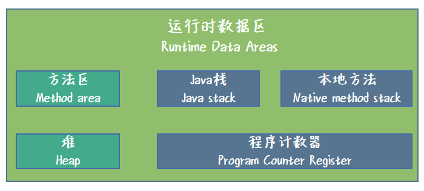

# 一. JVM 概述

## 1. JVM介绍

 ### 1.1 JVM定义

* JVM (java Virtual Machine 简称 JVM), 亦可成之为Java虚拟机。他是运行所有Java程序的抽象计算机。是Java语言的运行环境, 他是Java最具吸引力的特征之一。

### 1.2 JVM的作用 

* **跨平台性:** _在各大操作系统上安装了JVM后, 就可以支持Java程序的运行_
* **优秀的垃圾回收机制:** _极大的降低了软件开发人员的学习难度_

### 1.3 查看自己的 JVM

* 命令行输入命令:  

```shell
java -version
```

* 以本人的机器为例, 可以看到如下执行结果:

```shell
java version "1.8.0_181"
Java(TM) SE Runtime Environment (build 1.8.0_181-b13)
Java HotSpot(TM) 64-Bit Server VM (build 25.181-b13, mixed mode)
```

### 1.4 JVM , JRE 和 JDK 关系


* **三者定义**
   * **JDK**: Java开发环境。java开发工具包, 面向开发者, 为开发者提供开发类库, 他是Java的核心。JDK包含JRE, 一堆工具类以及Java基础类库。
   * **JRE**:Java运行环境。包含JVM实现和需要的类库。是一个运行环境, 不是开发工具。
   * **JVM**:他是一个虚构出来的计算机, 是通过在实际计算机上方针模拟各种计算机功能来实现的。JVM有自己完善的硬件架构, 比如L处理器, 堆栈,寄存器等, 还具有相应的指令系统。Java语言最重要的特点就是跨平台运行。使用JVM就是为了实现跨平台。
* **三者区别**
   * **JDK 和 JRE的区别**: JDK是开发工具包, 包含JRE; JRE是运行环境, 不提供开发工具包。
   * **JRE和JVM的区别**: JRE包含了JVM, JRE=JVM+lib。JRE为class文件提供了运行环境, 但是需要JVM进行class文件的翻译, JVM将翻译好的文件传给OS系统或者是CPU映射指令集, 才能够最终完成运行。
* **三者联系**
   * 三者相互配合不可分割。

>总体来说, 我们利用JDK开发了属于我们自己的程序, 通过JDK的javac工具包进行编译, 将Java文件编译成为了class文件(字节码文件), 在JRE上运行这些文件的时候, JVM进行了这些文件(字节码文件)的翻译。翻译给操作系统, 映射到CPU指令集或者是操作系统调用, 最终完成了我们的代码程序的顺利运行。


## 2. JVM整体架构(各模块简介)



----

### 2.1  JVM 模块 

* **Class文件:** 主要是编译成字节码的Java文件, Class文件才是JVM可以识别的文件, 所以Java文件需要先进行编译才可以进入JVM执行。
* **类加载子系统:** 类的加载, 主要负责从文件系统中, 或者网络中加载Class信息, 并与运行数据区进行交互。
* **运行时数据区:** 主要包括5个小模块: java堆, java栈, 本地方法栈, 方法区, 寄存器。
* **执行引擎:** 分配给运行时数据区的字节吗酱油执行引擎执行, 执行引擎读取字节码并逐个执行。垃圾回收器就是执行引擎的一部分。
* **本地方法接口:** 本机方法库进行交互, 并提供执行引擎所需的本机库
* **本地方法库: ** 他是执行引擎所需的本级库的集合 


---

### 2.2 Java文件的流转过程



我们对上图中的6个步骤, 逐一进行介绍:

* **步骤 1: ** 我们的Demo.java文件,通过JDK的javac命令, 成功的编译成为Demo.class文件
* **步骤 2: ** JVM有自己的类加载器, 将编译好的Demo.class文件进行加载
* **步骤 3: ** 类加载器将加载的Demo.class文件投放到运行时数据区, 供程序执行使用
* **步骤 4: ** 运行时数据区将字节码文件,交给执行引擎执行
* **步骤 5: ** 执行引擎执行完毕, 会对运行时数据区的数据进行操作, 比如垃圾回收机制是执行引擎的一部分, 垃圾回收机制, 针对的是运行时数据区的堆空间, 交给执行引擎执行
* **步骤 R: **我们发现图中有很多R步骤, 此处R代表的是Random, 即随机发生的步骤, 其实就是在我们执行的过程中一个本地方法的调用, 只要我们的程序在运行的过程中需要调用本地方法, 那么步骤R就会发生。


---

### 2.3 类加载子系统



* **加载 : ** 通过三种不同的类加载器对class文件进行加载,  我们也可以自定义类加载器, 通过父子额classLoader方法可以实现自定义的类加载器。
* **链接: ** 链接阶段会对加载好的Class问阿金进行字节码, 静态变量, 方法引用等进行验证和解析, 为初始化做准备。
* **初始化: ** 类加载的最后阶段, 对类进行初始化。

---

### 2.4 运行时数据区



> Tips: **方法区**和**堆**为共享内存区域, 多线程环境下共享这两块内存区域(**会有线程安全问题**)。**Java栈,本地方法栈和程序计数器**为线程私有部分, 私有数据对其他线程不可见(**不会有现线程安全问题**)

* **方法区 (Method Area): **所有类级别的数据将存储在这里, 包括静态变量。每个JVM只有一个方法区, 它是资源共享的。
* **堆区域 (Heap Area): **所有对象及其对应的实例变量和数据将存储在堆区域中。每个JVM也只有一个堆区域。由于方法区和堆区域共享多个线程的内存, 所以储存的数据不是线程安全的。
* **栈区域 (Stack Area): ** 对于每个线程, 将创建单独的运行时栈, 对于每个方法调用, 将在栈存储器中产生一个条目, 称为栈帧。所有局部变量将在栈内存中创建。栈区域是线程安全的, 因为它不共享资源。
* **PC寄存器 (PC Registers): ** 也称作程序计数器。每个线程都有单独的PC寄存器, 用于保存当前执行的指令地址, 一旦执行指令, PC寄存器将被下一条指令更新。
* **本地方法栈 (Native Moethod stacks): **本地方法栈保存本地方法信息。对于每个线程将创建一个单独的本地方法栈。

---

### 2.5 执行引擎 


包含:**解释器, JIT编译器,垃圾回收器(Garbage Collector)**

* **解释器: ** 解释器的作用于字节码的解释, 解释器的缺点是当一个方法被调用多次时, 每一次都要重新解释该方法。
* **JIT编译器: ** JIT编译器消除了解释器的缺点。执行引擎在转换字节码时是用解释器的帮助, 但是当他发现重复代码时, 将使用JIT编译器, 这提高了系统的性能。
* **垃圾回收器: ** 手机和删除未引用的对象。可以通过`System.gc()`出发垃圾收集。

>垃圾回收器执行引擎模块的重中之重。
>
>

# 二. JVM常用参数配置


## 1.  JVM 参数：跟踪垃圾回收

示例代码准备

```java
public class PrintGCParamsDemo {
    public static void main(String[] args) {
        ArrayList<String> list = new ArrayList<String>();
        list.add("Hello");
        list.add("World");
        list.add("!!!");
        System.gc(); //手动执行 gc 垃圾回收
    }
}
```

---

### 1.1  -XX:+PrintGC 参数:

**参数作用**: 

-XX:+PrintGC参数是垃圾回收跟踪中十分常用的参数。使用这个参数启动虚拟机后, 只要遇到GC就会打印日志

**结果: **

```java
[GC (System.gc())  3933K->792K(251392K), 0.0054898 secs]
[Full GC (System.gc())  792K->730K(251392K), 0.0290579 secs]
```

**分析: **

* **GC 与 Full GC :** 代表垃圾回收的类型
* **System.gc() :** 代表垃圾回收的方式, 是通过调用gc方法进行垃圾回收的
* **3933K->792K(251392K) :** 代表之前使用了3933k的空间, 回收之后使用的空间为792k的空间, 回收了3933k - 792k = 3141k 的容量。 251392k代表了总容量。
* **792K->730K(251392K) :** 分析同上;
* **0.0054898 secs : ** 代表了垃圾回收执行之间, 以秒为单位。

---

### 1.2   -XX:+PrintGCDetails 参数 :

**参数作用 :**

 -XX:+PrintGCDetails 参数是垃圾回收跟踪中十分重要的参数, 而且日志更加详细。获取的比-XX:PringtGC参数更详细的信息。

**结果:**

```java
[GC (System.gc()) [PSYoungGen: 3933K->792K(76288K)] 3933K->800K(251392K), 0.0034601 secs] [Times: user=0.00 sys=0.00, real=0.00 secs] 
[Full GC (System.gc()) [PSYoungGen: 792K->0K(76288K)] [ParOldGen: 8K->730K(175104K)] 800K->730K(251392K), [Metaspace: 3435K->3435K(1056768K)], 0.0217628 secs] [Times: user=0.03 sys=0.00, real=0.02 secs] 
```

**分析 : **

* **PSYoungGen : ** 年轻代的回收
* **ParOldFen :** 老年代的回收
* **Matasoace :** 元空间的回收 JDK低版本称之为永久代

---

### 1.3  -XX:+PrintGCHeapAtGC 参数 :

**参数作用:**

-XX:+PrintHeapAtGc 参数是垃圾回收跟踪中, 对对空间进行跟踪时十分常用的参数, 可以在每此GC前后分别打印堆的信息。注意, 只在GC前后均打印, 打印两次。

**结果 : **

```java
{Heap before GC invocations=1 (full 0):
 PSYoungGen      total 76288K, used 3933K [0x000000076b400000, 0x0000000770900000, 0x00000007c0000000)
  eden space 65536K, 6% used [0x000000076b400000,0x000000076b7d7480,0x000000076f400000)
  from space 10752K, 0% used [0x000000076fe80000,0x000000076fe80000,0x0000000770900000)
  to   space 10752K, 0% used [0x000000076f400000,0x000000076f400000,0x000000076fe80000)
 ParOldGen       total 175104K, used 0K [0x00000006c1c00000, 0x00000006cc700000, 0x000000076b400000)
  object space 175104K, 0% used [0x00000006c1c00000,0x00000006c1c00000,0x00000006cc700000)
 Metaspace       used 3420K, capacity 4496K, committed 4864K, reserved 1056768K
  class space    used 371K, capacity 388K, committed 512K, reserved 1048576K
Heap after GC invocations=1 (full 0):
 PSYoungGen      total 76288K, used 792K [0x000000076b400000, 0x0000000770900000, 0x00000007c0000000)
  eden space 65536K, 0% used [0x000000076b400000,0x000000076b400000,0x000000076f400000)
  from space 10752K, 7% used [0x000000076f400000,0x000000076f4c6030,0x000000076fe80000)
  to   space 10752K, 0% used [0x000000076fe80000,0x000000076fe80000,0x0000000770900000)
 ParOldGen       total 175104K, used 0K [0x00000006c1c00000, 0x00000006cc700000, 0x000000076b400000)
  object space 175104K, 0% used [0x00000006c1c00000,0x00000006c1c00000,0x00000006cc700000)
 Metaspace       used 3420K, capacity 4496K, committed 4864K, reserved 1056768K
  class space    used 371K, capacity 388K, committed 512K, reserved 1048576K
}
{Heap before GC invocations=2 (full 1):
 PSYoungGen      total 76288K, used 792K [0x000000076b400000, 0x0000000770900000, 0x00000007c0000000)
  eden space 65536K, 0% used [0x000000076b400000,0x000000076b400000,0x000000076f400000)
  from space 10752K, 7% used [0x000000076f400000,0x000000076f4c6030,0x000000076fe80000)
  to   space 10752K, 0% used [0x000000076fe80000,0x000000076fe80000,0x0000000770900000)
 ParOldGen       total 175104K, used 0K [0x00000006c1c00000, 0x00000006cc700000, 0x000000076b400000)
  object space 175104K, 0% used [0x00000006c1c00000,0x00000006c1c00000,0x00000006cc700000)
 Metaspace       used 3420K, capacity 4496K, committed 4864K, reserved 1056768K
  class space    used 371K, capacity 388K, committed 512K, reserved 1048576K
Heap after GC invocations=2 (full 1):
 PSYoungGen      total 76288K, used 0K [0x000000076b400000, 0x0000000770900000, 0x00000007c0000000)
  eden space 65536K, 0% used [0x000000076b400000,0x000000076b400000,0x000000076f400000)
  from space 10752K, 0% used [0x000000076f400000,0x000000076f400000,0x000000076fe80000)
  to   space 10752K, 0% used [0x000000076fe80000,0x000000076fe80000,0x0000000770900000)
 ParOldGen       total 175104K, used 705K [0x00000006c1c00000, 0x00000006cc700000, 0x000000076b400000)
  object space 175104K, 0% used [0x00000006c1c00000,0x00000006c1cb07a0,0x00000006cc700000)
 Metaspace       used 3420K, capacity 4496K, committed 4864K, reserved 1056768K
  class space    used 371K, capacity 388K, committed 512K, reserved 1048576K
}
```

**结果分析: **

这是对 对空间 的日志打印, 对于对空间的参数跟踪, 将PSYongGen 和ParOldGen 打印的信息更加详细, 

---

### 1.4  -XX:+PrintGCTimeStamps 参数  :

**参数作用 : **

会在每次GC发生时, 额外输出GC发生的时间, 该启动时间为虚拟机启动后的时间偏移量, 需要与-XX:PrintGC 或 -XX:PrintGCDetails 配合使用, 单独使用-XX:PrintGCTimeStamps参数是无效的。

**结果: **

```java
0.247: [GC (System.gc())  3933K->760K(251392K), 0.0114098 secs]
0.259: [Full GC (System.gc())  760K->685K(251392K), 0.0079185 secs]
```

**分析 : **

与-XX:PrintGC参数打印的结果一样, 唯一的区别及时在日志开头的 0.247 与 0.259 。此处的 0.247 与 0.259 表示, JVM开始运行了 0.247秒之后发生了GC,  开始运行了 0.259秒之后,  发生了FullGC。


## 2. JVM 参数: 跟踪类的加载与卸载

示例代码准备

```java
public class TracingClassParamsDemo {
    public static void main(String[] args) {
        ArrayList<String> list = new ArrayList<String>();
        list.add("Hello");
        list.add("World");
        list.add("!!!");
    }
}
```

>Tips: 注意, 此处示例代码, 并没有执行gc操作, 上一节的内容是为了跟踪垃圾回收, 所以需要手动调节调用 gc 方法而达到垃圾回收的效果。而此处我们讨论的是类的加载与卸载, 此处无需进行手动垃圾回收。
>
>

### 2.1 -XX:+TraceClassLoading 参数:

**参数作用 : **为了跟踪类的加载。

**结果: **此处仅展示具有代表性的类的加载

```java
[Opened C:\Program Files\Java\jdk1.8.0_152\jre\lib\rt.jar]
[Loaded java.lang.Object from C:\Program Files\Java\jdk1.8.0_152\jre\lib\rt.jar]
[Loaded java.util.ArrayList$SubList from C:\Program Files\Java\jdk1.8.0_152\jre\lib\rt.jar]
[Loaded java.util.ListIterator from C:\Program Files\Java\jdk1.8.0_152\jre\lib\rt.jar]
[Loaded java.util.ArrayList$SubList$1 from C:\Program Files\Java\jdk1.8.0_152\jre\lib\rt.jar]
[Loaded DemoMain.TracingClassParamsDemo from file:/D:/GIT-Repositories/GitLab/Demo/out/production/Demo/]
[Loaded java.lang.Class$MethodArray from C:\Program Files\Java\jdk1.8.0_152\jre\lib\rt.jar]
[Loaded java.lang.Void from C:\Program Files\Java\jdk1.8.0_152\jre\lib\rt.jar]
[Loaded java.lang.Shutdown from C:\Program Files\Java\jdk1.8.0_152\jre\lib\rt.jar]
[Loaded java.lang.Shutdown$Lock from C:\Program Files\Java\jdk1.8.0_152\jre\lib\rt.jar]
```

**结果分析:**

* **第一行 :** Opened rt.jar。打开tr.jar，tr.jar 全称是 Runtime，该jar包含了所有支持Java运行的核心类库， 是类加载的第一步。
* **第二行 :** 加载 java.lang.Object。Object是所有对象的父类， 是首要加载的类。
* **第三, 四, 五行 :** 加载了AttayList的相关类， 我们的实例代码汇总使用到了ArrayList，因此需要对该类进行加载。
* **第六行: ** 加载我们的测试类 TracingClassParamsDemo。
* **第七行 :** 加载java.lang.Class类， 并加载该类的方法MethodArray。
* **第八行 :** 加载java.lang.Void 类，因为我们的面函数式void的返回值类型，所以需要加载此类。
* **第九, 十行 :** 加载java.lang.ShutDown类，JVM结束运行后， 关闭JVM虚拟机。


> 从以上对日志分析来看， JVM对类的加载， 不仅仅是加载我们代码中使用的类， 还需要加载各种支持Java运行的核心类。类加载的日志非常庞大，此处是仅仅仅对重点类的加载日志进行解读。


### 2.2 -XX:+TraceClassUnloading 参数(了解):

**参数作用：** 是为了跟踪类的卸载。 由于系统类加载器加载的类不会被卸载， 并且只加载一次， 所以普通项目很难获取到类卸载的日志。

**结果验证 ：** 未打印日志， 未发生类的卸载。

**结果分析 ： **

为什么看不到葛总类卸载的日志呢？

由于系统类加载器 加载的类 不能够被卸载。所以想要看到跟踪类卸载的日志，我们需要是用自定义类加载器。通过自定义的类加载器加载的类， 在类不可达的时候， 就会发生垃圾回收， 并且卸载改类。

一般情况下, 开发过程中很少实现自定义类加载器, 除非有特殊场景需求要通过自定义的类加载器进行类的加载, 因此对此参数了解即可。 

### 2.3 -XX:+PrintClassHistorgram 参数:

**参数作用：** 是为了追溯系统中的类分布情况。

**实例代码：**为了更好的观察类的分布情况，我们不能让程序停止。

```java
public class TracingClassParamsDemo {
    public static void main(String[] args) {
        ArrayList<String> list = new ArrayList<String>();
        list.add("Hello");
        list.add("World");
        list.add("!!!");
        try {
            Thread.sleep(99999999999L);
        } catch (InterruptedException e) {
            e.printStackTrace();
        }
    }
}
```

**特殊步骤：** 不中断main函数的运行，爱那个鼠标指针移动到日志输出的console界面并单击鼠标左键，确保的实时位置在console界面。按下键盘Ctrl+Break键，观察日志输出(需要重新验证)。

**结果验证：**


**结果分析：**

* **num：** 自增序号，标注行数
* **instances ：** 实例数量 
* **bytes ：** 实例所占的字节数， 即占据的内存空间的大小。
* **class name：** 具体实例。


## 3. JVM 参数：配置堆空间与栈空间

**实例代码准备** ： 

```java
public class HeapAndStackParamsDemo {  
	 public static void main(String[] args) {  
		 System.out.println("Heap and Stack!");  
	 }  
}
```

**注意: ** 以下参数都要配合跟踪垃圾回收参数 -XX:PrintGCDeatils 来验证堆空间是否配置成功。

### 3.1 -Xms 和 -Xmx 参数

**参数作用:**

* **-Xms : ** (start)设置堆的初始空间大小。

* **-Xmx : ** (max)设置堆的最大空间大小。

  > **Tips:** 多数情况下, 这两个参数是配合使用的, 设置完堆初始空间大小后, 为了对堆空间的最大值有一个把控,还需要这是一下堆空间的最大值。

**场景设置:** 设置对的初始空间大小为10M, 这是堆的最大空间大小为20M。(实验空间大小)

* **步骤 1 :** 在VM Options 中配置参数 -Xms10m -Xmx20m -XX:PrintGCDetails并保存。
* **步骤 2 : ** 运行实例代码, 观察结果。

**结果验证:**

```java
Heap
 PSYoungGen      total 2560K, used 2012K [0x00000000ffd00000, 0x0000000100000000, 0x0000000100000000)
  eden space 2048K, 98% used [0x00000000ffd00000,0x00000000ffef7388,0x00000000fff00000)
  from space 512K, 0% used [0x00000000fff80000,0x00000000fff80000,0x0000000100000000)
  to   space 512K, 0% used [0x00000000fff00000,0x00000000fff00000,0x00000000fff80000)
  
 ParOldGen       total 7168K, used 0K [0x00000000ff600000, 0x00000000ffd00000, 0x00000000ffd00000)
  object space 7168K, 0% used [0x00000000ff600000,0x00000000ff600000,0x00000000ffd00000)
  
 Metaspace       used 3354K, capacity 4496K, committed 4864K, reserved 1056768K
  class space    used 367K, capacity 388K, committed 512K, reserved 1048576K
```

**分析结果:** 实验场景中,设置了堆空间的初始大小为10M, 换算成Kb 为 10M = 1024Kb。

> **Tips:** 我们从打印结果中看到了三部分内存, PSYoungGen(年轻代), ParOldGen(老年代), Metaspace(元空间)。从Java1.8开始 Metaspace(元空间)不属于堆空间, 目前饿哦们使用的JDK大版本号为1.8, 因此对于对于堆空间的初始化大小为10M, 应该只分配给PSYoung(年轻代) 和 ParOldGen(老年代)。

**提出问题 :**  我们来进行一下计算, (PSYoungGen total) 2560Kb + (ParOldGen total) 7168Kb = 9728Kb。 为什么不等于10240Kb ?

**问题解决 : ** 其实是因为这里的total指的是可用内存, 因为(PSYoungGen)年轻代 的 幸存者from 和 幸存者to区间, 同一时刻只有一个空间可用, 所以total 计算是只会计算 一个幸存者去的内存, 重新计算结果为: 2048Kb + 512Kb + 512Kb + 7168Kb = 10240Kb。

**注意: ** **默认情况下**PSYoung(年轻代) 和 PerOldGen(老年代) 的空间比例为 2:8 , 年轻代占20%的堆空间, 老年代占80%堆空间。但可以设置

### 3.2 -Xmn 参数

**参数作用: ** -Xmn(new `新生代`) 专门设置年轻代 PSYoungGen大小的参数。

**场景设置:** 为了更好的理解并掌握-Xmn参数, 我们沿用上一知识点的 -Xms10m -Xmx20m -XX:printGCDetails参数, 再次参数的基础之上, 添加 -Xmn5m , 单独设置PSYoungGen(年轻代)的大小为5m。

> **Tips:** 前文讲解过, 堆空间的大小 = 年轻代空间的大小 + 老年代空间的大小, 此处设置堆空间的初始大小为10m, 年轻代的大小为5m, 那么 老年代的空间大小应为 10m - 5m = 5m。

**步骤 1: ** 在VM Options 中配置参数 -Xms10m -Xmx20 -Xmn5m -XX:PrintGCDetails并保存。

**步骤 2:**  运行实例代码, 观察执行结果。

**结果验证: **

```java
Heap
 PSYoungGen      total 4608K, used 2142K [0x00000000ffb00000, 0x0000000100000000, 0x0000000100000000)
  eden space 4096K, 52% used [0x00000000ffb00000,0x00000000ffd179c0,0x00000000fff00000)
  from space 512K, 0% used [0x00000000fff80000,0x00000000fff80000,0x0000000100000000)
  to   space 512K, 0% used [0x00000000fff00000,0x00000000fff00000,0x00000000fff80000)
  
 ParOldGen       total 5120K, used 0K [0x00000000ff600000, 0x00000000ffb00000, 0x00000000ffb00000)
  object space 5120K, 0% used [0x00000000ff600000,0x00000000ff600000,0x00000000ffb00000)
  
 Metaspace       used 3441K, capacity 4496K, committed 4864K, reserved 1056768K
  class space    used 374K, capacity 388K, committed 512K, reserved 1048576K
```

**结果分析 :**  我们主要来关注下 PSYoungGen(年轻代) 的大小, 看是否是5m,  转换成Kb为5120Kb。PSYoungGen(年轻代) 总内存的大小为 4096Kb + 512Kb + 512Kb = 5120Kb = 5m。 

### 3.3 -XX:MetaspaceSize 和 -XX:MaxMetaspace 参数

> **Tips : ** 在JDK 1.8 之前, 所有的类加载信息都放在永久代中。但在JDK1.8之后, 永久代被移除, 取而代之的是元空间(Metaspace)。所以谈元空间和永久代一定是在JDK的版本的基础之上了解。

**参数作用 : **

* **-XX:MetaspaceSize** : 元空间发生GC的初始阈值。

  > **Tips :** -XX:MeatspaceSize 这个参数并非是设置元空间的初始大小, 而是设置的放生GC的初始阈值。举个例子来说, 如果设置-XX:MetaspaceSize为10m, 那么当元空间的数据存储量打到10时,就会发生GC。

* **-XX:MaxMetaspaceSize : ** 设置元空间的最大空间大小。

**场景设置: ** 设置元空间发生GC的初始阈值大小为10m, 设置元空间的最大空间大小为20m, (此处设置的空间大小为实验数据, 具体的设置, 需要根据不同项目的实际情况而定)。

* **步骤 1:** 咋VM Options中配置参数 -XX:MetaspaceSize=10m -XX:Metaspace=20m -XX:PrintGCDetails并保存。
* **步骤 2:** 运行实例代码, 观察执行结果。

**结果验证 :** 

```java
Heap
 PSYoungGen      total 76288K, used 5244K [0x000000076b400000, 0x0000000770900000, 0x00000007c0000000)
  eden space 65536K, 8% used [0x000000076b400000,0x000000076b91f0d8,0x000000076f400000)
  from space 10752K, 0% used [0x000000076fe80000,0x000000076fe80000,0x0000000770900000)
  to   space 10752K, 0% used [0x000000076f400000,0x000000076f400000,0x000000076fe80000)
  
 ParOldGen       total 175104K, used 0K [0x00000006c1c00000, 0x00000006cc700000, 0x000000076b400000)
  object space 175104K, 0% used [0x00000006c1c00000,0x00000006c1c00000,0x00000006cc700000)
  
 Metaspace       used 3392K, capacity 4496K, committed 4864K, reserved 1056768K
  class space    used 368K, capacity 388K, committed 512K, reserved 1048576K
```

**结果分析 :** 从上面执行结果可以看到, Metaspace空间的初始大小为3392k, 并不是我们设置的10m, 那是因为 -XX: MetaspaceSize设置的是元空间发生GC的初始阈值就。当达到这份值时, 元空间发生GC操作。 如果不进行设置, 这个默认值是20.8m。

而 -XX:MaxMetaspaceSize 则是设置元空间的最大值, 如果不手动设置, 默认基本是机器的物理机的内存咋大小。虽然可以不设置, 但是还是建议设置一下, 因为如果一直不断膨胀, 那么JVM进程可能会被 操作系统(OS) kill 掉。 

### 3.4 -Xss 参数(了解)

**参数作用 : ** 设置单个线程的栈大小, 一般默认是512K - 1024K。

> **Tips : ** 由于单个线程大小跟操作系统和JDK的版本都有关系, 因此默认大小是一个范围值215k - 1024k。在平时工作中 -Xss参数使用到的场景是非常少的, 因此单个线程的栈空间大小使用默认512k - 1024k 就足够满足需求。

如果在某些个别场景下, 单个线程的栈空间发生内训溢出, 多数情况是由于迭代的深度达到了栈的最大深度, 导致内存溢出, 这种异常情况, 多数会选择优化方法, 并不是like医生栈空间的大小, 因为盲目提升栈空间的大小, 是一种资源浪费, 工作中一般不用。


# 三.Class文件

## 1. Class文件总的魔数,主次版本号与常量池

## 2. Class文件的访问标志与常量池

## 3. Class文件中的字段表,方法表与属性表

# 四.类加载子系统

## 1. JVM 类加载器的分类

### 1.1 类的加载子系统知识回顾- 加载

我们在JVM总体架构的了解过程中, 提到过类加载子系统的工作流程分为三步: 加载->链接->初始化。如下图所示:


加载(Loading)过程还可以进一步细致的模块划分, 如下图所示:


从上图可以看出, 加载(Loading)这一步, 里面包含了三个更加细粒度的模块, 分别为 **BootStrap Class Loader**,**Extension Class Loader**和**Application Class Loader**, 这三个Class Loader就是我们加载类的过程中必须要使用到的三大类加载器。

----

### 1.2 启动(BootStrap) 类加载器

**定义 : ** 该加载器是用于本地代码实现的类加载器, 开发者无法直接获取到启动类加载器的引用, 他所加载的类库绝大多数都是出自%JAVA_HOME%/lib下面的核心类库和其他少部分所需类库。

**代码示例:**

```java
import java.net.URL;

public class LoaderDemo {
    public static void main(String[] args) {
        System.out.println("BootstrapClassLoader 的加载路径: ");
        URL[] urls = sun.misc.Launcher.getBootstrapClassPath().getURLs();
        for(URL url : urls)
            System.out.println(url);
     }
}
```

**输出结果:**

```java
BootstrapClassLoader 的加载路径: 
file:/Library/Java/JavaVirtualMachines/jdk1.8.0_181.jdk/Contents/Home/jre/lib/resources.jar
file:/Library/Java/JavaVirtualMachines/jdk1.8.0_181.jdk/Contents/Home/jre/lib/rt.jar
file:/Library/Java/JavaVirtualMachines/jdk1.8.0_181.jdk/Contents/Home/jre/lib/sunrsasign.jar
file:/Library/Java/JavaVirtualMachines/jdk1.8.0_181.jdk/Contents/Home/jre/lib/jsse.jar
file:/Library/Java/JavaVirtualMachines/jdk1.8.0_181.jdk/Contents/Home/jre/lib/jce.jar
file:/Library/Java/JavaVirtualMachines/jdk1.8.0_181.jdk/Contents/Home/jre/lib/charsets.jar
file:/Library/Java/JavaVirtualMachines/jdk1.8.0_181.jdk/Contents/Home/jre/lib/jfr.jar
file:/Library/Java/JavaVirtualMachines/jdk1.8.0_181.jdk/Contents/Home/jre/classes
```

**结果分析 :** BootStrap Class Loader 主要加载lib文件夹下的类库。

---

### 1.3 扩展(Extension) 类加载器

**定义:** 扩展类加载器是有Sun公司提供的ExtClassLoader(sun.misc.Launcher$ExtClassLoader)实现的, 它负责将%JAVA-HOME%/lib/ext或者少数有系统变量-Djava.ext.dir指定位置中的类库加载到内存中。

**代码示例 :**

```java
import java.net.URL;
import java.net.URLClassLoader;
public class LoaderDemo {
    public static void main(String[] args) {
        //取得扩展类加载器
        URLClassLoader extClassLoader = (URLClassLoader)ClassLoader.getSystemClassLoader().getParent();
        System.out.println(extClassLoader);
        System.out.println("扩展类加载器 的加载路径: ");
        URL[] urls = extClassLoader.getURLs();
        for(URL url : urls)
            System.out.println(url);
     }
}
```

**输出结果: **

```java
扩展类加载器 的加载路径: 
file:/Library/Java/JavaVirtualMachines/jdk1.8.0_181.jdk/Contents/Home/jre/lib/ext/sunec.jar
file:/Library/Java/JavaVirtualMachines/jdk1.8.0_181.jdk/Contents/Home/jre/lib/ext/nashorn.jar
file:/Library/Java/JavaVirtualMachines/jdk1.8.0_181.jdk/Contents/Home/jre/lib/ext/cldrdata.jar
file:/Library/Java/JavaVirtualMachines/jdk1.8.0_181.jdk/Contents/Home/jre/lib/ext/jfxrt.jar
file:/Library/Java/JavaVirtualMachines/jdk1.8.0_181.jdk/Contents/Home/jre/lib/ext/dnsns.jar
file:/Library/Java/JavaVirtualMachines/jdk1.8.0_181.jdk/Contents/Home/jre/lib/ext/localedata.jar
file:/Library/Java/JavaVirtualMachines/jdk1.8.0_181.jdk/Contents/Home/jre/lib/ext/sunjce_provider.jar
file:/Library/Java/JavaVirtualMachines/jdk1.8.0_181.jdk/Contents/Home/jre/lib/ext/sunpkcs11.jar
file:/Library/Java/JavaVirtualMachines/jdk1.8.0_181.jdk/Contents/Home/jre/lib/ext/jaccess.jar
file:/Library/Java/JavaVirtualMachines/jdk1.8.0_181.jdk/Contents/Home/jre/lib/ext/zipfs.jar
file:/System/Library/Java/Extensions/MRJToolkit.jar
```

**结果分析: ** ExtClassLoader 主要加载来自%JAVA_HOME%/lib/ext文件夹下的核心类库。

----

### 1.4 系统(System Application) 类加载器

**定义 : ** 系统类加载器是有Sun公司提供的AppClassLoader(sun.misc.Launcher$AppClassLoader)实现的, 他负责将用户类路径(java-classPath 或 -Djava.class.path 变量所致的目录, 即当前类所在路径及其引用的第三方类库的路径) 下的类库加载到内存中,  总而言之, 系统类加载器会加载 除了BootStrap类加载器 和 Extension类加载器 所加载的其余的所有的核心类库。

**实例代码**

```java
import java.net.URL;
import java.net.URLClassLoader;
public class LoaderDemo {
    public static void main(String[] args) {
        //取得应用(系统)类加载器
        URLClassLoader appClassLoader = (URLClassLoader)ClassLoader.getSystemClassLoader();
        System.out.println(appClassLoader);
        System.out.println("应用(系统)类加载器 的加载路径: ");
        URL[] urls = appClassLoader.getURLs();
        for(URL url : urls)
            System.out.println(url);
     }
}
```

**输出结果 : **

```java
应用(系统)类加载器 的加载路径: 
file:/Library/Java/JavaVirtualMachines/jdk1.8.0_181.jdk/Contents/Home/jre/lib/charsets.jar
file:/Library/Java/JavaVirtualMachines/jdk1.8.0_181.jdk/Contents/Home/jre/lib/deploy.jar
file:/Library/Java/JavaVirtualMachines/jdk1.8.0_181.jdk/Contents/Home/jre/lib/ext/cldrdata.jar
file:/Library/Java/JavaVirtualMachines/jdk1.8.0_181.jdk/Contents/Home/jre/lib/ext/dnsns.jar
file:/Library/Java/JavaVirtualMachines/jdk1.8.0_181.jdk/Contents/Home/jre/lib/ext/jaccess.jar
file:/Library/Java/JavaVirtualMachines/jdk1.8.0_181.jdk/Contents/Home/jre/lib/ext/jfxrt.jar
file:/Library/Java/JavaVirtualMachines/jdk1.8.0_181.jdk/Contents/Home/jre/lib/ext/localedata.jar
file:/Library/Java/JavaVirtualMachines/jdk1.8.0_181.jdk/Contents/Home/jre/lib/ext/nashorn.jar
file:/Library/Java/JavaVirtualMachines/jdk1.8.0_181.jdk/Contents/Home/jre/lib/ext/sunec.jar
file:/Library/Java/JavaVirtualMachines/jdk1.8.0_181.jdk/Contents/Home/jre/lib/ext/sunjce_provider.jar
file:/Library/Java/JavaVirtualMachines/jdk1.8.0_181.jdk/Contents/Home/jre/lib/ext/sunpkcs11.jar
file:/Library/Java/JavaVirtualMachines/jdk1.8.0_181.jdk/Contents/Home/jre/lib/ext/zipfs.jar
file:/Library/Java/JavaVirtualMachines/jdk1.8.0_181.jdk/Contents/Home/jre/lib/javaws.jar
file:/Library/Java/JavaVirtualMachines/jdk1.8.0_181.jdk/Contents/Home/jre/lib/jce.jar
file:/Library/Java/JavaVirtualMachines/jdk1.8.0_181.jdk/Contents/Home/jre/lib/jfr.jar
file:/Library/Java/JavaVirtualMachines/jdk1.8.0_181.jdk/Contents/Home/jre/lib/jfxswt.jar
file:/Library/Java/JavaVirtualMachines/jdk1.8.0_181.jdk/Contents/Home/jre/lib/jsse.jar
file:/Library/Java/JavaVirtualMachines/jdk1.8.0_181.jdk/Contents/Home/jre/lib/management-agent.jar
file:/Library/Java/JavaVirtualMachines/jdk1.8.0_181.jdk/Contents/Home/jre/lib/plugin.jar
file:/Library/Java/JavaVirtualMachines/jdk1.8.0_181.jdk/Contents/Home/jre/lib/resources.jar
file:/Library/Java/JavaVirtualMachines/jdk1.8.0_181.jdk/Contents/Home/jre/lib/rt.jar
file:/Library/Java/JavaVirtualMachines/jdk1.8.0_181.jdk/Contents/Home/lib/ant-javafx.jar
file:/Library/Java/JavaVirtualMachines/jdk1.8.0_181.jdk/Contents/Home/lib/dt.jar
file:/Library/Java/JavaVirtualMachines/jdk1.8.0_181.jdk/Contents/Home/lib/javafx-mx.jar
file:/Library/Java/JavaVirtualMachines/jdk1.8.0_181.jdk/Contents/Home/lib/jconsole.jar
file:/Library/Java/JavaVirtualMachines/jdk1.8.0_181.jdk/Contents/Home/lib/packager.jar
file:/Library/Java/JavaVirtualMachines/jdk1.8.0_181.jdk/Contents/Home/lib/sa-jdi.jar
file:/Library/Java/JavaVirtualMachines/jdk1.8.0_181.jdk/Contents/Home/lib/tools.jar
file:/MyProject/JVM/out/production/main/
file:/Applications/IntelliJ%20IDEA.app/Contents/lib/idea_rt.jar
```

**结果分析 : ** 系统类加载器(System Application) 类加载器加载的类库种类很多, 住了之前两种类加载器加载的类库, 其余的核心类库, 都是有系统类加载器加载。

---

## 2. JVM 双亲委派模型

### 2.1 双亲委派模型


**双亲委派模型原理 : **

* **向上委托 :**如果一个类加载器收到了类加载请求, 他并不会自己先去加载, 而是把这份请求委托给父类加载器去执行, 如果父类加载器还存在其父类加载器, 则进一步向上委托, 依次递归, 请求最终将到达顶层启动类加载器。如果父类加载器可以完成类加载任务, 就成功返回。
* **向下委派 :** 倘若父类加载器无法完成此加载任务, 子加载器才会尝试去加载, 这就是双亲委派模型原理。

### 2.2 案例 1


### 2.3 案例 2


### 2.4 案例 3


---

## 3. JVM 中类的加载中的 连接 与 初始化

###  3.1 类加载子系统知识回顾


从上图中我们可以看到, 链接(Linking) 这一步, 里面包含了三个更加细致的步骤, 分别为**验证(verify) , 准备(prepare) 和 解析(resolve)**

---

### 3.2 链接-验证(verify)

**定义:** 验证是链接阶段的第一步, 这个阶段的目的是为了确保Class文件的字节流中包含的信息符合当前虚拟机的要求, 并不会危害虚拟机的自身安全。

**验证过程中的主要验证信息 : ** 验证过程中, 主要对三种类型的数据进行验证, 分别为 **元数据验证**,**字节码验证**,**符号引用验证**。

**元数据验证:**

* 验证这个类是否有父类(除了java.lang.Object之外, 所有的类都应该有父类);
* 验证这个类是否继承了不允许被继承的类(被fianl修饰的类);
* 如果这个类不是抽象类, 验证这个类是否实现其父类或接口中所要求的实现的所有方法;
* 验证这个类中的字段, 方法是否与父类产生矛盾(例如覆盖了父类的final字段, 或出现不符合规则的方法重载, 例如方法参数一致, 但返回值类型不同等等)。

**字节码验证 : ** 字节码验证主要是通过数据流和控制流分析, 确定程序语义是否合法, 是否符合逻辑。 这个阶段将对类的方法体进行校验分析, 保证被校验类的方法在运行时不会产生危害虚拟机安全的事件, 例如:

* 保证任意时刻操作数栈的数据类型与指令代码序列都能配合工作。例如不会出现类似这样的情况:在操作数栈中放置了一个int类型的数据, 使用时却按long类型来加载入本地变量表中;
* 保证跳转指令不会跳转发方法体以外的字节码指令上;
* 保证方法体中的类 类型转换是有效的, 例如可以把一个子类对象赋值给父类数据类型, 但是吧父类对象赋值给子类数据类型, 甚至把对象赋值给与它毫无继承关系, 完全不相干的一个数据类型, 则是危险不合法的。

**符号引用验证 :** 符号引用验证可以看作是类自身以外的信息 ( 常量池中的葛总符号引用 ) 进行匹配性校验, 通常需要校验以下内容:

* 符号引用中通过字符串描述的全限定名是否能够找到对应的类;
* 在指定类中是否存在符合方法的字段描述符一级简单名称所描述的方法和字段;
* 符号引用中的类, 字段, 方法的访问性 (private , default, protected , piblic ) 是否可被当前类访问。

---

### 3.3 链接-准备(prepare)

**定义 : ** 准备阶段是正式为***类变量***分配内存并设置***类变量***默认是的阶段(通常请况下是数据类型的零值), **这些变量所使用的内存都将在方法区进行分配** , 这时候进行内存分配的仅包括类变量(被static修饰的变量), 而不包括实例变量, 实例变量将会在对象实例化的时候随着对象一起分配在java堆中。

> **Tips : ** 准备阶段是设置类变量的默认值, 不同的类型的类变量的默认值是不同的, 类变量默认值对照表请参照下表:

| 类变量类型 | 默认值   |
| ---------- | -------- |
| int        | 0        |
| long       | 0L       |
| short      | 0        |
| char       | '\u0000' |
| byte       | 0        |
| boolean    | false    |
| folat      | 0.0f     |
| double     | 0.0d     |
| reference  | null     |

### 3.4 链接-解析(resolve)

**定义 : ** 解析阶段是虚拟机将常量池内的符号引用替换为直接引用的过程。

> **Tips : ** 定义中又引出了两个新的概念: 符号引用和直接引用。想要理解解析, 必须要先搞明白什么是符号引用和直接引用。

**符号引用 ( Symbolic Reference ) : ** 符号引用以一组符号来描述所引用的目标, 符号可以是任何形式的字面量, 只要使用时能无歧义地定位到目标即可。

**直接引用 (Direct Reference) :** 直接引用可以是直接指向目标的指针, 相对偏移量或是一个能间接定位到目标的句柄。 如果有了直接引用, 那么引用的目标一定是已经存在于内存中的。

**解析过程具体的解析内容: ** 解析过程中, 主要对如下4中类型的数据进行验证:

* 类或接口的解析;
* 字段的解析;
* 类方法的解析;
* 接口方法的解析。

### 3.5 初始化

**定义:** 进行准备阶段时, 变量已经赋过一次系统要求的初始零值了, 在初始化阶段则会根据程序员通过程序编码指定主观机会五初始化类变量和其他资源。

类的初始化阶段是类加载过程中的最后一步, 之前介绍的几个类加载的动作里, 除了在接在阶段用户应用程序可以通过自定义类加载器的方式局部参与外, 其余动作都是完全在Java虚拟机来主导控制。直到初始化阶段, Java虚拟机哎真正开始执行类中编写的java程序代码, 将主导权交给应用程序。

**实例的初始化顺序 : ** ==类静态变量 → 父类静态代码块 → 子类静态变量 → 子类静态代码块 → 父类构造代码块 → 父类构造方法 → 子类构造代码块 → 子类构造方法==


实例的初始化顺序是非常重要的知识点,  属于高频面试题目。

# 五.运行时数据区

**运行时数据区回顾 : ** 

 之前我们在讲解JVM整体架构的过程中, 对运行时数据区进行了总体概括, 运行时数据区又可以区分为五个模块: 栈, 堆, 寄存器, 方法区 和 本地方法栈


---

## 1.栈

### 1.1 栈的基本介绍

**基本概念  :** Java栈有两个, 分别是虚拟机栈 和 本地方法栈。这里以虚拟机栈为例, 本地方法栈和虚拟机栈基本相同。

**栈的特点  :**  对于每一个线程, 将创建单独的运行时栈。对于每个方法调用, 将在栈存储器中产生一个条目, 成为栈帧, 所有局部变量将在栈内存中创建。栈区域是线程安全的, 因为它不共享资源。

* Java虚拟机栈是线程私有的, 它的生命周期与线程的生命周期相同 ( 随线程而生, 随线程而灭 ;
* 如果线程请求的栈深度大于虚拟机所允许的深度, 将抛出StackOverFlowError异常, 如果虚拟机栈可以动态扩展, 如果扩展是无法申请到足够的内存, 就会抛出OutOfzMomoryError异常;
* Java虚拟机栈描述的是Java方法执行的内存模型: 每个方法执行的同时会创建一个栈帧。对于我们来说, 主要关注栈内存, 就是虚拟机栈中局部变量表部分。

> **Tips : ** 从栈的特点的最后一点可以看出, 开发者主要关注的是栈内存, 而栈内存的消耗因为每个方法执行的同时会创建一个栈帧, 二占用空间最大的部分就是栈帧的局部变量表部分。

---

### 1.2 栈帧

**定义 : ** 栈帧 ( Stack Frame ) 是用于支持虚拟机进行方法调用和方法执行的数据结构。他是虚拟机运行时数据区中的Java虚拟机栈的栈元素。栈帧存储了方法的 **局部变量表,  操作数栈,  动态链接 和 方法返回地址**  等信息。

**栈帧初始化大小 : ** 在编译代码的时候, 栈帧中需要多大的局部变量表内存, 多深的操作数栈都已经完全确定了。因此栈帧需要分配多少内存, 不会受到程序运行期变阿玲数据的影响, 仅仅取决于具体的虚拟机实现。

**栈帧结构 : ** 在一个线程中, 只有位于栈顶的栈帧才是有效的, 成为当前栈帧, 与这个栈帧相关联的方法称之为当前方法。每一个方法从调用开始至执行完成的过程, 都对应着一个栈帧在虚拟机里从入栈到出栈的过程。


#### 1.2.1 栈帧 - 局部变量表 :star: 

在栈帧中, 局部变量表占用了大部分空间, 哪呢接接下来我们看一下局部变量表的基本概概念与特点

**基本概念:** 每个栈帧中都包含一组称为局部变量表的变量列表,==用于存放方法参数和方法内部定义的局部变量==。

**特点 :** 

* 局部变量表的容量以变量槽(Variable Slot) 为最小单位;
* 在方法执行过程中, Java虚拟机是使用局部变量表完成参数值到参数变量列表的传递过程;
* 局部变量表中的Slot是可重用的, 方法体中定义的变量, 其中用域并不一定会覆盖整个方法体, 如果当前你自己饿吗程序计数器的值已经超过了某个变量的作用域, 那么这个变量响应的Slot就可以交个其他变量去使用了, 节省栈空间。

#### 1.2.2 栈帧 - 操作数栈 :star: 

 操作数栈也是栈帧中非常重要的结构, 操作数栈不需要占用很大的空间, 那么我们一起来看一下操作数栈的作用及特点。

* 操作数栈是一个后入先出的(Last In First Out ) 栈, 方法执行操作在栈中完成, 每个字节码指令往操作数栈进行写入和提取的过程, 就是入栈和出栈的过程。
* 操作数栈的每个元素可以是任何的 Java数据类型, 32位数类型所占的栈容量为1, 64为数据类型所占的栈容量为2;
* 当一个方法刚刚执行的时候, 这个方法的操作数栈是空的, 在方法执行的过程总, 通过一些字节码指令从局部变量表或者对象实例字段中复制常量或者对象实例字段中复制常量或者变量值到操作数栈中。

#### 1.2.3 - 栈帧 - 动态链接 和 返回地址  :star: 

**动态链接的基本概念及作用 :**

* 每个栈帧都包括包含一个指向运行时常量池(`jvm运行时数据区-方法区` )中该栈帧所属方法属性的引用, 持有这个引用是为了支持方法调用过程中的动态链接。
* 在Class文件格式的常量池中存有大量的符号引用(包括: 1.类的全限定名 2.字段名和属性 3.方法名和属性), 字节码中的方法方法指令就是以常量池中指向方法的符号引用为参数。
  * 这些符号引用一部分会在类加载过程的解析阶段的时候转化为直接引用 ( 指向目标的指针, 相对偏移量, 或者是一个能够直接定位带目标的句柄 ), 这种转化称之为静态解析。 另外一部分将在每一次运行期间直接转化为直接引用, 这部分称之为动态链接。

**返回地址 : ** 返回地址代表的是方法执行结束,  方法执行结束有两种方式, 我们来具体看下栈帧中返回地址的作用:

* 当一个方法开始执行后, 只有两个方式可以退出这个方法, 第一种方式是执行引擎遇到任意一个方法返回的字节码指令(例如: return), 这个时候可能会有返回值传递给上层的方法调用者( 掉on当前方法的方法称为调用者 ), 是否有返回值和返回值类型将根据遇到何种方法返回指令来决定, 这种退出方法的方式称之为正常完成出口
* 另外一种退出的方式是, 在方法执行的过程中遇到了异常, 并且这个异常没有在方法体内得到处理, 无论是Java虚拟机内部产生的异常, 还是代码throw字节码指令差生的异常, 只要是在本方法的异常处理器表中没有搜索到匹配的异常处理器, 就会导致方法退出, 这种退出方法的方式称为异常完成出口, 一个方法是用异常完成出口的方式退出, 是不会给他的上层调用者产生任何返回值的
* 方法退出的过程实际导航就等同于吧当前栈帧出栈, 因此退出是可能执行的操作有: 恢复上层方法的局部变量表好操作数栈, 把返回值(如果有的话) 压入调用者栈帧的操作数栈中, 调整个程序计数器的值以指向方法调用指令后面的一条指令等。

---

## 2. 寄存器

### 2.1 寄存器简介

**寄存器(PC Register) 基本概念 : ** 每个线程启动的时候, 就会创建一个PC寄存器, PC寄存器里保存有当前正在执行的JVM指令地址。

**寄存器简介 : ** 

* 每个线程都有他自己的PC寄存器, 也是该线程启动的时候创建的。PC寄存器的内容总是指向下一条将被执行指令的地址, 这个地址可以是一个本地指针, 也可以是在方法区中相对应于该方法其实指令的偏移量;
* 每个线程都有一个寄存器, 是线程私有的, 其实就是一个指针, 指向方法区中的方法字节码(用来存储指向下一条指令的地址, 以及即将要执行的指令代码), 有执行引擎读取下一条指令, 是一个非常小的内存空间, 几乎可以忽略不计;
* 这块内存区域很小, 它是当前线程所执行的字节码行号指示器, 字节码解释器通过改变这个计数器的值来选取下一条需要走执行的字节码指令。
* 如果执行的是一个Native方法, 那这个计数器是空的。

----

### 2.2. 寄存器特点

通过对寄存器的介绍, 我们知道, 寄存器是用来存储指向下一条指令的地址, 以及即将要执行的指令代码, 寄存器的特点是:

* 他是一块很小的内存空间, 几乎可以或略不记。也是运行速度最快的存储区域;
* 在JVM规范中, 每个线程都有它自己的程序计数器, 是线程私有的, 生命周期和线程的生命周期保持一致;
* 任何时间一个线程都只有一个方法在执行, 也就是所谓的当前方法。程序计数器会存储当前线程即将执行的Java方法的JVM指令地址; 或者如果在执行Native方法,则是未指定值(undefined);
* 它是程序控制流程的指示器, 分支, 循环, 跳转, 异常处理, 线程恢复等基础功能都需要依赖这个计数器来完成;
* 字节码解释器工作时就是通过改变这个计数器的值来选取下一条需要执行的字节码指令;
* 它是唯一一个在JVM规范中没有任何c情况的区域(OutOfMemoryError);

> OOM 就是我们常说的内存溢出。

## 3. 方法区

### 3.1 什么是方法区

**定义 : ** 方法区, 也称为非堆,(Non-Heap), 是一个被线程共享的内存区域。其中主要作用是: 存储加载类的字节码, class/method/field等元数据对象, static-final常量, static变量, JIT编译器编译后的代码等数据。 另外, 方法区包含了一个特殊的区域 "运行时常量池"。

> **Tips : ** 对于运行时常量池, 后文会有讲解。

对于习惯在HotSpot虚拟机上开发和部署程序的开发者来说, 很多人愿意吧方法区成为 "永久代" (Permanent Generation) 本质上两者并不等价, 仅仅是因为HotSpot虚拟机的设计团队选择吧GC分代收集扩展值方法区, 或者说使用永久代来实现方法区而已, 对于其他虚拟机(如BEA JRockit , IBM J9) 来说不存在永久代的概念。

---

### 3.2 方法区存放的数据


从图中可以看出, 方法区存放了ClassLoader 对象的引用, 也存放了一个到类对象的引用, 这两个引用的对象实例会存放到堆内存中。方法区存放数据类型解释:

* **类的全限定名 : ** 全限定名为 package路径与类名称组合起来的路径;
* **类型的直接超类的全限定名 : ** 父类或者超类的全限定名;
* **类型是类类型还是接口类型 : ** 判定当前类是Class 还是接口 Interface;
* **类型的访问修饰符 : ** 判断修饰符, 如 public , private 等;
* **类型常量池 : ** 这部分会在下文中讲解;
* **字段信息 : ** 类中字段信息;
* **方法信息 : ** 类中方法的信息;
* **静态变量 : ** 类中的静态变量的信息;
* **一个到类 ClassLoader的引用 : ** 对ClassLoader的引用, 这份引用指向堆内存;
* **一个到Class类对象的引用 : ** 堆对象的实例引用, 这个引用只想对内存。

---

### 3.3 运行时常量池

我们先来回顾一下Class文件结构中常量池的相关知识。

**Class文件中的常量池 : **

在Class文件结构中, 最头的4个字节用于存储Megic Number, 用于确定一个文件是否能被JVM接受, 再接着4个字节用于存储版本号, 前面2个存储次版本号,后面2个存储主版本号, 再接着hi用于存放常量的常量池, 由于常量的数量不是固定的, 所以常量池的入口防止了一个u2类型的数据( constant_pool_count ) 存储常量池容量的计数值。

常量池主要用于存放量噶类常量: 字面量 (Literal) 和 字符号引用量 (Symbolic Reference) 

**运行时常量池 : ** 

> **Tips : ** 其实Class 文件中的常量池与运行时常量池的关系很容易理解, Class 文件中的常量池用于存放编译期生成的各种字面量和符号引用, 这部分内容将在类加载后进入方法区的运行时常量池中存放。简单总结来说, 编译期是用CLass文件中的常量池, 运行期使用运行时常量池。

运行时常量池相对于Class文件常量池的另外一个重要的特征是具备动态性, Java语言并不要求常量一定只有编译期才能产生, 也就是并非预置入Class文件中常量池的内容才能进入方法区运行时常量池, 运行期键也可能将新的常量放入池中, 这种特性被开发人员利用比较多的就是String类的intern()方法()。

>String.intern()方法是一种手动将字符串加入常量池的方法, 原理是: “如果常量池中存在当前字符串, 就会直接返回当前字符串. 如果常量池中没有此字符串, 会将此字符串放入常量池中后, 再返回”。

---

### 3.4 常量池的优势

常量池是为了避免频繁的创建和销毁对象而影响系统性能, 实现了对象的共享。例如: 字符串常量池, 在编译阶段就把所有的字符串文字放到一个常量池中。

* **节省内存空间 : ** 常量池中所有相同字符串常量会被合并, 只占用一个空间。
* **节省运行时间 : ** 比较字符串时, `==` 比`equals()` 快。 对于两个引用变量, 只用`==`判断引用是否相等, 也就可以判断实际值是否相等。

---

### 3.5 方法区内存变更


方法区的实现, 虚拟机规范中并未明确规定, 目前有2中比较主流的实现方式:

**HotSpot 虚拟机 1.8 之前 : ** 在JDK1.6之前版本, Hotpot使用 "永久代 (permanent generation)"的概念作为实现, 即将GC分代手机扩展至方法区。这种实现方式比较偷懒, 可以不必为方法区编写专门的内存管理, 但是带来的后果是容易碰到内存溢出的问题。(因为永久代有 -XX:MaxPermSize的上限)。

在JDK 1.7 Hospot 逐渐改变方法区的实现方式, 如 1.7 版本移除了方法区中的字符串常量池, 但为发生了本质的变化。

**Hospot 虚拟机 1.8之后 : ** 1.8 版本中移除了方法区并使用 metaspzce ( 元数据空间) 作为替代实现。metaspace 占用系统内存, 也就是说, 只要不碰触到系统内存的上线, 方法区会有足够的内存空间。 但是这不意味着我们部队方法区进行限制, 如果方法区无限膨胀, 最终会导致系统内存崩溃。

---

## 4. 堆内存

### 4.1 堆内存的结构

堆内存是运行时数据区中非常重要的结构, 实例对象会存放在堆内存汇总。 我们说的垃圾回收器, 绝大多数的垃圾回收都发生在堆内存中。

**堆内存结构图: **


* 堆内存从结构上来说分为年轻代(YounGen) 和老年代(OldGen)两部分
* 年轻代(YoungGen) 又可以分为 生成去(Eden) 和幸存者区 (Survivor)
* 幸存者区(Survivor) 又可细分为S0区(form space) 和 S1区(to space)

---

### 4.2 什么是堆内存

**物理层面 : ** 从屋里层面(硬件层面)来说, 当Java程序开始运行时, Javm会从操作系统回去一些内存, JVM是用这些内存, 这些内存的一部分就是堆内存。

**Java层面 : ** 从开发层面来说, ==堆内存通常在存储地址的底层, 向上排列。== 当一对姓通过`new`关键字或通过其他方式创建后, 对象从堆中获得内存。当对象不再使用了, 被当做垃圾回收掉后, 这些内存又重新回到堆内存中。

总结来说, 堆内存是JVM启动时, 操作系统获取的一片内存空间, 他主要用于存放实例对象本身, 创建完成的对象会放置到堆内存中。

----

### 4.3堆内存的分代概念

**分代概念 : ** 将堆内存从概念层面进行模块划分, 总体分为两部分, 年轻代和老年代。 从物理层面讲堆内存进行容量划分, 一部分分给年轻代, 一部分分给老年代。这就是我们所说的分代。

**分代的意义 : ** ==易于内存分类管理, 易于垃圾回收==。_类似于我们经常使用的Windows操作系统, 我们会将物理磁盘画出一部分存储空间作为用户系统安装盘(c盘), 我们还极大可能将剩余的磁盘空间划分为C,D,E等磁盘_ 用于存储不同类型的数据。

* **易于管理 : ** 对于堆空间的分代也是如此, 比如新创建的对象会进去年轻代中(YoungGen)的生成区(Eden), 生命周期未结束的并且可达的对象, 在经历多次垃圾回收之后, 会存放入老年代(OldGen) ,这就是分类管理。
* **易于垃圾回收 : ** 将对象根据存活率进行分类, 对存活时间长的对象, 放到固定区, 从而减少扫描垃圾时间 以及 GC频率。 针对分类进行不同的垃圾回收算法, 对算法扬长避短。

---

### 4.4 堆内存的结构图解


**堆内存每个模块之间的关系及各自的特点: **

* JVM内存划分为堆内存和非堆内存, 堆内存分为年轻代(YoungGen) 和老年底(OldGen)。
* 年轻代又分为生成区(Eden) 和 幸存者区(Survivor)。幸存者区(Survivor) 包含 S0区(from space) 和 S1区(to space)。
* Eden区占大容量, Survivor两个区占小容量, 默认比例 8:1:1。
* 堆内存存放的是对象, 垃圾收集器就是收集这些对象, 然后根据GC算法回收。
* 新生成的对象首先放到年轻代Eden区, 当Eden区空间满了, 出发MinorGC, 存活下来的对象移动到Survivor0区, Survivor0区满后出发执行MinorGC, Suvivor0区存活的对象移动到Survivor1区, 这样保证了一段时间内总有一个suvivor区为空。经过多次MinorGC仍然存活的对象奖移动到老年代。
* 老年代存储长期存活的对象, 老年代去空间满了会触发MajorGC或者FullGC。
* GC期间会停止所有的线程等待GC完成, 所以对响应要求高的应用尽量减少发生MajorGC,避免响应超时。

## 5. 堆的对象转义与年龄判断

### 5.1对象优先在Eden区分配

> **Tips : ** "**优先**" 说明对象在创建的时候先考虑在Eden去分配, 特殊情况下会在老年代(OldGen)分配。

上节课程我们学习了, Eden区属于年轻代(YoungGen), 在创建新的对象的时候, 大多数情况下, 对象现在Eden区中分配。当Eden区没有足够的空间进行分配时, 虚拟机将发起一次Ninor GC。

**实验设计 : ** 

* 创建一个类, 类名可以自定义, 并在类中实现一个mian函数, 为后续测试做准备;
* 在运行main函数之前, 通过设置JVM参数, 设置堆内存初始大小为20M, 最大为20M, 其中年轻代大小为10M, 其中年轻代的大小为10M, 不需要特殊这只Eden区的大小。
* 除了设置堆内存参数之外, 还需要设置JVM参数跟踪详细的垃圾回收日志, 以便于观察年轻代(YoungGen) 的内存使用情况
* 设置完成后, 面函数不写任何代码, 运行面函数观察打印日志, 
* 在main函数中创建2M大小的对象, 运行main函数观察日志打印。

> **Tips : ** 实验中会用到两种JVM的参数配置, 一种是配置堆内存的参数, 另外一种是配置跟踪垃圾回收的参数

**实验要点准备 : ** 

* 设置堆内存大小为20M, 最大内存为20M, 其中年轻代的大小为10M, 并设置垃圾回收跟踪日志打印, 需要通过JVM参数`-Xms20M -Xmx20M -Xmn10M -XX:+PrintGCDetails`进行设置;
* 不需要特殊设置Eden区的大小, 那么年轻代中Eden区, Survivor0区 和 Survivor1区将会以默认的8:1:1进行空间分配;

**空运行main函数代码演示 : ** 

````java
public class DemoTest {
    public static void main(String[] args) {
    }
}
````

**空运行main函数日志 : **

```java
Heap
 PSYoungGen      total 9216K, used 2370K [0x00000000ff600000, 0x0000000100000000, 0x0000000100000000)
  eden space 8192K, 28% used [0x00000000ff600000,0x00000000ff850aa0,0x00000000ffe00000)
  from space 1024K, 0% used [0x00000000fff00000,0x00000000fff00000,0x0000000100000000)
  to   space 1024K, 0% used [0x00000000ffe00000,0x00000000ffe00000,0x00000000fff00000)
 ParOldGen       total 10240K, used 0K [0x00000000fec00000, 0x00000000ff600000, 0x00000000ff600000)
  object space 10240K, 0% used [0x00000000fec00000,0x00000000fec00000,0x00000000ff600000)
 Metaspace       used 3439K, capacity 4496K, committed 4864K, reserved 1056768K
  class space    used 374K, capacity 388K, committed 512K, reserved 1048576K
```

**结果分析 : **

我们主要关注PSYoungGen(年轻代)下的内存分配。空运行情况下, 我们考到Eden区的大小为8192k, 已使用28%, 为什么空运行下还会有28%的内存是用呢? 这28%的内存使用, 包括了支持main函数运行的对象实例。

**新建2M对象的代码演示 : **

```java
public class DemoTest {
    public static void main(String[] args) {
        byte[] obj = new byte[2*1024*1024];
    }
}
```

**新建2M对象的运行日志 : **此处我们只看年轻代的运行日志。

```java
PSYoungGen      total 9216K, used 4418K [0x00000000ff600000, 0x0000000100000000, 0x0000000100000000)
  eden space 8192K, 53% used [0x00000000ff600000,0x00000000ffa50ac8,0x00000000ffe00000)
```

**结果分析 : ** 我们看到,新建2M的对象之后, Eden去是用的空间从之前的28%增长到了53%, 净增长25%。那么我们进来进行简单的Eden去总内存大小8192k*25% = 2048k  = 2m。

看到这里我们应该明白, 新创建的对象却是优先存储年轻代(YoungGen) 中的Eden区中的。

---

### 5.2 大对象直接进入老年代

我们在进行上一知识点讲解时提到过, 新创建的的对象是优先存放入Eden去的, 那么对于新创建的大对象来说, 会直接进入老年代吗 ?

**什么是大对象 : ** JVM参数中能够通过 -XX:PertenureSizeThreshold 这个参数设置大对象的标准, 可惜这个参数只对Serial 和ParNew 两款新生代收集器有效。 **另外一种大对象的标准就是: Eden去容量不够存放的对象就是所谓的带对象。**

**验证大对象直接进入老年代实验 :**

**实验设计 : **

* 沿用上一个实验的参数设置:`-Xms20M -Xmx20M -Xmn10m -XX:+PrintGCDetails `;
* 将新建的2m对象改成6m对象
* 运行main,观察日志

```java
public class DemoTest {
    public static void main(String[] args) {
        byte[] obj = new byte[6*1024*1024];
    }
}
```

**运行结果 : **

```java
Heap
 PSYoungGen      total 9216K, used 2370K [0x00000000ff600000, 0x0000000100000000, 0x0000000100000000)
  eden space 8192K, 28% used [0x00000000ff600000,0x00000000ff850aa0,0x00000000ffe00000)
  from space 1024K, 0% used [0x00000000fff00000,0x00000000fff00000,0x0000000100000000)
  to   space 1024K, 0% used [0x00000000ffe00000,0x00000000ffe00000,0x00000000fff00000)
 ParOldGen       total 10240K, used 6020K [0x00000000fec00000, 0x00000000ff600000, 0x00000000ff600000)
  object space 10240K, 58% used [0x00000000fec00000,0x00000000ff1e1010,0x00000000ff600000)
 Metaspace       used 3439K, capacity 4496K, committed 4864K, reserved 1056768K
  class space    used 374K, capacity 388K, committed 512K, reserved 1048576K
```

**结果分析 : **

我们先看一下老年代(OldEden) , total 10240K, used 6020K, 说明我们新创建的对象是直接进入老年代, 然后我们来看下Eden去为什么不能储存6M大小的对象呢 ? 

Eden区剩余内存空间 = 总空间8192k * (100% - 28%) = 5898k = 5.76M < 6M。这就是我们说的, 大对象直接进入老年代。

---

### 5.3对象的转义流程

上文我们学习了Eden区优先存放新建的对象, 新建的大对象不会经过Eden区, 直接进入老年代, name是剩两个区域没有讲解: Survivor0区 和 Survivor1区。 在对流程图讲解时,会对这两块内存区域进行说明。


从上图中可以看出, 新生成的肥大对象首先放到年轻代的Eden去, 当Ede空间满了, 触发MinorGC, 存活下来的对象移动到Survivor0区, Survivor0区满后触发执行MinorGC, Survivor0区存活的对象移动到Survivor1区, 这样保证了一段时间内总有一个Survivor区为空, 经过多次MinnorGC扔冉存活的对象移动到老年代。

如果新生成的对象是大对象, 会直接将该对象存放老年代。

老年代会存储长期存活的对象, GC期间会停止所有的线程等待GC完成, 所以对响应要求高的应用尽量减少发生MajorGC,避免响应超时

---

### 5.4 对象年龄判断

**对象年龄判断的作用 : ** JVM通过判断对象的具体年龄来判别是否将该对象存入老年代, JVM通过对年龄的判断来完成对象从年轻代到老年代的转移。

**对象的年龄(Age)计数器 : ** HotSpot虚拟机中多数收集器都采用了分代收集来管理内存, 那内存回收时就必须能决策哪些对象应当放在新生代, 哪些对象应当放在老年代中。为做到这点, 虚拟机给每个对象定义了一个对象年龄 (Age) 计数器, 存储在对象头中。

**年龄增加 : ** 对象通常在Eden去里诞生, 如果经过第一次MinorGC后仍然存活, 并且能被Survivor容纳的话, 该对象会被移动到Survivor空间中, 并且将对象的年龄设置为1岁, 对象在Survivor区中每熬过一次MinorGC, 年龄就增加1岁。

**年龄的默认阈值 : ** 当他的年龄增加导一定的程度(默认15), 就会被晋升到老年代中。对象晋升老年代的年龄阈值, 可以通过参数-XX:MaxTenuringThreshlod设置。

# 六.垃圾回收器

## 1.JVM可达性分析

### 1.1垃圾回收器的位置

我们在JVM整体架构汇总介绍的小节提到过JVM垃圾回收器位于执行引擎中。来看执行引擎的结构图:


### 1.2垃圾回收器的基本概念

**什么是垃圾回收器 : ** JVM为Java提供了垃圾回收机制, 其实就是一种偏自动的内存管理机制。简单来说, 垃圾回收器会自动追踪所有正在使用的对象, 并将其余未被使用的对象标记为垃圾, 不需要开发者手动进行垃圾回收, JVM会自动进行垃圾回收, 释放对象。

**为什么进行垃圾回收 : ** 如果不进行垃圾回收, 内存迟早会被消耗空的, 所以垃圾回收是必须的。

**那些内存需要回收 : ** 不可能在被使用的对象,会被标记为垃圾, 等待JVM回收此部分内存。

> **Tips : ** Java中通过可达性分析来检测对象是否为垃圾, 如果不可达, 则将对象标记为垃圾, 会被JVM回收。

### 1.3 可达性分析示例

可达性分析是通过GC Roots为起点搜索, 有四种对象可以作为GC Roots, 下图示意何为不可达对象:


**GC Roots四种类型解释 : **

* **虚拟机栈中引用的对象 : **正常创建出来的对象, 对象会在堆中开辟一块内存空间, 同时会将这款对象的首地址作为引用存放在虚拟机栈中, 如果对象的生命周期结束了, 那么引用就会在虚拟机中弹栈。
* **全局的静态对象 : ** 使用了statis 关键字, 这种对象的引用会存放在方法区。
* **常量引用 : ** 使用了 final statis 关键字, 这种引存放在 方法区常量池中, 这种引用初始化后不会修改。
* **Native方法引用对象 : ** 本地方法栈中保存的对象引用。

---

## 2.四种引用

### 2.1 强引用

* **定义：**强引用是在程序中普遍存在的, 只要强引用还存在， 垃圾回收器永远不会回收掉被引用的对象，当内存不足时， JVM宁愿抛出OutOfMemeoryError错误， 是程序终止， 也不会靠随意回收具有强引用的对象来解决内存不足的问题
* **消除强引用 ：**通过将强引用赋值为空 `obj = null`, 将强引用消除

---

### 2.2 软引用

* **定义 ：** 软引用用来描述一些还有用，但并非必须的对象。对于软引用关联的对象，如果内存充足，则垃圾回收不会回收该对象， 如果内存不够了， 就会回收这些对象的内存。 
* **软引用使用场景：** 软引用主要应用于内存敏感的高速缓存。
* **作用 ：** 当内存将要发生OOM的时候， GC会迅速把所有的软引用清楚， 防止OOM的发生。

---

### 2.3 弱引用

* **定义：** 弱引用描述非IXUS对象。被弱引用关联的对象只能生存到下次垃圾回收之前，垃圾收集器工作之后，无论当前内存是否足够， 都会回收掉只被弱引用关联的对象。Java类中WeakReference 表示弱引用

----

### 2.4 虚引用

* **定义：** "虚引用" 顾名思义，就是形同虚设， 与其他几种引用都不同， 虚引用不会决定对象的生命周期。如果一个对象仅持有虚引用， 那么它和没有任何引用一样， 在任何时候都可能被垃圾回收， 虚引用在Java中使用`java.lang.ref.PhantomReference`类表示
* **作用：** 虚引用主要是用来跟踪垃圾回收的活动。
* **虚引用于软引用的区别：** 虚引用必须和引用队列（Refercence Queue）联合使用。当立即回收器准备回收一个对象时， 如果发现他还有虚引用， 就会在回收对象的内存之前， 把这个虚引用加入到预支关联的引用队列中，程序可以通过判断引用队列中是否已经加入了虚引用， 来了解被引用的对象是否将要被垃圾回收，程序如果返现某个虚引用已经被加入到了引用队列， 那么就可以在所引用的对象的内存被回收之前采取必要的行动。

## 3.JVM常见的垃圾回收算法 

### 3.1 垃圾回收算法种类

* 标记清楚算法（Mark-Sweep）
* 复制算法（coping）
* 标记整理算法（Mark-Compact）

### 3.2 标记清楚算法（Mark-Sweep）

标记-清除算法（Mark-Sweep)算法是最基本的算法

**基本概念：** 标记-清楚算法就如同它的名字一样， 分为“标记” 和 “清楚” 两个阶段：

* 首先标记处所有需要回收的对象， 这就是标记阶段；
* 标记完成后统一回收所有被标记的对象， 这就是所谓的清除阶段

**缺点 ： ** 这种算法的不足主要体现在效率和空间。

* **从效率的角度讲：** 标记和清除两个过程的效率都不高；
* **从空间的角度讲：** 标记清楚后会产生大量不连续的内存碎片， 内存碎片太多可能会导致以后程序运行过程中在需要分配较大对象时，无法找到足够的连续内存而不得不提前出发一次垃圾回收动作；如下图：


### 3.3 复制算法（coping）

> **Tips ：** 标记清除算法（Mark-Sweep）从效率的角度讲， “标记” 和 “清除” 两个过程的效率都不高，为了提升效率， 提出了复制算法（coping）

**基本概念：** 复制算法是为了解决效率问题而出现的， 他安静可用的内存分为两块， 每次只用其中的一块， 当这一块内存用完了， 就将还活着的对象复制到另外一块上面， 然后再把已经使用过的内存一次性清理掉。这样每次只需要对整个班去进行内存回收， 内存分配执行过程如下：


**缺点：** 不过这种算法有个缺点， 就是内存缩小为原来的一半， 这样的代价太高了。

现在商用的模拟机都采用这种算法来回收新生代， 不过研究表明1：1的比例非常不科学，因此新生代的内存被划分为一块较大的Eden空间和两块比较小的Survivor空间， 每次使用Eden和其中的一块Survivor

每次回收时，将Eden和Survivor种还存活着的对象一次性复制到另外一块Survivor空间上，最后清理掉Eden和刚才使用过的Survivor空间。

HotSpot虚拟机默认Eden区和Survivor区的比例为8：1， 意思是每次新生代中可用的内存空间为整个新生代容量的90%。当然我们没有办法保证每次回收都只有不多于10%的对象存活， ==当Survivor空间不够时， 需要依赖老年代进行分配担保。==

###  3.4 标记整理算法（Mark-Compact）

> **Tips:  ** 复制算法在对象存活率较高的场景下要进行大量法人复制操作， 效率还是很低， 并且每次只是用一半的内存空间，资源浪费严重。标记-清理（Mark-Cimpact）算法解决了内存利用率的问题，并且较少了大量的复制问题。

根据老年代的特点， 有人提出了另外标记整理（Mark-Compact）算法， 标记过程与标记清除算法一样，不过不是直接对可回收对象进行整理， 而是让所有存活的对象有向一段移动， 然后清理掉便捷以外的内存。标记整理算法的工作过程如图：


### 3.5 分代清理思想

* 通常我们称之为分代收集理论， 或称之为分代收集思想，目前虚拟机基本都采用分代收集理论来进行垃圾回收。
* 分代收集理论结合了以上3种算法， 根据对象的生命周期的不同将内存分为几块， 然后根据可块的特点采用最适当的收集算法。准确的说，分代收集理论就是在不同的内存区域使用不同的算法，它是以上三种算法的使用者。
* 所以说， 分代清理并非是一种单独的算法， 而是一种收集理论。


## 4. 垃圾回收器分类

### 4.1 前言

本节主要讲7种垃圾收集器， 其中有3种垃圾回收器地作用于年轻代垃圾回收的收集器； 另外3种垃圾回收器是作用于老年代垃圾回收的收集器；剩余1种垃圾回收器能够同时作用于年轻代和老年代。

7种垃圾回收器以及起作用的内存区域如图：


---

### 4.2 Serial 收集器

**基本概念：** Serial收集器是最基本的，发展历史最悠久额收集器， 这个收集器是采用复制算法的单线程的收集器。

> **Tips: ** 从概念上来看， 我们需要注意Serial收集器的两个特点： ①采用赋值算法， ②单线程收集。

**单线程的收集器：** 单线程一方面意味着它只用一个CPU或者一条线程去完成垃圾收集工作， 另一方面也意味着它进行垃圾收集收集时必须暂停其他线程的所有工作， 知道它收集结束为止。

不过实际上到目前为止， Serial收集器依然是虚拟机运行在Client模式下的默认新生代收集器， 因为安检单而高效， Serial收集器运行过程如下：


---

### 4.3 Parnew收集器

**基本概念：** Parnew收集器其实就是Serial收集器的多线程版本，除了使用多线程进行垃圾收集外， 其余行为和Serial收集器完全一样， 但是它却是Server模式下的虚拟机首选的新生代收集器。

> **Tips: ** 从概念上来看， 我们需要注意Parnew收集器有两个特点：①采用复制算法， ②采用多线程收集。

**特点：** Parnew收集器默认开启的收集线程数余CPU数量相同， 在CPU数量非常多的情况下，可以使用`-XX：ParallelGCThreads` 参数来限制垃圾收集的线程数。

Parnew收集器运行过程如图所示：


---

### 4.4 Parallel Scavenge 收集器

**基本概念：** Parallel Scavenge收集器也是一个新生代收集器， 也是采用赋值算法，也是并行的多线程的收集器。Parallel Scavenge收集的目标是达到一个可控制的吞吐量。Parallel Scavenge收集器是虚拟机运行在Server模式下的默认垃圾收集器。 被称为 “ 吞吐量优先收集器 ”。

 

#### 参考资料: [深入拆解Java虚拟机](https://time.geekbang.org/column/intro/108)

