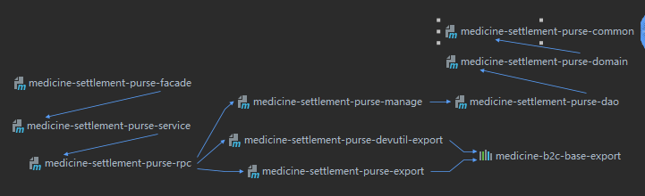

## 一. Maven基础

### 1. Maven简介

* maven是一个软件工程的项目管理工具，给予工程对象模型（POM）， maven可以从中央信息篇中来构建项目， 生成报告好文档。
* maven主要功能是管理项目， 构建项目的

### 2. Maven下载安装

* **下载地址：**<http://maven.apache.org/download.cgi>

* **依赖项：** JDK
* **解压安装：**
* **配置MAVEN_HOME  : **

* **配置本地仓库**
* **配置阿里云镜像**

### 3. Maven POM模型

**Maven 的坐标**

* **groupId：** 组织逆向域名或公司逆向域名；
* **artifactId：** 改组织下，项目的唯一标识；
* **packageing：** 项目类型，常见的java项目为jar包，常见的web项目为war包；
* **version：** 项目版本号，快照版为SNAPSHOT结尾，稳定版以RELEASE结尾；

**Maven 超级POM** 

对于我们的项目我们称超级POM为父POM， 我们项目中的POM为子POM，一般情况下如果父子POM中存在相同的元素或者节点， 那么子POM会覆盖父POM的元素或者节点（有点类似Java中的override），但是也会有几个例外存在：

* dependencies：
* developers 和 contributors；
* plugins；
* resources；

子POM在继承这些元素的时候， 并不会覆盖，而是在其基础之上继续追加。

### 4. Maven 的依赖

**依赖范围**

Maven在编译和运行以及执行测试用例的时候， 分别会使用不同的classpath,而 Maven的依赖范围则是用来控制依赖于不同classpath关系的。

* **compile :** 编译依赖范围， Maven默认依赖范围， 该范围的依赖对编译，运行，测试的classpath都有效
* **test : ** 测试依赖范围， 该范围只对测试classpath有效
* **provided：** 已提供依赖范围
* **tuntime：** 运行时依赖范围
* **system：** 系统依赖范围

**传递性依赖**

我们在依赖某一个项目之后，我们不用考虑这个项目依赖什么， maven会自动帮我们导入需要的项目， 不用我们自己关心。

**依赖最短路径原则**

**例如：**

1. `spring-boot-starter --> spring-boot --> spring-aop --> spring-core`
2. `spring-boot-starter --> spring-core`

两条路径最终引用的`spring-core` 版本是5.2.5-RELEASE。但是如果引用的psring版本不同，会使用最短路径原则，路径2种的`psring-core`版本会被引用， 这样就不会造成重复依赖的问题产生。

**排除依赖**

```xml
<dependency>
    <groupId>org.springframework.boot</groupId>
    <artifactId>spring-boot-starter-test</artifactId>
    <scope>test</scope>
    <exclusions>
        <exclusion>
            <groupId>org.junit.vintage</groupId>
            <artifactId>junit-vintage-engine</artifactId>
        </exclusion>
    </exclusions>
</dependency>
```

通过exclusions标签来排除依赖, 可以用多个exclusion标签来排除不需要的依赖。

### 5.Maven仓库

* 本地仓库
* 远程仓库
  * 中央仓库
  * 私服
  * 其他公共仓库（阿里云仓库）

### 6.Maven生命周期

Maven生命周期分为三类

1. clean（清理）

   * pre-clean : 清理前的准备工作
   * clean：清理上一次构建的结果
   * post-clean：清理结束后需要完成的工作

2. default（默认）**在生命周期中，后执行的阶段要等限制性的阶段执行完再执行****

   **Maven打包命令：mvn package -DskipTests**

   * validate：验证阶段：验证项目构建过程中需要的信息正确性；
   * compil：编译阶段
   * test：测试阶段，使用测试框架对项目进行测试，打包过程中，非必要阶段，可以跳过
   * package：打包阶段，将编译好的文件打包成jar包，war包或者ear包
   * verfiy：检查阶段，检查打包结果的有效性
   * install：本地部署阶段，将包部署到本地仓库，可以提供给本地开发过程中的其他项目使用
   * deploy：远程仓库部署阶段，将最终的包复到远程仓库，提供给该仓库的其他开发者使用

3. site（站点）**生成文档或者站点**

   * pre-site：准备阶段， 在生成站点之前需要做的工作
   * site：生成站点阶段
   * post-site：结束阶段，生成站点结束后需要做的工作
   * site-deploy：发布阶段，我们可以将上面生成的站带你发布到对应的服务器

### 7. Maven版本管理

例如：


### 8.Maven聚合与继承

我们在构建项目的时候就需要分别构建不同的模块，Maven的聚合特性能过够将各个不同的模块聚合在一起来进行构建。而继承的特性能够帮助我们抽取各个模块大的公共依赖，插件等，实现配置统一

**Maven内部依赖关系图**：



​         export -> facade -> service -> rpc -> manage -> dao - domain -> common 

### 9. Maven多模块构建

**构建项目Maven命令**：`mvn clean install`

### 10.Mven单元测试

**测试代码**


**Maven 单元测试命令**：`mvn test`

**Maven测试指定测试类**：`mvn test -Dtest=OrderService2Test`（指定测试类类名）

**Maven跳过测试**：

* `mvn package -DskipTests` (**会编译测试类**)
* `mvn package -Dmaven.test.skip=ture`  （**不会编译测试类**）

### 11.Maven使用Profile构建

 根据不同的运行环境动态的选择配置文件构建项目

**Profile被定义在pom.xml文件中**

```xml
<profiles>
   <profile>
        <id>dev</id>
        <properties>
            <database.driver>com.mysql.cj.jdbc.Driver</database.driver>
            <database.url>jdbc:mysql://localhost:3306/dev</database.url>
            <database.username>Mic</database.username>
            <database.password>Abc123</database.password>
        </properties>
    </profile>
    <profile>
        <id>test</id>
        <properties>
            <database.driver>com.mysql.cj.jdbc.Driver</database.driver>
            <database.url>jdbc:mysql://localhost:3306/test</database.url>
            <database.username>Mic</database.username>
            <database.password>Abc123</database.password>
        </properties>
     </profile>
</profiles>
```

配置好Profile后，可通过Maven命令 通过参数来指定对应的配置：`mvn clean package -Pdev`

**Profile + 配置文件**   ： 比较常用

pom.xml 文件 更改

```xml
<build>
    <finalName>mall-order</finalName>
    <plugins>
        <plugin>
            <groupId>org.springframework.boot</groupId>
            <artifactId>spring-boot-maven-plugin</artifactId>
            <configuration>
            	<executable>true</executable>
            </configuration>
        </plugin>
    </plugins>

    <resources>
        <resource>
        	<directory>src/main/resources/</directory>
        	<!-- 打包时,将对应配置文件先排除 -->
            <excludes>
            	<exclude>**/*.yml</exclude>
            </excludes>
            <includes>
            <!--如果有其他定义通用文件，需要包含进来-->
            </includes>
        </resource>
        <resource>
            <!-- 通过自定义的节点来激活指定的配置文件 -->
            <directory>src/main/resources/${profile.active}</directory>
        </resource>
    </resources>
</build>

<profiles>
    <profile>
        <id>dev</id>
        <properties>
            <!-- 自定义节点profile.active-->
            <profile.active>dev</profile.active>
        </properties>
        <!--activation用来指定激活方式，可以根据jdk环境，环境变量，文件的存在或缺失-->
        <activation>
            <!-- 表示默认激活-->
            <activeByDefault>true</activeByDefault>
        </activation>
    </profile>
    <profile>
        <id>test</id>
        <properties>
        	<profile.active>test</profile.active>
        </properties>
    </profile>
</profiles>
```

添加配置文件


### 12.Maven私服搭建

参考：<http://www.imooc.com/wiki/mavenlesson/mavenNexus.html>

### 13.查看Maven 依赖关系图

**操作**


**效果**

